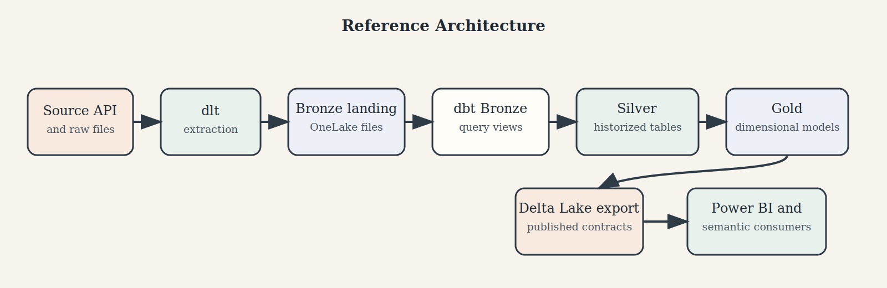
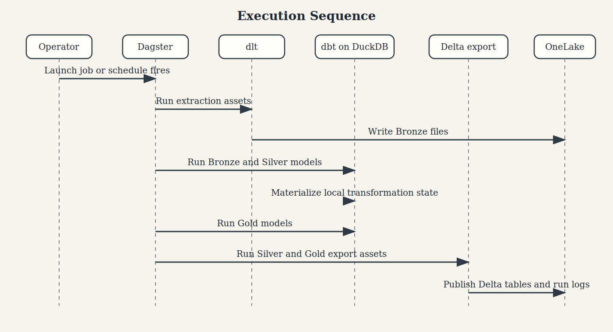
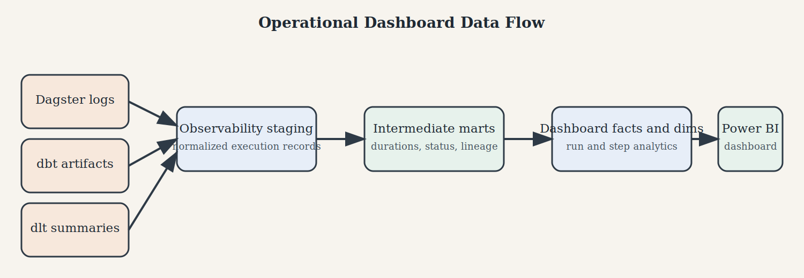

# The Modern Data Platform Handbook

## A Working, Practical, and Slightly Experimental Edition

**Builder's Edition — March 2026**

*A practical handbook built from a working repository, written for people who like real projects, useful patterns, and honest trade-offs more than grand claims.*

---

## Foreword

Most data-platform books split in one of two directions. Some stay at the architecture level and never descend into code. Others are little more than a repository tour with a few paragraphs of explanation around it. Neither is sufficient if the objective is to build a serious platform.

This handbook is my attempt to be a little more useful than either of those extremes.

It combines a general platform architecture with a real implementation. The architectural patterns are not just abstract diagrams; they are exercised in code in this repository: extraction with dlt, orchestration with Dagster, transformation with dbt and DuckDB, export to Delta Lake on Microsoft Fabric OneLake, and downstream consumption in Power BI.

It is also worth stating plainly, near the front, that this work had a real starting point. The repository https://github.com/bgarcevic/danish-democracy-data served as inspiration and as an early foundation for the direction taken here.

I am not presenting this as the final word on the subject. I am presenting it as a serious attempt to build something that works, explain why it works the way it does, and leave enough code and detail behind that someone else might adapt it, improve it, or at least steal a few good ideas.

## How to Read This Book

This book is still designed to be read in more than one way.

- If you are evaluating the architecture, read Parts I, IV, and VII first.
- If you are implementing the platform, read Parts II, III, and Appendix B first.
- If you are teaching from the repository, read Parts V and VI before assigning labs.
- If you are extending the codebase, study Chapters 13 through 17 and the full-code appendices.

The intended reading experience is still cumulative. Early chapters establish the vocabulary and design boundaries. Middle chapters explain the implementation. Later chapters turn the repository into a teachable reference system and operational handbook. If you mainly want the working bits, it is perfectly reasonable to skip ahead and come back later.

## Intended Audience

This handbook still leans toward advanced practitioners, but not in a gatekeeping sense. It helps if the reader is already comfortable with:

- Python as an application and automation language,
- SQL as a transformation language,
- cloud storage concepts,
- batch data pipelines,
- and source control as part of engineering practice.

It does not assume prior expertise in dlt, Dagster, dbt, DuckDB, or Microsoft Fabric. Those tools are explained in context through the implementation itself, which is one of the main reasons the repository matters.

## Conventions Used Throughout

- “Bronze” means landed source-aligned data with minimal interpretation.
- “Silver” means historized and technically conformed data.
- “Gold” means analytically shaped data products intended for semantic consumption.
- “Current-version” or `_cv` means the latest analytically relevant version of a historized entity.
- “Contract” refers to a stable interface between layers, tools, or environments.

Where working code is shown, it is taken from this repository unless explicitly identified as generalized or adapted explanatory material.

---

## Table of Contents

- [Part I — Why This Platform Exists](#part-i-why-this-platform-exists)
  - [Chapter 1: Executive Summary](#chapter-1-executive-summary)
  - [Chapter 2: Design Principles](#chapter-2-design-principles)
  - [Chapter 3: Reference Architecture](#chapter-3-reference-architecture)
- [Part II — The Working Implementation](#part-ii-the-working-implementation)
  - [Chapter 4: The Repository as a Data Platform](#chapter-4-the-repository-as-a-data-platform)
  - [Chapter 5: Runtime and Dependency Stack](#chapter-5-runtime-and-dependency-stack)
  - [Chapter 6: Environment and Configuration Loading](#chapter-6-environment-and-configuration-loading)
  - [Chapter 7: Ingestion with dlt](#chapter-7-ingestion-with-dlt)
  - [Chapter 8: Orchestration with Dagster](#chapter-8-orchestration-with-dagster)
  - [Chapter 9: Bronze Models in dbt](#chapter-9-bronze-models-in-dbt)
  - [Chapter 10: Silver Models and SCD Type 2 History](#chapter-10-silver-models-and-scd-type-2-history)
  - [Chapter 11: Gold Models and the Serving Layer](#chapter-11-gold-models-and-the-serving-layer)
  - [Chapter 12: Delta Lake Export to OneLake](#chapter-12-delta-lake-export-to-onelake)
- [Part III — Code Patterns That Make the Platform Maintainable](#part-iii-code-patterns-that-make-the-platform-maintainable)
  - [Chapter 13: Configuration as Code](#chapter-13-configuration-as-code)
  - [Chapter 14: Code Generation over Repetition](#chapter-14-code-generation-over-repetition)
  - [Chapter 15: Asset Factories and Dependency-Driven Execution](#chapter-15-asset-factories-and-dependency-driven-execution)
  - [Chapter 16: Metadata Columns, Naming, and Semantics](#chapter-16-metadata-columns-naming-and-semantics)
  - [Chapter 17: Testing Strategy](#chapter-17-testing-strategy)
- [Part IV — Operating the Platform](#part-iv-operating-the-platform)
  - [Chapter 18: End-to-End Execution](#chapter-18-end-to-end-execution)
  - [Chapter 19: Operational Concerns](#chapter-19-operational-concerns)
  - [Chapter 20: Cost and Trade-Offs](#chapter-20-cost-and-trade-offs)
  - [Chapter 21: How to Extend the Platform](#chapter-21-how-to-extend-the-platform)
  - [Chapter 22: What This Architecture Gets Right](#chapter-22-what-this-architecture-gets-right)
  - [Chapter 23: Where It Will Bend or Break](#chapter-23-where-it-will-bend-or-break)
- [Part V — Advanced Implementation Topics](#part-v-advanced-implementation-topics)
    - [Chapter 24: OneLake as the Persistent Lakehouse Boundary](#chapter-24-onelake-as-the-persistent-lakehouse-boundary)
    - [Chapter 25: DuckDB as Local Analytical Runtime](#chapter-25-duckdb-as-local-analytical-runtime)
    - [Chapter 26: The dbt Project as Semantic Compiler](#chapter-26-the-dbt-project-as-semantic-compiler)
    - [Chapter 27: Delete Handling and Historical Correctness](#chapter-27-delete-handling-and-historical-correctness)
    - [Chapter 28: Serving Patterns for Power BI and Semantic Tools](#chapter-28-serving-patterns-for-power-bi-and-semantic-tools)
    - [Chapter 29: Observability, Logging, and Operational Feedback Loops](#chapter-29-observability-logging-and-operational-feedback-loops)
    - [Chapter 30: DEV, PROD, and Promotion Strategy](#chapter-30-dev-prod-and-promotion-strategy)
    - [Chapter 31: Guided Workshop for Advanced Students](#chapter-31-guided-workshop-for-advanced-students)
- [Part VI — Course Use and Teaching Notes](#part-vi-course-use-and-teaching-notes)
    - [Chapter 32: Learning Objectives](#chapter-32-learning-objectives)
    - [Chapter 33: Suggested Multi-Week Course Structure](#chapter-33-suggested-multi-week-course-structure)
    - [Chapter 34: Discussion Questions and Assignments](#chapter-34-discussion-questions-and-assignments)
- [Part VII — Platform Reference Material](#part-vii-platform-reference-material)
    - [Chapter 35: Power BI and Semantic Consumption Strategy](#chapter-35-power-bi-and-semantic-consumption-strategy)
    - [Chapter 36: CI/CD, Packaging, and Runtime Shell](#chapter-36-cicd-packaging-and-runtime-shell)
    - [Chapter 37: Metadata, Logs, and Platform Memory](#chapter-37-metadata-logs-and-platform-memory)
    - [Chapter 38: Implementation Checklist](#chapter-38-implementation-checklist)
    - [Chapter 39: Architectural Decision Summary](#chapter-39-architectural-decision-summary)
    - [Chapter 40: The Data Engineering Dashboard](#chapter-40-the-data-engineering-dashboard)
- [Appendix A — Project Structure](#appendix-a-project-structure)
- [Appendix B — Working Commands](#appendix-b-working-commands)
- [Appendix C — Representative Code Listings](#appendix-c-representative-code-listings)
- [Appendix D — Full Listing: dbt Project Configuration](#appendix-d-full-listing-dbt-project-configuration)
- [Appendix E — Full Listing: Lazy Environment Loader](#appendix-e-full-listing-lazy-environment-loader)
- [Appendix F — Full Listing: dbt Model Generator](#appendix-f-full-listing-dbt-model-generator)
- [Appendix G — Full Listing: Dagster Jobs](#appendix-g-full-listing-dagster-jobs)
- [Appendix H — Full Listing: Gold Fact Model `individual_votes`](#appendix-h-full-listing-gold-fact-model-individual_votes)
- [Appendix I — Full Listing: Dagster Resources, Schedules, and Sensors](#appendix-i-full-listing-dagster-resources-schedules-and-sensors)
- [Appendix J — Full Listing: Dagster dbt Assets](#appendix-j-full-listing-dagster-dbt-assets)
- [Appendix K — Full Listing: Dagster Extraction Assets](#appendix-k-full-listing-dagster-extraction-assets)
- [Appendix L — Full Listing: dlt Extraction Runner](#appendix-l-full-listing-dlt-extraction-runner)
- [Appendix M — Glossary](#appendix-m-glossary)
- [Appendix N — Bibliography and Selected References](#appendix-n-bibliography-and-selected-references)

---

# Part I — Why This Platform Exists

## Chapter 1: Executive Summary

The modern data platform described in this handbook grew out of a fairly practical constraint set: a small team, modest budget, a need for real governance and lineage, and very little interest in paying enterprise-platform prices before the business case exists.

The stack is deliberately simple in concept, but disciplined in execution:

- Microsoft Fabric OneLake provides persistent cloud storage.
- DuckDB provides high-performance analytical compute without cluster management.
- dbt provides SQL-first transformation and testing.
- dlt provides Python-native ingestion with stateful extraction patterns.
- Dagster provides orchestration, lineage, scheduling, and operational structure.
- Delta Lake provides an interoperable serving format for downstream tools.

That stack is not just proposed here. It is implemented in this repository against a public domain dataset: the Danish Parliament OData API. The pipeline ingests 18 entities, splits them between incremental and full extraction strategies, lands them in Bronze, historizes them in Silver using SCD Type 2 patterns, transforms them into English-named dimensional Gold models, and exports the results to OneLake as Delta tables.

The platform therefore serves two purposes at the same time:

1. It is a concrete implementation of a medallion-style analytics platform.
2. It is a reference architecture for similar systems handling operational or public-sector source data.

That dual role is the premise of the book. Theory becomes more interesting when it predicts implementation shape. Implementation becomes more valuable when it can be generalized into architecture rather than staying trapped as one-off project glue.

## Chapter 2: Design Principles

Several design principles recur throughout the repository and are worth stating explicitly, not because they are universally correct, but because they are the ones that made this project manageable.

### 1. Prefer boring infrastructure over exotic infrastructure

The system is designed to minimize platform surface area. DuckDB replaces a dedicated warehouse for this scale. Dagster replaces bespoke orchestration scripts. YAML and Python constants replace a metadata database for small-team scenarios. The aim is not novelty. The aim is leverage.

### 2. Put metadata in code before putting it in databases

Entity lists, layer membership, environment variables, naming conventions, and execution semantics are all represented in version-controlled files. This makes review, testing, and evolution more tractable than burying configuration in runtime state.

### 3. Use one source of truth for model families

The project avoids hand-maintaining dozens of parallel model lists. Bronze, Silver, and Gold memberships are defined centrally in Python, then reused by code generation, export logic, and tests.

### 4. Optimize for inspectability

Every layer is meant to be understandable. Bronze models are simple views. Silver models are macro-generated but consistent. Gold models are mostly hand-authored semantic SQL. Dagster assets expose operational metadata. The repository is intentionally easier to read than a deeply abstracted framework.

### 5. Accept asymmetry where the business semantics demand it

Not everything is generated. The codebase deliberately mixes generated SQL with hand-written SQL. `individual_votes` is manual because it expresses business logic, not mechanical duplication. For this project, that asymmetry is useful rather than a problem.

## Chapter 3: Reference Architecture

At the architectural level, the platform is a medallion pipeline with a serving export step.

*Figure 1. End-to-end reference architecture for the platform implemented in this repository.*



```text
Source API / Files / Databases
            |
            v
      dlt extraction
            |
            v
      Bronze landing
   raw files, minimal logic
            |
            v
      dbt Bronze views
            |
            v
      dbt Silver tables
   SCD Type 2 historization
            |
            v
       dbt Gold views
   dimensional consumption model
            |
            v
  Delta Lake export to OneLake
            |
            v
       Power BI / BI layer
```

This repository instantiates that architecture against a concrete source system. In other teams, the exact source may differ, but the architectural responsibilities will generally remain stable.

---

# Part II — The Working Implementation

## Chapter 4: The Repository as a Data Platform

This project is not a monolith. It is a coordinated collection of concerns.

```text
dbt/                 SQL transformation project and macros
ddd_python/
  ddd_dagster/       Orchestration, assets, jobs, schedules, sensors
  ddd_dlt/           Extraction and Delta export logic
  ddd_dbt/           Code generation for dbt models
  ddd_utils/         Shared configuration and environment helpers
tests/               Unit and integration tests
documentation/       Architecture and handbook material
```

The repository is organized around platform responsibilities rather than arbitrary technical layers. That sounds obvious, but many data repositories drift at exactly this point: they become a miscellaneous pile of notebooks, scripts, and SQL fragments. Here, the boundary between ingestion, transformation, orchestration, and support utilities stays fairly clear.

## Chapter 5: Runtime and Dependency Stack

The dependency declarations in `pyproject.toml` tell an important story about the intended runtime.

```toml
[project]
requires-python = ">=3.12"

dependencies = [
    "dlt>=1.17,<2",
    "requests>=2.31",
    "python-dotenv>=1.0",
    "adlfs>=2024.7",
    "azure-identity>=1.16",
    "azure-storage-file-datalake>=12.15",
    "dbt-core>=1.10,<2",
    "dbt-duckdb>=1.9,<2",
    "duckdb>=1.1,<1.5",
    "deltalake>=1.0",
    "pyarrow>=17",
    "sqlalchemy>=2.0",
]
```

There are several noteworthy choices here.

- Python is pinned conceptually to a modern runtime, not legacy compatibility.
- DuckDB is intentionally capped below 1.5 because of a documented issue affecting dbt uniqueness tests on `_cv` views.
- Delta export is treated as a first-class concern, not an afterthought.
- Azure authentication is implemented directly in the application layer instead of delegating to a hidden vendor runtime.

To me, this is what a serious working project can look like when dependencies reflect operational knowledge, not just feature wish lists.

## Chapter 6: Environment and Configuration Loading

The environment-loading design in this repository is more thoughtful than it first appears. Rather than requiring every environment variable at import time, the module in `ddd_python/ddd_utils/get_variables_from_env.py` resolves only the values that are actually accessed.

```python
_LAZY_REQUIRED: dict[str, str] = {
    "FABRIC_ONELAKE_STORAGE_ACCOUNT": "FABRIC_ONELAKE_STORAGE_ACCOUNT",
    "FABRIC_WORKSPACE": "FABRIC_WORKSPACE",
    "FABRIC_ONELAKE_FOLDER_BRONZE": "FABRIC_ONELAKE_FOLDER_BRONZE",
    "FABRIC_ONELAKE_FOLDER_SILVER": "FABRIC_ONELAKE_FOLDER_SILVER",
    "FABRIC_ONELAKE_FOLDER_GOLD": "FABRIC_ONELAKE_FOLDER_GOLD",
    "DLT_PIPELINE_RUN_LOG_DIR": "DLT_PIPELINE_RUN_LOG_DIR",
    "AZURE_TENANT_ID": "AZURE_TENANT_ID",
    "AZURE_CLIENT_ID": "AZURE_CLIENT_ID",
    "AZURE_CLIENT_SECRET": "AZURE_CLIENT_SECRET",
}

class _LazyEnv(types.ModuleType):
    def __getattr__(self, name: str) -> str:
        env_var = _LAZY_REQUIRED.get(name)
        if env_var is not None:
            return _require(env_var)
        raise AttributeError(f"module {self.__name__!r} has no attribute {name!r}")
```

This matters for three reasons.

1. Tests can import modules without needing live Azure credentials.
2. Code generation can run in lightweight environments.
3. Failure occurs at the point of actual use, which makes configuration errors easier to reason about.

That is a good example of small design work paying off later in operations.

## Chapter 7: Ingestion with dlt

The ingestion layer targets the Danish Parliament OData API. The project distinguishes between entities that support incremental extraction through `opdateringsdato` and entities that must be fully reloaded.

The script-level runner shows the pattern clearly.

```python
incremental_set = set(configuration_variables.DANISH_DEMOCRACY_FILE_NAMES_INCREMENTAL)

with concurrent.futures.ThreadPoolExecutor(max_workers=4) as executor:
    for file_name in file_names_to_retrieve:
        api_filter = (
            f"$filter=opdateringsdato ge DateTime'{date_to_load_from}'&$orderby=id"
            if file_name in incremental_set
            else "$inlinecount=allpages&$orderby=id"
        )
```

This is a practical pattern that could be generalized.

- Incremental loads are used when the source semantics support them.
- Full extracts are reserved for reference data or sources lacking change filters.
- Concurrency is explicit and conservative: `max_workers=4`.

The execution layer in `ddd_python/ddd_dlt/dlt_pipeline_execution_functions.py` then normalizes the mechanics of running and logging pipelines. It supports `api_to_file`, `sql_to_file`, and `file_to_file`, even though the Danish Democracy implementation primarily exercises the API path. That suggests the code is being shaped toward a reusable platform layer, not just a single-source script.

An especially strong choice is the treatment of logs as first-class data. Each run writes structured output to OneLake, and failures in log upload do not mask primary pipeline failures.

## Chapter 8: Orchestration with Dagster

Dagster is where the repository stops being a set of scripts and becomes a platform.

The top-level definition assembles extraction assets, dbt assets, export assets, jobs, schedules, and sensors into one `Definitions` object.

```python
defs = Definitions(
    assets=[
        *all_extraction_assets,
        dbt_seeds_assets,
        dbt_bronze_assets,
        dbt_silver_assets,
        dbt_gold_assets,
        *all_export_assets,
    ],
    jobs=[
        danish_parliament_incremental_job,
        danish_parliament_full_extract_job,
        danish_parliament_all_job,
        dbt_seeds_job,
        dbt_bronze_job,
        dbt_silver_job,
        dbt_gold_job,
        export_silver_job,
        export_gold_job,
        danish_parliament_full_pipeline_job,
    ],
    schedules=[danish_parliament_full_pipeline_schedule],
    sensors=[
        danish_parliament_run_success_sensor,
        danish_parliament_run_failure_sensor,
    ],
)
```

What matters here is not only the presence of orchestration, but the shape of it.

- Extraction and export are modeled as individual assets.
- dbt layers are integrated as assets, not black-box subprocesses.
- Full-pipeline execution is derived from asset selection, not from manually choreographed shell sequences.
- Sensors allow operational outcomes to be persisted and inspected.

This gives the platform lineage, observability, and recomposability. In this project, those are the attributes that make it feel more like a platform and less like a scheduled script folder.

## Chapter 9: Bronze Models in dbt

Bronze in this platform is intentionally thin. The purpose of Bronze is not to clean, enrich, or interpret data. It is to provide a structured, queryable representation of landed raw files.

The Bronze models are generated, not hand-authored, because the logic is repetitive and semantically shallow. In a setup like this, generation seems like a reasonable place to lean.

The generator writes one-liner model files such as:

```python
query = f"{{{{ generate_model_bronze(this.name,'{source_system_code}','{source_name}') }}}}"
```

That pattern is useful because it centralizes structural decisions into macros while keeping the repository contents explicit. The generated SQL files still exist and can still be reviewed, but the logic is not duplicated 18 times by hand.

Bronze therefore becomes the readable edge between landed files and curated transformation logic.

## Chapter 10: Silver Models and SCD Type 2 History

Silver is the analytical backbone of the project.

The core Silver macro implements hash-based change detection, versioning, and delete handling. It is probably the single most consequential transformation primitive in the repository.

```sql
WITH CTE_BRONZE AS (
SELECT src.*
,sha256({{ base_for_hash }}) AS LKHS_hash_value
,{{ base_for_hash }} AS LKHS_base_for_hash_value
,CAST(MIN({{ date_column }}) OVER (PARTITION BY {{ primary_key_columns }}) AS DATETIME) AS LKHS_date_inserted_src
FROM {{ ref(bronze_table_name) }} src
)
```

The macro then derives validity windows from filenames, compares row hashes to prior versions, emits `I` and `U` operations, and preserves deletes during non-incremental refresh scenarios.

This is a fairly mature pattern for source systems where:

- change timestamps are available but not fully trustworthy as sole CDC markers,
- deletes may not be represented cleanly,
- historical traceability is required,
- and a current-version surface is still needed for downstream simplicity.

The project also generates companion `_cv` views for each Silver table. Those are effectively convenience surfaces for “latest state” access.

```python
query_cv = (
    f"{{{{ config( materialized='view' ) }}}}\n"
    f"SELECT src.*\n"
    f"FROM {{{{ ref('{model_name}') }}}} src\n"
    f"QUALIFY ROW_NUMBER() OVER (PARTITION BY src.LKHS_source_system_code,src.id ORDER BY src.LKHS_date_valid_from DESC) = 1\n"
)
```

The distinction between Silver history tables and `_cv` convenience views matters. The platform preserves history without forcing every consumer to become an expert in historized joins.

## Chapter 11: Gold Models and the Serving Layer

Gold is where the repository becomes a business-facing model rather than an ingestion engine.

The Gold layer translates Danish source structures into English-named dimensions and facts. It is also where the repository makes a crucial architectural decision: not all Gold models are generated.

Representative dimension logic from `actor.sql`:

```sql
SELECT {{ cast_hash_to_bigint('src.LKHS_source_system_code,src.id,src.LKHS_date_valid_from') }} AS LKHS_actor_id
,       src.*
,       LEAD(src.LKHS_date_valid_from,1,CAST('9999-12-31' AS DATETIME)) OVER (PARTITION BY src.id ORDER BY src.LKHS_date_valid_from) AS LKHS_date_valid_to
,       ROW_NUMBER() OVER (PARTITION BY src.LKHS_source_system_code,src.id ORDER BY src.LKHS_date_valid_from) AS LKHS_row_version
FROM {{ ref('silver_aktoer') }} src
```

And the fact table `individual_votes.sql` is hand-written to join current-version dimensions and voting entities into a consumable star-schema fact.

That split is, in my view, a sensible architectural boundary for this project.

- Current-version helper views such as `actor_cv` can be generated.
- Semantic dimensions such as `actor.sql` are probably easier to keep honest as readable SQL.
- Fact tables such as `individual_votes.sql` are often better written by humans, because the business grain and join logic are part of the model’s meaning.

For the kind of platform this repository is trying to be, that boundary seems to work reasonably well.

## Chapter 12: Delta Lake Export to OneLake

The platform does not stop at dbt model execution. It explicitly exports Silver and Gold to OneLake Delta Lake tables.

Gold export is illustrative.

```python
def export_single_gold_table(connection: duckdb.DuckDBPyConnection, table: str) -> int:
    token = get_fabric_onelake_clients.get_fabric_token()
    target_table_path = (
        f"abfss://{get_variables_from_env.FABRIC_WORKSPACE}"
        f"@{get_variables_from_env.FABRIC_ONELAKE_STORAGE_ACCOUNT}"
        f".dfs.fabric.microsoft.com/{get_variables_from_env.FABRIC_ONELAKE_FOLDER_GOLD}/{table}/"
    )
    query = f"SELECT * FROM {get_variables_from_env.DUCKDB_DATABASE}.main_gold.{table}"
    result = connection.execute(query)
    df = result.fetch_arrow_table()
    write_deltalake(
        target_table_path, df,
        mode="overwrite", schema_mode="merge",
        storage_options={"bearer_token": token, "use_fabric_endpoint": "true"},
    )
    return df.num_rows
```

Three implementation details are worth calling out.

1. The export is explicit and typed: DuckDB query to Arrow to Delta Lake.
2. Silver and Gold use different write modes: incremental append for Silver, overwrite for Gold.
3. Authentication is handled through bearer tokens and Fabric-specific endpoint settings rather than brittle filesystem mounting tricks.

This export stage is what turns internal transformation state into a serving contract for BI tools.

---

# Part III — Code Patterns That Make the Platform Maintainable

## Chapter 13: Configuration as Code

The constants in `ddd_python/ddd_utils/configuration_variables.py` are more than configuration. They are the central model registry for the platform.

```python
DANISH_DEMOCRACY_FILE_NAMES_INCREMENTAL = [
    "Aktør",
    "Møde",
    "Sagstrin",
    "Sag",
    "SagstrinAktør",
    "Stemme",
]

DANISH_DEMOCRACY_MODELS_GOLD = [
    "actor",
    "actor_type",
    "case",
    "date",
    "meeting",
    "meeting_status",
    "meeting_type",
    "vote",
    "vote_type",
]
```

Several parts of the system derive behavior from these lists.

- The dlt layer decides which sources are incremental.
- The dbt generator decides which Silver models use incremental logic.
- The Gold `_cv` generator decides which companion views to build.
- Export asset factories decide which tables to publish.
- Tests verify that those derivations remain correct.

One platform-engineering lesson here, at least for me, is that configuration becomes much more useful when it is both central and executable.

## Chapter 14: Code Generation over Repetition

The file `ddd_python/ddd_dbt/generate_dbt_models.py` contains the project’s clearest maintainability stance: if the SQL pattern is mechanical, generate it.

The Silver generation logic demonstrates this cleanly.

```python
if model_name in _INCREMENTAL_SILVER_MODELS:
    macro_name = "generate_model_silver_incr_extraction"
else:
    macro_name = "generate_model_silver_full_extraction"
```

This approach produces several benefits.

- Consistency across model families.
- Lower maintenance cost when a naming convention changes.
- Fewer hand-edited files with near-duplicate logic.
- Stronger testability because one generator can be validated across the full set.

Just as importantly, the generator stops where semantics begin. It does not try to synthesize `individual_votes`, because `individual_votes` is not repetitive infrastructure SQL. It is domain SQL.

That restraint is one of the things that helps the codebase stay legible.

## Chapter 15: Asset Factories and Dependency-Driven Execution

The Dagster extraction and export layers both use factory functions to define assets. That seems to fit well here because the assets differ by parameterization, not by structure.

```python
export_silver_assets: list[AssetsDefinition] = [
    _make_export_silver_asset(name)
    for name in configuration_variables.DANISH_DEMOCRACY_MODELS_SILVER
]

export_gold_assets: list[AssetsDefinition] = [
    _make_export_gold_asset(name)
    for name in configuration_variables.DANISH_DEMOCRACY_MODELS_GOLD
]
```

The benefit is not merely fewer lines of code. The deeper benefit is alignment:

- one table corresponds to one asset,
- one asset carries its own metadata,
- and dependencies are expressed at the asset level.

This is the kind of structure that can let a small team operate a non-trivial platform without accumulating orchestration entropy too quickly.

## Chapter 16: Metadata Columns, Naming, and Semantics

The `LKHS_` prefix is used throughout the repository for platform metadata fields. These columns carry technical semantics rather than business semantics.

Examples include:

- `LKHS_hash_value`
- `LKHS_date_inserted_src`
- `LKHS_date_valid_from`
- `LKHS_date_valid_to`
- `LKHS_row_version`
- `LKHS_cdc_operation`

This naming discipline matters. It creates a stable semantic partition between platform-introduced metadata and source or business attributes. That, in turn, makes downstream modeling and debugging less error-prone.

The project also normalizes Danish entity names to ASCII-safe path and model names, converting characters such as `ø`, `æ`, and `å`. That is not just cosmetic. It reduces filesystem and engine friction while preserving source meaning at the semantic layer.

## Chapter 17: Testing Strategy

The tests in this repository are not just ornamental. They are aimed at structural correctness.

For example, the generator tests verify that incremental-versus-full Silver behavior is derived from canonical configuration, not a hidden hardcoded list.

```python
def test_incremental_silver_models_derived_from_config():
    expected = {
        f"silver_{n.replace('ø', 'oe').replace('æ', 'ae').replace('å', 'aa').lower()}"
        for n in cv.DANISH_DEMOCRACY_FILE_NAMES_INCREMENTAL
    }
    assert _INCREMENTAL_SILVER_MODELS == expected
```

That is the sort of test a metadata-driven platform benefits from. It checks the contract between configuration and code generation rather than merely checking that a function returned a string.

The testing lesson here is broader than Python. In data platforms, the highest-value tests are often those that guard structure, derivation rules, and invariants.

---

# Part IV — Operating the Platform

## Chapter 18: End-to-End Execution

The repository supports both staged execution and full-pipeline execution.

*Figure 2. The typical execution sequence from extraction through export.*



Typical first-run flow:

```bash
python -m venv .venv
source .venv/bin/activate
pip install -e ".[dagster,dev]"
cd dbt && dbt deps && cd ..
python -m ddd_python.ddd_dbt.generate_dbt_models
cd dbt && dbt seed --profiles-dir . && cd ..
dagster dev -w workspace.yaml
```

After that, the primary jobs are:

- `danish_parliament_incremental_job`
- `danish_parliament_full_extract_job`
- `dbt_bronze_job`
- `dbt_silver_job`
- `dbt_gold_job`
- `export_silver_job`
- `export_gold_job`
- `danish_parliament_full_pipeline_job`

The orchestration model intentionally preserves both clarity and flexibility. You can run the full pipeline, or you can run one layer at a time while debugging.

## Chapter 19: Operational Concerns

Every architecture choice trades one class of problems for another. This stack is no exception.

### Concurrency and single-writer constraints

Extraction and export use concurrent execution with a limit of four workers. dbt jobs run in-process because DuckDB’s write semantics do not reward careless parallelism.

### Credential management

Azure credentials are supplied through environment variables and loaded lazily. This is practical for local development and CI, but it requires strong secret hygiene and careful runtime configuration.

### Runtime ephemerality

If this platform runs inside ephemeral compute such as Azure Container Instances, logs must be exported before teardown. The repository already leans in that direction by treating logs as data and shipping them to OneLake.

### Schema drift

The Silver macros are built to tolerate appended columns, but no system becomes magically resilient simply because `on_schema_change='append_new_columns'` is present. Upstream contract changes still need review.

## Chapter 20: Cost and Trade-Offs

The stack is budget-conscious, not cost-free. That distinction matters. Good low-cost architectures are not built by pretending cost disappears. They are built by concentrating spend where it creates real leverage and avoiding permanent infrastructure that solves scale problems you do not yet have.

The economic argument of this platform rests on four core observations.

1. DuckDB eliminates most warehouse-style compute cost at this scale.
2. dbt-core, dlt, and Dagster are open source, so their cost is operational rather than licensing-driven.
3. OneLake becomes especially attractive when the organization already lives in the Power BI / Fabric orbit.
4. Small teams benefit disproportionately from tools that reduce control-plane overhead.

### What actually drives spend

In practice, the cost categories that seem to matter most are:

- BI licensing or Fabric capacity,
- runtime compute hours,
- source-data growth and retention,
- and the engineering time required to operate the stack.

That final point deserves emphasis. Cheap infrastructure can still become expensive if the platform design is operationally brittle.

### Baseline cost categories

| Category | What you pay for | Primary driver | Typical behavior |
|---|---|---|---|
| Reporting | Power BI Pro, PPU, or Fabric capacity | Number of builders, number of viewers, premium features | Usually the largest swing factor |
| Runtime | Container or runner compute | Frequency and duration of pipeline runs | Mostly variable spend |
| CI/CD | GitHub seats, Actions minutes, Codespaces | Team size and automation volume | Often modest for small teams |
| Storage | OneLake / ADLS and retained logs | Data volume and retention policy | Usually lower early than teams expect |

### Why the stack can be inexpensive

This architecture avoids several common cost traps.

- There is no always-on warehouse cluster.
- There is no separate paid orchestration control plane.
- There is no mandatory commercial ingestion license.
- There is no need to stand up a metadata database at small-team scale.

That said, low cost comes with responsibility. You are choosing composable tools over managed abstraction. That can be a very good bargain, but it is still a bargain.

### Example small-team posture

For a three-user team, the baseline profile is often:

- per-user Power BI licensing,
- GitHub-hosted source control and CI,
- ephemeral runtime compute,
- and modest OneLake storage.

At that size, BI licensing can easily dominate infrastructure cost. I think that can be a useful corrective for students who assume compute is always the largest line item. In many modern analytics stacks, the visualization and sharing layer shapes the commercial profile more than the transformation layer does.

### Trade-offs by growth path

Costs increase most sharply when one of the following happens:

1. Pipeline frequency shifts from daily batch to intraday or near-real-time.
2. BI usage shifts from a few builders to many consumers.
3. Data volume exceeds what a single-node DuckDB-centered runtime handles comfortably.
4. Governance, multi-team coordination, or tenancy requirements force additional infrastructure.

These are not arguments against the architecture. They are the conditions under which the architecture graduates to a different operating envelope.

### The real trade-off

The real trade-off is simple: this stack minimizes vendor spend by increasing the importance of engineering clarity. If the codebase is disciplined, the economics are excellent. If the codebase becomes chaotic, the cheap tools stop being cheap.

## Chapter 21: How to Extend the Platform

A useful handbook should not only explain the current system. It should also help a reader change it safely.

To add a new Danish Democracy-style entity, the sequence is straightforward.

1. Add the source entity name to the relevant configuration list.
2. Decide whether it belongs in the incremental list.
3. Regenerate dbt Bronze and Silver models.
4. Add or refine Gold semantics if the entity should be surfaced analytically.
5. Update tests to cover any new derivation or naming behavior.
6. Run the affected Dagster jobs.

The deeper architectural lesson, at least as I read this repository, is that extension gets much easier when the platform’s core abstractions are stable. Here, those abstractions are layer membership, factory-defined assets, macro-driven model families, and explicit export boundaries.

## Chapter 22: What This Architecture Gets Right

This design makes several decisions that seem easy to underestimate.

- It keeps raw, historical, and serving concerns distinct.
- It treats the data platform as software, not as a collection of ad hoc tasks.
- It embraces generation where repetition dominates, and hand-written SQL where semantics dominate.
- It uses open tools with strong local-development ergonomics.
- It is inspectable enough that a new engineer can reason about it without reverse-engineering a proprietary control plane.

## Chapter 23: Where It Will Bend or Break

No architecture deserves praise without constraints.

This stack will become strained when:

- data volume exceeds what DuckDB-centric processing can comfortably handle in the chosen runtime,
- many teams begin demanding independent orchestration and tenancy boundaries,
- near-real-time requirements replace daily or batch-oriented cadence,
- governance needs outgrow code-and-review workflows alone,
- or the organization demands always-on managed services rather than composable open tooling.

Those are not failures of the design. They are simply the boundaries of the design’s intended operating range.

---

# Part V — Advanced Implementation Topics

## Chapter 24: OneLake as the Persistent Lakehouse Boundary

In many platform discussions, storage is treated as a passive implementation detail. I do not think that holds up very well in practice. Storage determines persistence semantics, cost posture, interoperability options, recovery strategy, and the practical meaning of “done” in a pipeline run.

In this repository, OneLake is the persistent boundary between ephemeral compute and durable analytical state. The pipeline can execute locally. The Dagster process can restart. DuckDB can be recreated. But if the OneLake contract remains stable, the platform remains operationally meaningful.

This is one of the stronger architectural ideas in the project. It keeps the runtime lightweight without making the data estate fragile.

The dbt project variables make the storage contract visible rather than implicit:

```yaml
vars:
    danish_democracy_data_source: "abfss://onelake.dfs.fabric.microsoft.com/<YOUR_WORKSPACE>/<YOUR_LAKEHOUSE>.Lakehouse/Files/Bronze/DDD"
    bronze_columns_to_exclude_in_silver_hash: "'LKHS_date_inserted','LKHS_pipeline_execution_inserted','LKHS_filename'"
    hash_null_replacement: "'<NULL>'"
    hash_delimiter: "']##['"
```

The significance of this configuration is easy to miss if you read it too quickly.

- The Bronze landing zone is expressed as a concrete filesystem path, not as an abstract warehouse object.
- Hashing behavior is parameterized and version-controlled.
- The row-comparison policy used by Silver is therefore inspectable and reproducible.

For advanced students, this is a useful pattern to study because it shows how often platform quality depends on what is made explicit.

### Bronze as a landing contract

Bronze in this platform is not simply the first modeling layer. It is the contract of receipt. The landed files are the closest durable representation of what the source system actually delivered. Bronze views exist to make those files queryable, not to reinterpret them beyond recognition.

That separation matters for several reasons.

1. Reprocessing becomes practical because the raw landed files are preserved.
2. Debugging becomes credible because the first transformation layer can still be compared directly with source payloads.
3. Historical auditability improves because the boundary between landed and curated state remains visible.

### Silver and Gold as exported contracts

The repository does not stop at dbt execution. Silver and Gold are exported into OneLake as Delta Lake tables. That means the lakehouse contract survives independently of the local DuckDB runtime.

This is a very workable architecture for a platform that wants both low runtime complexity and durable downstream consumption. A local analytical engine becomes much more operationally viable when it is paired with a durable, interoperable storage layer.

### Teaching implication

Students frequently understand transformations but do not yet understand platform boundaries. This repository is strong pedagogically because it makes the boundaries clear:

- source ingestion writes landed files,
- transformation reads and shapes them,
- export publishes stable serving artifacts,
- and the serving contract outlives the transformation process.

That is a real platform lesson, not just a tool lesson.

## Chapter 25: DuckDB as Local Analytical Runtime

DuckDB is often pitched as a fast embedded database. That description is true, but insufficient. In this repository, DuckDB is best understood as a local analytical runtime that sits between cloud storage and semantic models.

It is responsible for executing dbt transformations, materializing historized Silver tables, exposing Gold views, and acting as the read source for Delta export. That is a more consequential role than “query engine.”

### Why DuckDB fits this platform

DuckDB fits because the project is optimizing for:

- low infrastructure overhead,
- strong local development ergonomics,
- file-native analytics,
- and deterministic batch execution.

The platform is not trying to be a globally distributed, multi-tenant warehouse. It is trying to be reliable, inspectable, and economically sane for a modest-scale analytical estate.

### dbt profile as architecture signal

The dbt profile is short, but architecturally dense:

```yaml
danish_democracy_data:
    target: dev
    outputs:
        dev:
            type: duckdb
            path: "{{ env_var('DUCKDB_DATABASE_LOCATION') }}"
            extensions:
                - httpfs
                - parquet
                - azure
                - delta
            settings:
                azure_transport_option_type: 'curl'
            external_root: 'data/curated'
```

Each extension is present because the platform requires a specific capability.

- `httpfs` allows remote file access.
- `parquet` supports file-native analytics.
- `azure` enables access to OneLake via Azure-backed storage semantics.
- `delta` allows Delta-aware operations.

This is not just bloat. It is close to the minimum integration surface needed for a lightweight lakehouse pipeline.

### Concurrency discipline matters

Dagster uses multiprocess execution for extraction and export, but dbt jobs run with `in_process_executor`. That is not conservatism for its own sake. It is a runtime-specific decision informed by DuckDB’s write behavior.

One useful lesson for advanced practitioners is that performance is not about indiscriminately adding concurrency. It is more about matching concurrency to engine semantics.

### Strategic implication

What DuckDB mainly enables here is not just speed. It enables a different kind of platform design: one where serious data engineering can happen without a permanent warehouse control plane. That architectural possibility is a large part of why I think it is worth teaching in this context.

## Chapter 26: The dbt Project as Semantic Compiler

The dbt project in this repository is best understood as a semantic compiler. It takes landed files, transformation logic, macros, and tests and turns them into an executable graph of models with predictable semantics.

The compiler analogy is useful because it pushes back on a common misunderstanding. dbt is not simply a folder of SQL files that happen to run in order. It is also a graph construction and execution framework.

### Project-level materialization strategy

The project file captures the layer semantics cleanly:

```yaml
models:
    danish_democracy_data:
        bronze:
            +schema: bronze
            +materialized: view
        silver:
            +schema: silver
            +materialized: table
        gold:
            +schema: gold
            +materialized: view
```

This materialization strategy is not arbitrary.

- Bronze is cheap and structural, so views are sufficient.
- Silver is historical and persistent, so tables are required.
- Gold is semantic and rebuildable, so views are appropriate prior to export.

The design lines up storage choices with semantic responsibility. That is the kind of alignment I would want advanced students to look for.

### Manifest-driven execution versus list-driven generation

This repository creates an especially useful teaching opportunity because it contains both generation lists and a manifest-driven execution graph.

- `DANISH_DEMOCRACY_MODELS_GOLD` is used for generating `_cv` files and export assets.
- Dagster’s dbt asset selection for `dbt_gold_job` is driven by the dbt manifest.

That is why a model like `individual_votes.sql` is executed by the Gold job even though it is not part of the Gold generation list. It exists in the dbt graph, so the manifest includes it. This distinction is subtle, and understanding it usually signals a deeper level of platform fluency.

### Why the compiler framing helps

Once students think of dbt as a compiler, several things become clearer:

- the manifest is a compiled artifact,
- macros are reusable language constructs,
- model folders encode semantic layers,
- and `dbt build` is graph execution rather than manual command sequencing.

That is, at least in this context, the mental model I have found most useful.

## Chapter 27: Delete Handling and Historical Correctness

Delete handling is one of the places where data platforms tend to reveal their maturity level. Inserts and updates are comparatively easy. Deletes are where temporal correctness, operational assumptions, and downstream trust all meet.

The Silver macro in this project addresses deletes explicitly rather than treating them as an inconvenient corner case. In my experience, that already puts it in better company than many production systems.

The relevant section of the incremental Silver macro emits a delete event when a row that used to be current is absent from the latest Bronze-derived state.

```sql
UNION ALL
SELECT  cv.* EXCLUDE (LKHS_date_inserted,LKHS_cdc_operation,LKHS_date_valid_from)
,       CTE_FILE_LATEST.LKHS_date_valid_from
,       CAST('{{ run_started_at.strftime("%Y-%m-%d %H:%M:%S.%f")[:-3] }}' AS DATETIME) AS LKHS_date_inserted
,       'D' AS LKHS_cdc_operation
FROM      {{ this.schema }}.{{ this.name }}_current_temp cv
CROSS JOIN CTE_FILE_LATEST
LEFT JOIN {{ ref(bronze_latest_version) }} bronze_latest
ON        cv.id = bronze_latest.id
WHERE     cv.LKHS_cdc_operation != 'D'
AND       bronze_latest.id IS NULL
```

Several ideas are embedded in this logic.

### Current absence may be the best available delete signal

Many APIs do not emit explicit delete events. In those cases, absence in the latest state is the most practical signal. The macro encodes that assumption transparently.

### Preserving history matters

The repository does not physically remove historical state. Instead, it records a `D` operation. That means the Silver layer remains a truthful historical ledger of source-system state transitions.

### Downstream models remain responsible for interpretation

The fact that Silver records delete semantics does not mean Gold can ignore them. The manual Gold fact model explicitly filters deleted rows out of `silver_stemme_cv`.

```sql
individual_vote AS 
(
SELECT src.*
FROM {{ ref('silver_stemme_cv') }} src
-- Only include rows that are not marked as deleted!
WHERE src.LKHS_cdc_operation != 'D'
)
```

That feels like a sensible separation of concerns.

- Silver captures temporal truth.
- Gold decides what is analytically current and meaningful.

### Why this matters in a course

Delete handling is often where students move from “I can write transformations” to “I understand data systems.” I think a serious course should spend time here, because temporal correctness is one of the hardest things to retrofit after the fact.

## Chapter 28: Serving Patterns for Power BI and Semantic Tools

The final consumer rarely cares which engine produced a table. The consumer cares whether the contract is stable, documented, and performant enough to trust.

This repository’s serving pattern is therefore deliberately export-oriented. Gold views are produced in DuckDB and then published to OneLake as Delta tables. That turns the transformation layer into a producer of serving artifacts rather than a serving dependency in its own right.

### Why this serving pattern works reasonably well here

It decouples transformation from consumption.

- pipeline execution can be batch-oriented,
- BI consumption can be persistent and downstream,
- and the serving layer can be governed as a stable contract.

That seems like a workable design for many analytical platforms operating at this scale.

### Why not serve directly from the transformation engine

You could, in theory, let a BI tool depend directly on the execution runtime. But that would be a poor operational bargain.

- the execution runtime has different uptime expectations,
- transformation windows and BI query windows are different,
- and local runtimes are best treated as producers, not shared serving endpoints.

### Power BI in context

The broader architecture material in the original handbook explains Power BI and Microsoft-centric serving patterns at more length. In the context of this repository, the key takeaway is simple: the Gold serving contract is designed to fit naturally into a Fabric-centered downstream environment without making the transformation engine itself the semantic endpoint.

That is the kind of architectural distinction I would want advanced students to learn to make.

## Chapter 29: Observability, Logging, and Operational Feedback Loops

Pipelines that only write business data can feel incomplete. More mature platforms also write operational data about their own behavior.

This repository does that in a pragmatic and teachable way. The resource layer exposes a method for writing structured Dagster job run logs into OneLake, and sensors call that method on success and failure.

This matters because it turns platform operations into analyzable data rather than transient console output.

### The operational data path is explicit

The `DltOneLakeResource` contains a method designed specifically for job-run summaries. It writes an NDJSON record containing job name, run ID, start time, end time, duration, status, and optional structured detail.

This is not elaborate, but it is often effective. Small teams often cannot justify a large observability stack. Writing structured run summaries into the same lakehouse estate is a practical alternative.

### Sensors as platform feedback hooks

The success and failure sensors collect run statistics and write them through the resource. A key operational detail is that failures in writing the log do not block future runs.

That choice is worth noticing. Observability matters, but it should not become a new single point of failure for the platform.

### Why this is good course material

Students often learn orchestration as if the only interesting question were “did the job run?” This repository teaches a better question: “what durable operational data did the job itself produce?”

That is one way to start treating platform observability as an engineering discipline rather than a checklist item.

## Chapter 30: DEV, PROD, and Promotion Strategy

The repository itself is a working project, but it is also clearly shaped to fit into a larger DEV/PROD operating model. The original architecture handbook describes GitHub Actions, Azure Container Instances, and Power BI environment separation as the operational wrapper around a platform core like this one.

That distinction is useful and, in my view, worth making explicit in a course text.

- the repository contains the pipeline core,
- the deployment topology is the runtime shell around that core.

### Promotion is about contracts, not just code

Productionization is not simply “run the same thing somewhere else.” It is about keeping environment boundaries explicit.

- DEV should point to DEV storage and workspaces.
- PROD should point to PROD storage and workspaces.
- code moves forward through review and CI,
- data contracts remain environment-specific.

This may sound obvious, but many teams violate it accidentally by treating environment variables as a shallow afterthought. The repository’s strong configuration separation makes that mistake easier to avoid.

### Teaching implication

Advanced students benefit from learning to separate repository scope from deployment scope. A project can fully implement its pipeline logic without hardcoding every detail of the production runtime shell into the same codebase.

## Chapter 31: Guided Workshop for Advanced Students

This chapter turns the repository from a reference implementation into a course instrument.

### Workshop goals

By the end of the workshop, I would hope students can:

1. trace a single entity from source API to Gold export,
2. explain the distinction between generation registries and execution graphs,
3. describe how Silver historization works,
4. explain why the Gold fact model is manual,
5. and run or modify the pipeline without guessing blindly.

### Exercise 1: Trace one entity end to end

Use `Aktør` as the trace subject.

Tasks:

1. Find the source entity in configuration.
2. Determine whether it is extracted incrementally.
3. Identify the Bronze model name.
4. Identify the Silver model name.
5. Identify the Gold dimension name.
6. Identify the export asset that publishes it.

The conceptual answer is:

- source entity: `Aktør`
- extraction mode: incremental
- Bronze model: `bronze_aktoer`
- Silver model: `silver_aktoer`
- Gold model: `actor`
- export asset: `export_actor`

This exercise forces students to move between configuration, naming normalization, dbt generation, and Dagster asset construction.

### Exercise 2: Explain why `individual_votes` is special

Students can inspect the repository and explain why `individual_votes` is not code-generated and why it is not part of the Gold generation list.

The explanation I would look for is that `individual_votes` is a semantic fact model, not a repetitive infrastructure model. It appears in the dbt manifest and therefore in the Gold execution graph, but it is not part of the mechanical generation flow that creates `_cv` companions.

This is one of the more useful lessons in the repository: not everything needs to be generated just because some things are.

### Exercise 3: Delete reasoning

Ask students why the Gold fact model filters deleted rows from `silver_stemme_cv`. A weak answer is “to avoid wrong counts.” A stronger answer is that Gold is explicitly choosing the analytically valid current-state projection of a historized Silver source.

### Exercise 4: Stage the pipeline deliberately

Run the jobs in order:

```bash
dagster job launch -w workspace.yaml --job danish_parliament_all_job
dagster job launch -w workspace.yaml --job dbt_bronze_job
dagster job launch -w workspace.yaml --job dbt_silver_job
dagster job launch -w workspace.yaml --job dbt_gold_job
dagster job launch -w workspace.yaml --job export_silver_job
dagster job launch -w workspace.yaml --job export_gold_job
```

Then discuss:

- where concurrency is used,
- where it is intentionally avoided,
- what outputs are durable after each stage,
- and how the asset graph differs from a shell-script mindset.

### Exercise 5: Design a new Gold mart

Have students propose a new Gold mart derived from the existing Silver layer. They must define:

- grain,
- keys,
- delete behavior,
- whether a `_cv` companion should exist,
- and whether the model should be hand-authored or generator-supported.

This exercise is useful because it turns repository reading into design thinking.

---

# Part VI — Course Use and Teaching Notes

## Chapter 32: Learning Objectives

For instructors, this repository-backed handbook supports advanced objectives across architecture, engineering, and operations.

### Architecture objectives

- Explain medallion layering in terms of responsibility, not buzzwords.
- Distinguish execution runtime from durable serving contract.
- Evaluate why this stack is economically attractive for a small team.

### Engineering objectives

- Read a multi-tool data platform repository without losing the thread.
- Understand where generation adds value and where it removes clarity.
- Explain current-version views versus historized tables.
- Trace lineage across dlt, dbt, DuckDB, Dagster, and Delta export.

### Operational objectives

- Explain why concurrency differs by layer.
- Interpret the purpose of sensors and structured run summaries.
- Separate repository scope from deployment topology scope.

## Chapter 33: Suggested Multi-Week Course Structure

One effective teaching plan is a six-week advanced module.

### Week 1: Architecture and economic framing

- Read Part I.
- Discuss why lightweight stacks can still be real platforms.
- Compare this architecture to warehouse-first designs.

### Week 2: Ingestion and orchestration

- Read Chapters 7, 8, and 15.
- Map entity extraction through Dagster assets.
- Lab: trace one source from API to Bronze.

### Week 3: Historization and delete semantics

- Read Chapters 10, 14, and 27.
- Study the Silver macro and current-version views.
- Lab: explain how a delete is inferred and represented.

### Week 4: Gold modeling and serving contracts

- Read Chapters 11, 12, and 28.
- Study `actor.sql` and `individual_votes.sql`.
- Lab: define Gold grain and key choices.

### Week 5: Operations and observability

- Read Chapters 18, 19, and 29.
- Study schedules, sensors, and run logging.
- Lab: design an operational dashboard from run summaries.

### Week 6: Critique and extension

- Read Chapters 20 through 23 and Chapter 31.
- Students propose an extension or critique.
- Final assignment: write a design note for adding a new source domain.

## Chapter 34: Discussion Questions and Assignments

The following questions work well in an advanced classroom.

1. Why is manifest-driven execution a better fit for Dagster dbt assets than maintaining a hardcoded execution list in Python?
2. Under what scaling conditions would you replace DuckDB while preserving the broader platform shape?
3. What assumptions about source-system behavior are embedded in the Silver delete logic?
4. Why are operational logs written as data to OneLake rather than left solely in process output?
5. What criteria should determine whether a Gold model is generated or hand-authored?

Suggested assignments:

1. Write a design critique of the project’s configuration-as-code approach.
2. Propose a revised serving strategy for lower-latency analytical refreshes.
3. Design a new Gold mart and justify its grain, keys, and delete semantics.
4. Draft an alternative deployment topology while keeping the repository core intact.

---

# Part VII — Platform Reference Material

## Chapter 35: Power BI and Semantic Consumption Strategy

The last mile of a data platform is usually where architectural discipline erodes. Teams spend immense effort designing ingestion, transformation, and orchestration, only to let the serving layer become an improvised set of loosely governed queries.

The original architecture handbook rightly emphasizes Power BI as the business-facing consumption layer. In the context of this repository, the important point is not simply that Power BI can read the exported Gold data. The important point is that the platform is deliberately shaping Gold as a stable semantic contract for downstream use.

### A Gold layer is not a report layer

One of the central lessons for advanced students, at least as I see it, is that the Gold layer is different from reports or dashboards. Gold is a semantic data product. It is the layer where the data model becomes intentionally consumable, but it is usually better if it remains independent of any single report canvas.

In this repository, that distinction is visible in the construction of dimensions like `actor`, `meeting`, and `vote`, and in the hand-written fact model `individual_votes`. These models are not report tabs. They are stable analytical surfaces.

### Why this matters for Power BI

Power BI usually performs best in a well-governed platform when it connects to curated entities whose grain, keys, and update semantics are explicit. That is what the Gold layer appears to be trying to provide here.

Questions I would want students to ask include:

- what is the grain of the Gold model?
- what is its surrogate key or business key?
- what does “current” mean?
- what should be materialized versus modeled in the semantic layer?

These questions matter far more than whether the final visualization uses a bar chart or a matrix.

### The serving contract principle

The broader platform principle I would argue for is this: BI tools should consume exported and governed contracts, not execution internals.

That principle is evident throughout the repository:

- transformations happen in DuckDB,
- durable results are exported to OneLake,
- and semantic consumption happens against persisted artifacts.

This is one of the more important ideas in the whole book. It protects downstream consumers from the instability of the transformation runtime.

### Licensing reality matters

Power BI strategy is never only a semantic-model question. It is also a licensing and workspace-topology question.

At a practical level, teams usually choose among:

- Pro for collaborative publishing and sharing,
- Premium Per User for premium capabilities per builder,
- or Fabric / Premium capacity when many consumers need access to centrally hosted semantic models.

An advanced course would probably do well to make students think about this explicitly. Architecture that ignores licensing feels incomplete.

### Direct Lake versus import-style patterns

In a Fabric-centered environment, Direct Lake is attractive because it removes much of the traditional import-refresh overhead. Where Direct Lake is unavailable or inappropriate, import-style patterns over Delta tables remain viable.

The key architectural rule I would keep stable regardless of which serving mode is chosen is this: Power BI should read a curated and exported Gold contract rather than coupling itself to the transformation runtime.

### DEV and PROD semantic isolation

The original handbook emphasizes DEV and PROD workspace separation, and that pattern remains valuable here. Even when the repository core is identical across environments, the semantic consumption layer benefits from a meaningful separation between experimental and published artifacts.

Students will usually benefit from seeing that promotion is not just a code event. It is also a semantic-contract event.

### What an advanced practitioner should ask

When designing the Power BI boundary for a platform like this, ask:

1. Is the Gold layer stable enough to be treated as a published semantic source?
2. Which parts of the model belong in dbt and which belong in the semantic model?
3. What licensing model does the organization actually support?
4. What workspace topology prevents DEV experimentation from contaminating PROD consumption?

## Chapter 36: CI/CD, Packaging, and Runtime Shell

The repository contains the platform core. A production system also needs a runtime shell: packaging, promotion, scheduling, and environment isolation.

The original handbook describes that shell using GitHub Actions and Azure Container Instances. Even though this repository does not encode every part of that shell as runnable infrastructure code, it is clearly designed to fit within that model.

### Repository core versus runtime shell

I would distinguish carefully between two scopes.

1. The pipeline core: extraction, transformation, orchestration, export, tests, and configuration.
2. The runtime shell: where and how that core is executed in DEV and PROD.

This distinction is pedagogically useful because many teams confuse operational wrappers with platform logic. The repository keeps the core logic clean enough that multiple runtime shells remain possible.

### Packaging and Python environment

The `pyproject.toml` file signals the intended packaging and dependency discipline. It is not merely a convenience file. It defines the reproducible runtime boundary for development and execution.

Advanced students can treat dependency declarations as architecture clues.

- the chosen libraries reveal which cloud and file patterns the platform depends on,
- version caps reveal known runtime constraints,
- optional dependency groups show how the development shell differs from the platform core.

### CI/CD as contract enforcement

In a mature implementation, CI/CD is not just about running unit tests. It is about enforcing contracts.

- Do generated models stay aligned with configuration?
- Do dbt tests still pass after model changes?
- Do environment assumptions remain explicit rather than hidden in a developer laptop?
- Are deployment shells promoting code without silently crossing environment boundaries?

This repository is already structured to support that style of discipline. A course could make that explicit rather than treating CI/CD as an unrelated DevOps concern.

### GitHub Actions as DEV runtime

One of the stronger ideas in the original handbook is that the DEV environment can run directly on the GitHub Actions runner rather than through a more elaborate intermediate environment. That is a pragmatic choice:

- it reduces environment drift,
- it provides automation close to the pull-request workflow,
- and it proves that the pipeline can execute in a clean machine context.

For advanced students, this is a useful reminder that CI is not just a test harness. It can also be a real development-time execution surface for the platform.

### Azure Container Instances as PROD shell

The original architecture also proposes Azure Container Instances as a low-friction production runtime for scheduled batch execution. Whether a team ultimately uses ACI, Container Apps, Cloud Run Jobs, Fargate, or another batch shell, the architectural point remains the same: the platform core should be portable enough to run inside a short-lived containerized execution boundary.

That is the sort of portability this repository encourages.

### Interactive development still matters

Even with a strong CI/CD posture, advanced data work still benefits from an interactive environment. That is why Codespaces or local VS Code setups remain relevant. A good operational pattern, in my view, is not to choose between interactive development and automation, but to make them converge on the same runtime assumptions.

### Publishing-quality engineering lesson

For a book or course, one key teaching point is that packaging and runtime design are part of the platform architecture, not a thin afterthought bolted on at the end. A pipeline that cannot be packaged, promoted, and executed predictably still feels incomplete, no matter how elegant its SQL may be.

## Chapter 37: Metadata, Logs, and Platform Memory

Metadata in this platform exists at several levels, and understanding those levels is part of advanced data engineering.

### Configuration metadata

This includes the canonical Python lists in `configuration_variables.py`, project-level dbt configuration, and environment contracts. This metadata determines what the system believes exists.

### Execution metadata

This includes dlt run summaries, Dagster step results, dbt manifests, and exported job-run NDJSON logs. This metadata records what actually happened.

### Semantic metadata

This includes naming conventions, surrogate keys, business keys, current-version views, and the interpretive logic inside Gold models. This metadata tells consumers what the data means.

### Why the distinction matters

Advanced practitioners probably should not lump all metadata together. Configuration metadata, execution metadata, and semantic metadata answer different questions.

- configuration metadata: what should happen?
- execution metadata: what did happen?
- semantic metadata: what does this model mean?

The repository is valuable because all three are visible and inspectable.

### Logs as platform memory

The run-summary NDJSON pattern effectively gives the platform a memory of itself. That seems like a strong design for small teams. Instead of relying solely on ephemeral logs, the platform accumulates a structured history of run behavior in the same data estate where the business data lives.

This is more than convenience. It turns operations into something analyzable.

## Chapter 38: Implementation Checklist

This chapter condenses the architecture and repository into an implementation checklist suitable for practitioners and instructors.

### Platform setup checklist

1. Provision a Fabric workspace and confirm OneLake paths.
2. Create an Azure AD service principal with the required storage access.
3. Configure the `.env` file with OneLake, DuckDB, dbt, and credential settings.
4. Create and activate a Python virtual environment.
5. Install project dependencies and dbt packages.
6. Generate Bronze, Silver, and Gold companion SQL where applicable.
7. Load dbt seeds.
8. Confirm Dagster can load the `Definitions` object.

### First-run checklist

1. Run full extraction.
2. Run Bronze models.
3. Run Silver models and inspect current-version views.
4. Run Gold models and validate dimension/fact outputs.
5. Run Silver and Gold exports to OneLake.
6. Confirm run summaries and logs are written.

### Governance checklist

1. Verify that configuration changes are reviewed through Git.
2. Verify that generation logic remains aligned with canonical model lists.
3. Verify that delete handling is tested and understood.
4. Verify that downstream consumers use exported contracts rather than runtime internals.

### Teaching checklist

1. Ensure students can trace one entity from source to serving layer.
2. Ensure students can explain why some models are generated and some are not.
3. Ensure students can reason about Silver history versus Gold current-state modeling.
4. Ensure students can articulate the operational purpose of sensors and structured logs.

### Production-readiness checklist

1. Confirm that DEV and PROD environment variables point to distinct storage and workspaces.
2. Confirm that secret rotation has an explicit operational procedure.
3. Confirm that run summaries, dbt artifacts, and dlt logs are retained long enough for troubleshooting.
4. Confirm that backfill strategy is documented before the first failure forces one.
5. Confirm that downstream consumers understand which Gold entities are stable contracts.

### Teaching-readiness checklist

1. Ensure learners can navigate the repository without a guided tour.
2. Ensure every lab question points to an actual implementation artifact.
3. Ensure students are asked to critique assumptions, not just reproduce commands.
4. Ensure at least one assignment forces them to propose a change to the architecture rather than merely describe it.

## Chapter 39: Architectural Decision Summary

This final reference chapter summarizes the major architectural decisions embedded in the repository.

### Decision 1: Use a medallion architecture

Rationale: separate ingestion truth, historical truth, and serving semantics.

### Decision 2: Use dlt for extraction

Rationale: Python-native source handling, incremental state support, and composable file landing patterns.

### Decision 3: Use DuckDB for transformation runtime

Rationale: low operational overhead, strong local execution model, and lakehouse-friendly file access.

### Decision 4: Use dbt as the transformation compiler

Rationale: graph-based execution, macros, tests, and a strong separation between repetitive and semantic modeling logic.

### Decision 5: Use Dagster as orchestration layer

Rationale: asset-level lineage, explicit dependencies, schedules, sensors, and a first-class operational model.

### Decision 6: Export to Delta Lake on OneLake

Rationale: durable serving contracts that outlive the local transformation runtime and fit naturally into a Fabric-centered analytics estate.

### Decision 7: Keep configuration in code

Rationale: reviewability, testability, and lower platform complexity for a small team.

### Decision 8: Generate repetitive SQL, hand-write semantic SQL

Rationale: maximize consistency without sacrificing clarity where business meaning matters.

Taken together, these decisions form the working thesis of this book: a modern data platform is less about assembling fashionable tools than about choosing durable boundaries between storage, execution, semantics, and operations.

## Chapter 40: The Data Engineering Dashboard

The platform generates not only business data, but also operational data about its own execution. This is where the repository starts to become a genuinely teachable platform rather than just a sequence of batch tasks.

The original handbook framed this as a dedicated data engineering dashboard built from dbt, Dagster, and dlt run metadata. That idea is important enough to stand on its own here.

### Operational data is a first-class dataset

Dagster emits run and step information. dbt emits execution artifacts such as manifests and run results. dlt emits pipeline summaries. When these outputs are treated as durable data rather than disposable logs, the platform gains an introspective layer.

That layer can answer questions like:

- which jobs failed most often?
- which layer contributes the most runtime?
- which source entities are most volatile?
- which runs changed the most rows?
- which environments are becoming stale or unstable?

These are not secondary questions. They are part of operating a serious data platform.

### Why a dashboard belongs in the architecture

Many teams treat observability as an external concern to be solved later by an infrastructure team. In a data platform, I think that often backfires. The pipeline’s own execution history is analytical data. I think it deserves a modeled surface just as much as business facts do.

### A practical modeling pattern

An effective observability mart for this repository would include:

- a run fact table keyed by Dagster run ID,
- a step fact table keyed by run ID and step key,
- dimension tables for tool, job, source system, environment, and status,
- and derived marts for failure rate, duration trends, and freshness or recency analysis.

This design aligns naturally with the structured job summaries already written to OneLake.

*Figure 3. Operational data flow for the data engineering dashboard.*



### Why this matters for advanced students

Students often learn to model only business processes. A more mature perspective is to also model platform behavior. To me, that is part of the difference between merely building pipelines and operating a data platform as an engineered system.

---

## Conclusion

The main point of this handbook is fairly simple: a modern data platform does not need to begin with heavyweight infrastructure to become useful, serious, or real.

A small team can build a platform with lineage, metadata, medallion layering, historized transformation logic, orchestration, serving exports, and a credible operational model using tools that are mostly open source and economically sane.

This repository is my attempt to show that claim in code rather than just assert it in prose.

It also suggests a second point that I think matters just as much: good data-platform engineering is mostly about boundaries. Know what to generate. Know what to hand-write. Know what belongs in configuration. Know what belongs in metadata. Know what belongs in the serving contract. Once those boundaries are chosen reasonably well, the implementation usually gets clearer, more testable, and easier to evolve.

That, more than any single tool choice, is what this book is really about.

---

# Appendix A — Project Structure

```text
dbt_duckdb_demo/
├── dbt/
│   ├── dbt_project.yml
│   ├── profiles.yml
│   ├── macros/
│   ├── models/
│   │   ├── bronze/
│   │   ├── silver/
│   │   └── gold/
│   └── seeds/
├── ddd_python/
│   ├── ddd_dagster/
│   ├── ddd_dbt/
│   ├── ddd_dlt/
│   └── ddd_utils/
├── documentation/
├── tests/
├── pyproject.toml
└── workspace.yaml
```

---

# Appendix B — Working Commands

## Install and bootstrap

```bash
python -m venv .venv
source .venv/bin/activate
pip install -e ".[dagster,dev]"
cd dbt && dbt deps && cd ..
python -m ddd_python.ddd_dbt.generate_dbt_models
cd dbt && dbt seed --profiles-dir . && cd ..
```

## Run Dagster locally

```bash
export DAGSTER_HOME="$(pwd)/.dagster"
dagster dev -w workspace.yaml
```

## Launch jobs from CLI

```bash
dagster job launch -w workspace.yaml --job danish_parliament_all_job
dagster job launch -w workspace.yaml --job dbt_silver_job
dagster job launch -w workspace.yaml --job dbt_gold_job
dagster job launch -w workspace.yaml --job export_silver_job
dagster job launch -w workspace.yaml --job export_gold_job
dagster job launch -w workspace.yaml --job danish_parliament_full_pipeline_job
```

## Run tests

```bash
pytest -q
```

---

# Appendix C — Representative Code Listings

## Listing 1: Silver model family derivation

```python
_INCREMENTAL_SILVER_MODELS: frozenset[str] = frozenset(
    f"silver_{name.replace('ø', 'oe').replace('æ', 'ae').replace('å', 'aa').lower()}"
    for name in configuration_variables.DANISH_DEMOCRACY_FILE_NAMES_INCREMENTAL
)
```

## Listing 2: Dagster Gold job selection

```python
def _gold_selection():
    from ddd_python.ddd_dagster.dbt_assets import dbt_gold_assets
    return build_dbt_asset_selection([dbt_gold_assets])

dbt_gold_job = define_asset_job(
    name="dbt_gold_job",
    selection=_gold_selection(),
    executor_def=in_process_executor,
)
```

## Listing 3: Gold export asset creation

```python
export_gold_assets: list[AssetsDefinition] = [
    _make_export_gold_asset(name)
    for name in configuration_variables.DANISH_DEMOCRACY_MODELS_GOLD
]
```

## Listing 4: Manual Gold fact model pattern

```sql
WITH
actor AS (
    SELECT * FROM {{ ref('actor_cv') }}
),
case_gold AS (
    SELECT * FROM {{ ref('case_cv') }}
),
meeting AS (
    SELECT * FROM {{ ref('meeting_cv') }}
),
vote AS (
    SELECT * FROM {{ ref('vote_cv') }}
)
```

This final listing captures the governing principle of the repository. The platform is generated where repetition dominates, but it remains hand-authored where semantic modeling matters.

---

# Appendix D — Full Listing: dbt Project Configuration

## `dbt/dbt_project.yml`

```yaml
# Name your project! Project names should contain only lowercase characters
# and underscores. A good package name should reflect your organization's
# name or the intended use of these models
name: 'danish_democracy_data'
version: '1.0.0'
config-version: 2

# This setting configures which "profile" dbt uses for this project.
profile: 'danish_democracy_data'

# These configurations specify where dbt should look for different types of files.
# The `model-paths` config, for example, states that models in this project can be
# found in the "models/" directory. You probably won't need to change these!
model-paths: ["models"]
analysis-paths: ["analyses"]
test-paths: ["tests"]
seed-paths: ["seeds"]
macro-paths: ["macros"]
snapshot-paths: ["snapshots"]

clean-targets:         # directories to be removed by `dbt clean`
  - "target"
  - "dbt_packages"


# Project variables
vars:
  danish_democracy_data_source: "abfss://onelake.dfs.fabric.microsoft.com/<YOUR_WORKSPACE>/<YOUR_LAKEHOUSE>.Lakehouse/Files/Bronze/DDD"
  bronze_columns_to_exclude_in_silver_hash: "'LKHS_date_inserted','LKHS_pipeline_execution_inserted','LKHS_filename'"
  hash_null_replacement: "'<NULL>'"
  hash_delimiter: "']##['"

models:
  danish_democracy_data:
    # Config indicated by + and applies to all files under models/example/
    bronze:
      +schema: bronze
      +materialized: view
    silver:
      +schema: silver
      +materialized: table
    gold:
      +schema: gold
      +materialized: view
```

## `dbt/profiles.yml`

```yaml
danish_democracy_data:
  target: dev
  outputs:
    dev:
      type: duckdb
      path: "{{ env_var('DUCKDB_DATABASE_LOCATION') }}"
      extensions:
        - httpfs
        - parquet
        - azure
        - delta
      settings:
        azure_transport_option_type: 'curl'
      external_root: 'data/curated'
```

---

# Appendix E — Full Listing: Lazy Environment Loader

## `ddd_python/ddd_utils/get_variables_from_env.py`

```python
import os
import types
import sys
from dotenv import load_dotenv

# Read secrets and variables from .env file
load_dotenv()


def _require(name: str) -> str:
    """Return the value of environment variable *name*, or raise if missing."""
    value = os.getenv(name)
    if not value:
        raise EnvironmentError(f"Required environment variable {name!r} is not set")
    return value


# Map of attribute name → env var name for required variables that are
# resolved lazily (on first access) rather than at import time.
_LAZY_REQUIRED: dict[str, str] = {
    # Fabric / OneLake
    "FABRIC_ONELAKE_STORAGE_ACCOUNT": "FABRIC_ONELAKE_STORAGE_ACCOUNT",
    "FABRIC_WORKSPACE": "FABRIC_WORKSPACE",
    "FABRIC_ONELAKE_FOLDER_BRONZE": "FABRIC_ONELAKE_FOLDER_BRONZE",
    "FABRIC_ONELAKE_FOLDER_SILVER": "FABRIC_ONELAKE_FOLDER_SILVER",
    "FABRIC_ONELAKE_FOLDER_GOLD": "FABRIC_ONELAKE_FOLDER_GOLD",
    # dlt
    "DLT_PIPELINE_RUN_LOG_DIR": "DLT_PIPELINE_RUN_LOG_DIR",
    # Azure AD service principal
    "AZURE_TENANT_ID": "AZURE_TENANT_ID",
    "AZURE_CLIENT_ID": "AZURE_CLIENT_ID",
    "AZURE_CLIENT_SECRET": "AZURE_CLIENT_SECRET",
}


class _LazyEnv(types.ModuleType):
    """Module wrapper that defers ``_require()`` calls until first attribute access.

    Optional variables (``os.getenv`` with no required assertion) are set as
    plain instance attributes at module-load time — they never raise.  Required
    variables listed in ``_LAZY_REQUIRED`` are resolved via ``__getattr__``
    only when actually accessed, so importing this module for code generation
    or testing does not fail when Azure credentials are absent.

    Because required vars go through ``__getattr__`` (not ``@property``),
    ``unittest.mock.patch`` can freely set and delete instance attributes for
    testing without hitting property descriptor issues.
    """

    def __getattr__(self, name: str) -> str:
        env_var = _LAZY_REQUIRED.get(name)
        if env_var is not None:
            return _require(env_var)
        raise AttributeError(f"module {self.__name__!r} has no attribute {name!r}")


# Instantiate the lazy module and copy over the eager (optional) attributes.
_mod = _LazyEnv(__name__)
_mod.__file__ = __file__
_mod.__package__ = __package__
_mod.__path__ = []  # type: ignore[attr-defined]
_mod.__spec__ = __spec__
# Re-export the helper so tests can import it directly.
_mod._require = _require  # type: ignore[attr-defined]

# ── Fabric / OneLake (optional — eager) ──────────────────────────────────
_mod.FABRIC_CAPACITY_NAME = os.getenv("FABRIC_CAPACITY_NAME")  # type: ignore[attr-defined]
_mod.FABRIC_ONELAKE_MOUNT = os.getenv("FABRIC_ONELAKE_MOUNT")  # type: ignore[attr-defined]

# ── DuckDB / dbt (optional — eager) ─────────────────────────────────────
_mod.DUCKDB_DATABASE_LOCATION = os.getenv("DUCKDB_DATABASE_LOCATION")  # type: ignore[attr-defined]
_mod.DUCKDB_DATABASE = os.getenv("DUCKDB_DATABASE")  # type: ignore[attr-defined]
_mod.DBT_PROJECT_DIRECTORY = os.getenv("DBT_PROJECT_DIRECTORY")  # type: ignore[attr-defined]
_mod.DBT_MODELS_DIRECTORY = os.getenv("DBT_MODELS_DIRECTORY")  # type: ignore[attr-defined]
_mod.DBT_LOGS_DIRECTORY = os.getenv("DBT_LOGS_DIRECTORY")  # type: ignore[attr-defined]
_mod.DBT_LOGS_DIRECTORY_FABRIC = os.getenv("DBT_LOGS_DIRECTORY_FABRIC")  # type: ignore[attr-defined]

# ── dlt (optional — eager) ───────────────────────────────────────────────
_mod.DLT_PIPELINES_DIR = os.getenv("DLT_PIPELINES_DIR", "/data/dlt_pipelines")  # type: ignore[attr-defined]
_mod.DLT_PIPELINES_LOG_DIR = os.getenv("DLT_PIPELINES_LOG_DIR")  # type: ignore[attr-defined]
_mod.DLT_PIPELINE_RUN_LOG_FILE = os.getenv("DLT_PIPELINE_RUN_LOG_FILE")  # type: ignore[attr-defined]

# ── Azure AD (optional — eager) ─────────────────────────────────────────
_mod.AZURE_SUBSCRIPTION_ID = os.getenv("AZURE_SUBSCRIPTION_ID")  # type: ignore[attr-defined]
_mod.AZURE_RESOURCE_GROUP = os.getenv("AZURE_RESOURCE_GROUP")  # type: ignore[attr-defined]

# ── Danish Democracy data retrieval (optional — eager) ───────────────────
_mod.DANISH_DEMOCRACY_BASE_URL = os.getenv("DANISH_DEMOCRACY_BASE_URL")  # type: ignore[attr-defined]
# DANISH_DEMOCRACY_DEFAULT_DAYS_TO_LOAD is defined in configuration_variables.py
# as the single source of truth (int, not string).
_mod.DANISH_DEMOCRACY_TABLES_SILVER = os.getenv("DANISH_DEMOCRACY_TABLES_SILVER")  # type: ignore[attr-defined]
_mod.DANISH_DEMOCRACY_TABLES_GOLD = os.getenv("DANISH_DEMOCRACY_TABLES_GOLD")  # type: ignore[attr-defined]

# Replace this module in sys.modules so that all existing
# ``from ddd_python.ddd_utils import get_variables_from_env`` and
# ``get_variables_from_env.SOME_VAR`` accesses go through the lazy wrapper.
sys.modules[__name__] = _mod
```

---

# Appendix F — Full Listing: dbt Model Generator

## `ddd_python/ddd_dbt/generate_dbt_models.py`

```python
"""Generate dbt model SQL files for Bronze, Silver, and Gold layers.

Reads entity lists from :mod:`ddd_python.ddd_utils.configuration_variables`
so that adding a new entity only requires updating that single file.

Usage::

    python -m ddd_python.ddd_dbt.generate_dbt_models
"""

import logging
import os

from ddd_python.ddd_utils import configuration_variables, get_variables_from_env

logger = logging.getLogger(__name__)

PREFIX = '{{'
SUFFIX = '}}'
PREFIX_STMT = ''
PRIMARY_KEY_COLUMNS_BRONZE = "'id'"

# Build the set of Silver model names that use incremental extraction,
# derived from the canonical list in configuration_variables — NOT hardcoded.
_INCREMENTAL_SILVER_MODELS: frozenset[str] = frozenset(
    f"silver_{name.replace('ø', 'oe').replace('æ', 'ae').replace('å', 'aa').lower()}"
    for name in configuration_variables.DANISH_DEMOCRACY_FILE_NAMES_INCREMENTAL
)


def generate_dbt_models_bronze(
    table_names: list[str],
    file_names: list[str],
    source_system_code: str = "DDD",
    source_name: str = "danish_parliament",
) -> None:
    """Generate dbt Bronze model files (one view + one ``_latest`` view per entity)."""
    target_dir = os.path.join(get_variables_from_env.DBT_MODELS_DIRECTORY, "bronze")
    os.makedirs(target_dir, exist_ok=True)

    for table_name in table_names:
        model_name = table_name.lower()
        model_path = os.path.join(target_dir, model_name)
        query = f"{PREFIX} generate_model_bronze(this.name,'{source_system_code}','{source_name}') {SUFFIX}"
        with open(f"{model_path}.sql", "w") as f:
            f.write(query)
        logger.info("Generated Bronze model %s.sql", model_name)

    for file_name in file_names:
        file_name = file_name.replace("ø", "oe").replace("æ", "ae").replace("å", "aa").lower()
        model_name = f"bronze_{file_name}_latest"
        model_path = os.path.join(target_dir, model_name)
        query = f"{PREFIX} generate_model_bronze_latest('{file_name}','{source_system_code}','{source_name}') {SUFFIX}"
        with open(f"{model_path}.sql", "w") as f:
            f.write(query)
        logger.info("Generated Bronze model %s.sql", model_name)


def generate_dbt_models_silver(table_names: list[str]) -> None:
    """Generate dbt Silver model files (incremental table + ``_cv`` view per entity).

    The macro selection (``generate_model_silver_incr_extraction`` vs
    ``generate_model_silver_full_extraction``) is derived from
    ``configuration_variables.DANISH_DEMOCRACY_FILE_NAMES_INCREMENTAL``.
    """
    target_dir = os.path.join(get_variables_from_env.DBT_MODELS_DIRECTORY, "silver")
    os.makedirs(target_dir, exist_ok=True)

    for table_name in table_names:
        model_name = table_name.lower()
        model_path = os.path.join(target_dir, model_name)

        # Derive the Bronze file name from the Silver model name.
        file_name = model_name.replace("silver_", "", 1)

        # Select the correct macro based on the canonical incremental list.
        if model_name in _INCREMENTAL_SILVER_MODELS:
            macro_name = "generate_model_silver_incr_extraction"
        else:
            macro_name = "generate_model_silver_full_extraction"

        query = (
            f"{PREFIX_STMT} set bronze_table_name = this.name.replace('silver', 'bronze', 1) {SUFFIX_STMT}\n"
            f"{PREFIX_STMT} set base_for_hash = generate_base_for_hash(table_name=bronze_table_name,"
            f"columns_to_exclude=var('bronze_columns_to_exclude_in_silver_hash'),"
            f"primary_key_columns=\"{PRIMARY_KEY_COLUMNS_BRONZE}\") {SUFFIX_STMT}\n"
            f"{PREFIX} config( materialized='incremental',incremental_strategy='append',"
            f"on_schema_change='append_new_columns',unique_key=['id','LKHS_date_valid_from'],\n"
            f"pre_hook  = \"{PREFIX} generate_pre_hook_silver('{file_name}') {SUFFIX}\",\n"
            f"post_hook = \"{PREFIX} generate_post_hook_silver('{file_name}') {SUFFIX}\"\n"
            f") {SUFFIX}\n"
            f"{PREFIX} {macro_name}(file_name='{file_name}',bronze_table_name=bronze_table_name,"
            f"primary_key_columns='id',date_column='opdateringsdato',base_for_hash=base_for_hash) {SUFFIX}\n"
        )
        with open(f"{model_path}.sql", "w") as f:
            f.write(query)
        logger.info("Generated Silver model %s.sql (macro: %s)", model_name, macro_name)

        query_cv = (
            f"{PREFIX} config( materialized='view' ) {SUFFIX}\n"
            f"SELECT src.*\n"
            f"FROM {PREFIX} ref('{model_name}') {SUFFIX} src\n"
            f"QUALIFY ROW_NUMBER() OVER (PARTITION BY src.LKHS_source_system_code,src.id ORDER BY src.LKHS_date_valid_from DESC) = 1\n"
        )
        with open(f"{model_path}_cv.sql", "w") as f:
            f.write(query_cv)
        logger.info("Generated Silver model %s_cv.sql", model_name)


def generate_dbt_models_gold_cv(table_names: list[str]) -> None:
    """Generate dbt Gold ``_cv`` (current-version) model files."""
    target_dir = os.path.join(get_variables_from_env.DBT_MODELS_DIRECTORY, "gold")
    os.makedirs(target_dir, exist_ok=True)

    # The 'date' table is manually developed — skip it.
    tables = [t for t in table_names if t != "date"]

    for table_name in tables:
        model_name = table_name.lower()
        model_path = os.path.join(target_dir, model_name)

        query = (
            f"SELECT  src.* EXCLUDE (LKHS_date_inserted_src,LKHS_date_valid_from,LKHS_date_valid_to,LKHS_row_version)\n"
            f"FROM {PREFIX} ref('{table_name}') {SUFFIX} src\n"
            f"QUALIFY ROW_NUMBER() OVER (PARTITION BY src.LKHS_source_system_code,src.{table_name}_bk ORDER BY src.LKHS_date_valid_from DESC) = 1\n"
        )
        with open(f"{model_path}_cv.sql", "w") as f:
            f.write(query)
        logger.info("Generated Gold model %s_cv.sql", model_name)


if __name__ == "__main__":
    logging.basicConfig(level=logging.INFO)

    generate_dbt_models_bronze(
        configuration_variables.DANISH_DEMOCRACY_MODELS_BRONZE,
        configuration_variables.DANISH_DEMOCRACY_FILE_NAMES,
        "DDD",
        "danish_parliament",
    )
    generate_dbt_models_silver(configuration_variables.DANISH_DEMOCRACY_MODELS_SILVER)
    generate_dbt_models_gold_cv(configuration_variables.DANISH_DEMOCRACY_MODELS_GOLD)
```

---

# Appendix G — Full Listing: Dagster Jobs

## `ddd_python/ddd_dagster/jobs.py`

```python
"""Dagster job definitions for the Danish Democracy Data (DDD) pipeline.

Extraction jobs
~~~~~~~~~~~~~~~
``danish_parliament_incremental_job``
    Runs all assets in the ``ingestion/DDD`` group (6 incremental entities).

``danish_parliament_full_extract_job``
    Runs all assets in the ``ingestion/DDD`` group (12 full-extract entities).

``danish_parliament_all_job``
    All 18 extraction assets in a single job.

dbt transformation jobs
~~~~~~~~~~~~~~~~~~~~~~~
``dbt_seeds_job``, ``dbt_bronze_job``, ``dbt_silver_job``, ``dbt_gold_job``

Export jobs
~~~~~~~~~~
``export_silver_job``
    Exports all Silver tables from DuckDB to OneLake as Delta Lake tables
    (incremental append).

``export_gold_job``
    Exports all Gold tables from DuckDB to OneLake as Delta Lake tables
    (full overwrite).

End-to-end pipeline
~~~~~~~~~~~~~~~~~~~
``danish_parliament_full_pipeline_job``
    Runs extraction → dbt Bronze → Silver → Gold → export Silver → export Gold.

Executor
--------
Extraction and export jobs use ``multiprocess_executor`` (``max_concurrent=4``).
dbt jobs use ``in_process_executor`` (DuckDB single-writer constraint).
"""

from dagster import (
    AssetSelection,
    define_asset_job,
    in_process_executor,
    multiprocess_executor,
)
from dagster_dbt import build_dbt_asset_selection

_concurrent_executor = multiprocess_executor.configured({"max_concurrent": 4})

danish_parliament_incremental_job = define_asset_job(
    name="danish_parliament_incremental_job",
    selection=AssetSelection.groups("ingestion_DDD_incremental"),
    executor_def=_concurrent_executor,
    description=(
        "Incrementally extracts the 6 Danish Parliament resources that support "
        "OData date filtering (opdateringsdato).  Runs daily; date lower-bound "
        "defaults to today minus DANISH_DEMOCRACY_DEFAULT_DAYS_TO_LOAD days."
    ),
    tags={
        "team": "data-engineering",
        "source_system": "DDD",
        "load_mode": "incremental",
    },
)

danish_parliament_full_extract_job = define_asset_job(
    name="danish_parliament_full_extract_job",
    selection=AssetSelection.groups("ingestion_DDD_full_extract"),
    executor_def=_concurrent_executor,
    description=(
        "Full extraction of the 12 Danish Parliament reference/lookup resources "
        "that do not support incremental OData filtering.  Fetches all records "
        "on every run.  Runs weekly on Mondays."
    ),
    tags={
        "team": "data-engineering",
        "source_system": "DDD",
        "load_mode": "full_extract",
    },
)

danish_parliament_all_job = define_asset_job(
    name="danish_parliament_all_job",
    selection=AssetSelection.groups("ingestion_DDD_incremental", "ingestion_DDD_full_extract"),
    executor_def=_concurrent_executor,
    description=(
        "Runs all 18 Danish Parliament extraction assets — incremental and "
        "full-extract — in a single job.  Intended for initial backfills and "
        "ad-hoc full reloads."
    ),
    tags={
        "team": "data-engineering",
        "source_system": "DDD",
        "load_mode": "all",
    },
)

def _seeds_selection():
    from ddd_python.ddd_dagster.dbt_assets import dbt_seeds_assets
    return build_dbt_asset_selection([dbt_seeds_assets])


def _bronze_selection():
    from ddd_python.ddd_dagster.dbt_assets import dbt_bronze_assets
    return build_dbt_asset_selection([dbt_bronze_assets])


def _silver_selection():
    from ddd_python.ddd_dagster.dbt_assets import dbt_silver_assets
    return build_dbt_asset_selection([dbt_silver_assets])


def _gold_selection():
    from ddd_python.ddd_dagster.dbt_assets import dbt_gold_assets
    return build_dbt_asset_selection([dbt_gold_assets])


dbt_seeds_job = define_asset_job(
    name="dbt_seeds_job",
    selection=_seeds_selection(),
    executor_def=in_process_executor,
    description=(
        "Loads all dbt seeds (static CSV reference data) into local DuckDB "
        "via ``dbt seed``.  Run this job on initial setup or whenever the "
        "seed CSV files change."
    ),
    tags={
        "team": "data-engineering",
        "source_system": "DDD",
        "layer": "seeds",
    },
)

dbt_bronze_job = define_asset_job(
    name="dbt_bronze_job",
    selection=_bronze_selection(),
    executor_def=in_process_executor,
    description=(
        "Runs all dbt Bronze models (views that read raw NDJSON from OneLake) "
        "via ``dbt build --select bronze``.  Bronze models are cheap views; "
        "this job wires the dlt extraction output into the dbt transformation "
        "layer.  Normally included implicitly in the Silver job schedule."
    ),
    tags={
        "team": "data-engineering",
        "source_system": "DDD",
        "layer": "bronze",
    },
)

dbt_silver_job = define_asset_job(
    name="dbt_silver_job",
    selection=_silver_selection(),
    executor_def=in_process_executor,
    description=(
        "Runs all dbt Silver models (incremental CDC tables and current-version "
        "views) via ``dbt build --select silver``.  "
        "Reads from Bronze views on DuckDB (local)."
    ),
    tags={
        "team": "data-engineering",
        "source_system": "DDD",
        "layer": "silver",
    },
)

dbt_gold_job = define_asset_job(
    name="dbt_gold_job",
    selection=_gold_selection(),
    executor_def=in_process_executor,
    description=(
        "Runs all dbt Gold models (dimensional views and the individual_votes "
        "fact table) via ``dbt build --select gold``.  "
        "Reads from the Silver layer.  Must run after dbt_silver_job."
    ),
    tags={
        "team": "data-engineering",
        "source_system": "DDD",
        "layer": "gold",
    },
)

export_silver_job = define_asset_job(
    name="export_silver_job",
    selection=AssetSelection.groups("export_silver"),
    executor_def=_concurrent_executor,
    description=(
        "Exports all Silver tables from DuckDB to OneLake as Delta "
        "Lake tables (incremental append).  Each table is exported as its own "
        "asset, running concurrently (max 4).  Must run after dbt_silver_job."
    ),
    tags={
        "team": "data-engineering",
        "source_system": "DDD",
        "layer": "export_silver",
    },
)

export_gold_job = define_asset_job(
    name="export_gold_job",
    selection=AssetSelection.groups("export_gold"),
    executor_def=_concurrent_executor,
    description=(
        "Exports all Gold tables from DuckDB to OneLake as Delta "
        "Lake tables (full overwrite).  Each table is exported as its own "
        "asset, running concurrently (max 4).  Must run after dbt_gold_job."
    ),
    tags={
        "team": "data-engineering",
        "source_system": "DDD",
        "layer": "export_gold",
    },
)


def _full_pipeline_selection():
    from ddd_python.ddd_dagster.dbt_assets import dbt_bronze_assets, dbt_silver_assets, dbt_gold_assets
    return (
        AssetSelection.groups("ingestion_DDD_incremental", "ingestion_DDD_full_extract")
        | build_dbt_asset_selection([dbt_bronze_assets])
        | build_dbt_asset_selection([dbt_silver_assets])
        | build_dbt_asset_selection([dbt_gold_assets])
        | AssetSelection.groups("export_silver", "export_gold")
    )


danish_parliament_full_pipeline_job = define_asset_job(
    name="danish_parliament_full_pipeline_job",
    selection=_full_pipeline_selection(),
    executor_def=_concurrent_executor,
    description=(
        "End-to-end pipeline: extracts all 18 Danish Parliament resources via "
        "dlt, runs dbt Bronze → Silver → Gold, then exports Silver and Gold "
        "tables to OneLake as Delta Lake.  Assets within each layer execute "
        "concurrently (max 4); layers are sequenced by data dependencies."
    ),
    tags={
        "team": "data-engineering",
        "source_system": "DDD",
        "load_mode": "full_pipeline",
    },
)
```

---

# Appendix H — Full Listing: Gold Fact Model `individual_votes`

## `dbt/models/gold/individual_votes.sql`

```sql
WITH
actor AS (
    SELECT * FROM {{ ref('actor_cv') }}
),
case_gold AS (
    SELECT * FROM {{ ref('case_cv') }}
),
meeting AS (
    SELECT * FROM {{ ref('meeting_cv') }}
),
vote AS (
    SELECT * FROM {{ ref('vote_cv') }}
),
vote_silver AS
(
SELECT src.*
FROM {{ ref('silver_afstemning_cv') }} src
),
individual_voting_type AS 
(
SELECT src.*
FROM {{ ref('silver_stemmetype_cv') }} src
),
individual_vote AS 
(
SELECT src.*
FROM {{ ref('silver_stemme_cv') }} src
-- Only include rows that are not marked as deleted!
WHERE src.LKHS_cdc_operation != 'D'
)
SELECT  
--      surrogate keys
        COALESCE(vote.LKHS_vote_id,0)       AS LKHS_vote_id
,       COALESCE(actor.LKHS_actor_id,0)     AS LKHS_actor_id
,       COALESCE(meeting.LKHS_meeting_id,0) AS LKHS_meeting_id
,       COALESCE(case_gold.LKHS_case_id,0)  AS LKHS_case_id
--      The key of the date dimension is date_day, not a surrogate key
,       cast(meeting.meeting_date as date)  AS date_day
--      degenerate dimension
,       individual_voting_type.type         AS individual_voting_type
--      measures
,       1                                   AS individual_vote_count
FROM      individual_vote
LEFT JOIN individual_voting_type
       ON individual_vote.typeid = individual_voting_type.id
LEFT JOIN vote_silver
       ON individual_vote.afstemningid = vote_silver.id
LEFT JOIN meeting
       ON CONCAT(vote_silver.LKHS_source_system_code,'-',CAST(vote_silver."mødeid" AS VARCHAR)) = meeting.meeting_bk
LEFT JOIN actor
       ON CONCAT(individual_vote.LKHS_source_system_code,'-',CAST(individual_vote."aktørid" AS VARCHAR)) = actor.actor_bk
LEFT JOIN case_gold
       ON CONCAT(vote_silver.LKHS_source_system_code,'-',CAST(vote_silver.sagstrinid AS VARCHAR)) = case_gold.case_bk
LEFT JOIN vote
       ON CONCAT(vote_silver.LKHS_source_system_code,'-',CAST(vote_silver.id AS VARCHAR)) = vote.vote_bk
```

---

# Appendix I — Full Listing: Dagster Resources, Schedules, and Sensors

## `ddd_python/ddd_dagster/resources.py`

```python
from __future__ import annotations

import json
from datetime import datetime, timezone
from typing import Any

from dagster import ConfigurableResource

from ddd_python.ddd_dlt import dlt_pipeline_execution_functions as dpef
from ddd_python.ddd_utils import get_variables_from_env


class DltOneLakeResource(ConfigurableResource):
    source_system_code: str = "DDD"

    def execute_pipeline(self, pipeline_type: str, **kwargs: Any) -> dict:
        return dpef.execute_pipeline(
            pipeline_type=pipeline_type,
            source_system_code=self.source_system_code,
            **kwargs,
        )

    def write_job_run_log(
        self,
        job_name: str,
        run_id: str,
        status: str,
        start_time: datetime,
        end_time: datetime,
        extra: dict[str, Any] | None = None,
    ) -> None:
        record = (
            json.dumps(
                {
                    "job_name": job_name,
                    "run_id": run_id,
                    "source_system_code": self.source_system_code,
                    "start_time": start_time.isoformat(),
                    "end_time": end_time.isoformat(),
                    "duration_seconds": round(
                        (end_time - start_time).total_seconds(), 3
                    ),
                    "status": status,
                    **(extra or {}),
                },
                ensure_ascii=False,
                default=str,
            )
            + "\n"
        )

        log_dir = (
            f"{get_variables_from_env.DLT_PIPELINE_RUN_LOG_DIR}"
            f"/{self.source_system_code}"
        )
        log_file = f"{job_name}_run_log.ndjson"

        dpef.write_log_to_onelake(record, log_dir, log_file)
```

## `ddd_python/ddd_dagster/schedules.py`

```python
from dagster import (
    DefaultScheduleStatus,
    ScheduleDefinition,
)

from ddd_python.ddd_dagster.jobs import danish_parliament_full_pipeline_job

danish_parliament_full_pipeline_schedule = ScheduleDefinition(
    name="danish_parliament_full_pipeline_schedule",
    job=danish_parliament_full_pipeline_job,
    cron_schedule="0 6 * * *",
    execution_timezone="UTC",
    description=(
        "Daily full pipeline at 06:00 UTC — runs extraction → dbt Bronze → "
        "Silver → Gold → export Silver → export Gold.  Layer ordering is "
        "enforced by Dagster asset dependencies, not time offsets."
    ),
    default_status=DefaultScheduleStatus.STOPPED,
)
```

## `ddd_python/ddd_dagster/sensors.py`

```python
from __future__ import annotations

from datetime import datetime, timezone

from dagster import (
    DagsterRunStatus,
    DefaultSensorStatus,
    RunStatusSensorContext,
    run_status_sensor,
)

from ddd_python.ddd_dagster.resources import DltOneLakeResource
from ddd_python.ddd_dagster.jobs import (
    danish_parliament_all_job,
    danish_parliament_full_extract_job,
    danish_parliament_incremental_job,
)

_MONITORED_JOBS = [
    danish_parliament_incremental_job,
    danish_parliament_full_extract_job,
    danish_parliament_all_job,
]


def _build_and_write_run_summary(
    context: RunStatusSensorContext,
    status: str,
    dlt_onelake: DltOneLakeResource,
) -> None:
    run = context.dagster_run
    logger = context.log

    run_stats = context.instance.get_run_stats(run.run_id)

    start_time = (
        datetime.fromtimestamp(run_stats.start_time, tz=timezone.utc)
        if run_stats.start_time
        else datetime.now(timezone.utc)
    )
    end_time = (
        datetime.fromtimestamp(run_stats.end_time, tz=timezone.utc)
        if run_stats.end_time
        else datetime.now(timezone.utc)
    )

    step_stats = context.instance.get_run_step_stats(run.run_id)

    steps_summary = sorted(
        [
            {
                "step_key": s.step_key,
                "status": s.status.value if s.status else "unknown",
                "duration_seconds": (
                    round(s.end_time - s.start_time, 3)
                    if s.end_time is not None and s.start_time is not None
                    else None
                ),
            }
            for s in step_stats
        ],
        key=lambda s: s["step_key"],
    )

    steps_succeeded = sum(
        1 for s in step_stats if s.status and s.status.value == "SUCCESS"
    )
    steps_failed = sum(
        1
        for s in step_stats
        if s.status and s.status.value not in ("SUCCESS", "SKIPPED")
    )

    try:
        dlt_onelake.write_job_run_log(
            job_name=run.job_name,
            run_id=run.run_id,
            status=status,
            start_time=start_time,
            end_time=end_time,
            extra={
                "steps_total": len(steps_summary),
                "steps_succeeded": steps_succeeded,
                "steps_failed": steps_failed,
                "steps": steps_summary,
                "tags": dict(run.tags) if run.tags else {},
            },
        )
        logger.info(
            "Job run summary written to OneLake — job=%s run_id=%s status=%s",
            run.job_name,
            run.run_id,
            status,
        )
    except Exception as exc:
        logger.warning(
            "Failed to write job run summary to OneLake — job=%s run_id=%s: %s",
            run.job_name,
            run.run_id,
            exc,
        )


@run_status_sensor(
    run_status=DagsterRunStatus.SUCCESS,
    monitored_jobs=_MONITORED_JOBS,
    name="danish_parliament_run_success_sensor",
    default_status=DefaultSensorStatus.RUNNING,
)
def danish_parliament_run_success_sensor(
    context: RunStatusSensorContext,
    dlt_onelake: DltOneLakeResource,
) -> None:
    _build_and_write_run_summary(context, status="success", dlt_onelake=dlt_onelake)


@run_status_sensor(
    run_status=DagsterRunStatus.FAILURE,
    monitored_jobs=_MONITORED_JOBS,
    name="danish_parliament_run_failure_sensor",
    default_status=DefaultSensorStatus.RUNNING,
)
def danish_parliament_run_failure_sensor(
    context: RunStatusSensorContext,
    dlt_onelake: DltOneLakeResource,
) -> None:
    _build_and_write_run_summary(context, status="failure", dlt_onelake=dlt_onelake)
```

---

# Appendix J — Full Listing: Dagster dbt Assets

## `ddd_python/ddd_dagster/dbt_assets.py`

```python
"""Dagster software-defined assets for dbt Silver and Gold transformations."""

from pathlib import Path
from typing import Any

from dagster import AssetExecutionContext, AssetKey
from dagster_dbt import DagsterDbtTranslator, DbtCliResource, DbtProject, dbt_assets

_REPO_ROOT = Path(__file__).resolve().parents[2]
_DBT_PROJECT_DIR = _REPO_ROOT / "dbt"
dbt_project = DbtProject(project_dir=_DBT_PROJECT_DIR)


class DddDbtTranslator(DagsterDbtTranslator):
    _LAYER_TO_GROUP: dict[str, str] = {
        "bronze": "ddd_bronze",
        "silver": "ddd_silver",
        "gold": "ddd_gold",
    }

    def get_asset_key(self, dbt_resource_props: dict[str, Any]) -> AssetKey:
        resource_type = dbt_resource_props.get("resource_type")

        if resource_type == "source":
            source_name: str = dbt_resource_props["name"]
            dlt_key = source_name.removeprefix("bronze_")
            return AssetKey(["ingestion", "DDD", dlt_key])

        if resource_type == "seed":
            seed_name: str = dbt_resource_props["name"]
            return AssetKey(["ingestion", "seeds", seed_name])

        return super().get_asset_key(dbt_resource_props)

    def get_group_name(self, dbt_resource_props: dict[str, Any]) -> str | None:
        resource_type = dbt_resource_props.get("resource_type")
        if resource_type == "seed":
            return "ingestion_seeds"
        fqn: list[str] = dbt_resource_props.get("fqn", [])
        layer = fqn[1] if len(fqn) >= 2 else None
        return self._LAYER_TO_GROUP.get(layer or "", layer)


_translator = DddDbtTranslator()


@dbt_assets(
    manifest=dbt_project.manifest_path,
    project=dbt_project,
    select="resource_type:seed",
    name="dbt_seeds_assets",
    dagster_dbt_translator=_translator,
)
def dbt_seeds_assets(context: AssetExecutionContext, dbt: DbtCliResource):
    yield from dbt.cli(["seed"], context=context).stream()


@dbt_assets(
    manifest=dbt_project.manifest_path,
    project=dbt_project,
    select="bronze",
    name="dbt_bronze_assets",
    dagster_dbt_translator=_translator,
)
def dbt_bronze_assets(context: AssetExecutionContext, dbt: DbtCliResource):
    yield from dbt.cli(["build"], context=context).stream()


@dbt_assets(
    manifest=dbt_project.manifest_path,
    project=dbt_project,
    select="silver",
    name="dbt_silver_assets",
    dagster_dbt_translator=_translator,
)
def dbt_silver_assets(context: AssetExecutionContext, dbt: DbtCliResource):
    yield from dbt.cli(["build"], context=context).stream()


@dbt_assets(
    manifest=dbt_project.manifest_path,
    project=dbt_project,
    select="gold",
    name="dbt_gold_assets",
    dagster_dbt_translator=_translator,
)
def dbt_gold_assets(context: AssetExecutionContext, dbt: DbtCliResource):
    yield from dbt.cli(["build"], context=context).stream()
```

---

# Appendix K — Full Listing: Dagster Extraction Assets

## `ddd_python/ddd_dagster/assets.py`

```python
from datetime import datetime, timedelta, timezone

from dagster import (
    AssetExecutionContext,
    AssetsDefinition,
    Config,
    MaterializeResult,
    MetadataValue,
    RetryPolicy,
    Backoff,
    asset,
)

from ddd_python.ddd_utils import configuration_variables, get_variables_from_env
from ddd_python.ddd_dagster.resources import DltOneLakeResource


class ExtractionConfig(Config):
    date_to_load_from: str | None = None


_SOURCE_SYSTEM_CODE = "DDD"
_PIPELINE_TYPE = "api_to_file"

_INCREMENTAL_NAMES: frozenset[str] = frozenset(
    configuration_variables.DANISH_DEMOCRACY_FILE_NAMES_INCREMENTAL
)

_RETRY_POLICY = RetryPolicy(
    max_retries=2,
    delay=60,
    backoff=Backoff.EXPONENTIAL,
)


def _base_name(api_resource: str) -> str:
    return (
        api_resource
        .replace("ø", "oe")
        .replace("æ", "ae")
        .replace("å", "aa")
        .lower()
    )


def _destination_path(base: str) -> str:
    return (
        f"{get_variables_from_env.FABRIC_ONELAKE_FOLDER_BRONZE}"
        f"/{_SOURCE_SYSTEM_CODE}/{base}"
    )


def _make_incremental_asset(api_resource: str) -> AssetsDefinition:
    base = _base_name(api_resource)

    @asset(
        name=base,
        key_prefix=["ingestion", "DDD"],
        group_name="ingestion_DDD_incremental",
        retry_policy=_RETRY_POLICY,
    )
    def _incremental_asset(
        context: AssetExecutionContext,
        config: ExtractionConfig,
        dlt_onelake: DltOneLakeResource,
    ) -> MaterializeResult:
        logger = context.log

        if config.date_to_load_from is not None:
            date_from = config.date_to_load_from
        else:
            default_days = configuration_variables.DANISH_DEMOCRACY_DEFAULT_DAYS_TO_LOAD
            date_from = f"{datetime.now(timezone.utc) - timedelta(days=default_days):%Y-%m-%d}"

        logger.info(
            "START incremental extraction — resource=%s  date_from=%s",
            api_resource,
            date_from,
        )

        ts = datetime.now(timezone.utc)
        destination_file = f"{base}_{ts:%Y%m%d_%H%M%S}.json"
        api_filter = f"$filter=opdateringsdato ge DateTime'{date_from}'&$orderby=id"

        result = dlt_onelake.execute_pipeline(
            pipeline_type=_PIPELINE_TYPE,
            pipeline_name=base,
            source_api_base_url=get_variables_from_env.DANISH_DEMOCRACY_BASE_URL,
            source_api_resource=api_resource,
            source_api_filter=api_filter,
            source_api_date_to_load_from=date_from,
            destination_directory_path=_destination_path(base),
            destination_file_name=destination_file,
        )

        duration = (datetime.now(timezone.utc) - ts).total_seconds()
        records = result.get("records_written") or 0

        logger.info(
            "END incremental extraction — resource=%s  date_from=%s  records=%d  duration_s=%.1f",
            api_resource,
            date_from,
            records,
            duration,
        )

        return MaterializeResult(
            metadata={
                "records_written": MetadataValue.int(records),
                "destination_file": MetadataValue.text(destination_file),
                "destination_path": MetadataValue.text(_destination_path(base)),
                "date_from": MetadataValue.text(date_from),
                "duration_seconds": MetadataValue.float(round(duration, 2)),
                "pipeline_status": MetadataValue.text(result.get("status", "unknown")),
            }
        )

    return _incremental_asset


def _make_full_extract_asset(api_resource: str) -> AssetsDefinition:
    base = _base_name(api_resource)

    @asset(
        name=base,
        key_prefix=["ingestion", "DDD"],
        group_name="ingestion_DDD_full_extract",
        retry_policy=_RETRY_POLICY,
    )
    def _full_extract_asset(
        context: AssetExecutionContext,
        dlt_onelake: DltOneLakeResource,
    ) -> MaterializeResult:
        logger = context.log

        logger.info("START full extraction — resource=%s", api_resource)

        ts = datetime.now(timezone.utc)
        destination_file = f"{base}_{ts:%Y%m%d_%H%M%S}.json"
        api_filter = "$inlinecount=allpages&$orderby=id"

        result = dlt_onelake.execute_pipeline(
            pipeline_type=_PIPELINE_TYPE,
            pipeline_name=base,
            source_api_base_url=get_variables_from_env.DANISH_DEMOCRACY_BASE_URL,
            source_api_resource=api_resource,
            source_api_filter=api_filter,
            source_api_date_to_load_from=None,
            destination_directory_path=_destination_path(base),
            destination_file_name=destination_file,
        )

        duration = (datetime.now(timezone.utc) - ts).total_seconds()
        records = result.get("records_written") or 0

        logger.info(
            "END full extraction — resource=%s  records=%d  duration_s=%.1f",
            api_resource,
            records,
            duration,
        )

        return MaterializeResult(
            metadata={
                "records_written": MetadataValue.int(records),
                "destination_file": MetadataValue.text(destination_file),
                "destination_path": MetadataValue.text(_destination_path(base)),
                "duration_seconds": MetadataValue.float(round(duration, 2)),
                "pipeline_status": MetadataValue.text(result.get("status", "unknown")),
            }
        )

    return _full_extract_asset


all_extraction_assets: list[AssetsDefinition] = [
    *[_make_incremental_asset(name) for name in configuration_variables.DANISH_DEMOCRACY_FILE_NAMES if name in _INCREMENTAL_NAMES],
    *[_make_full_extract_asset(name) for name in configuration_variables.DANISH_DEMOCRACY_FILE_NAMES if name not in _INCREMENTAL_NAMES],
]
```

---

# Appendix L — Full Listing: dlt Extraction Runner

## `ddd_python/ddd_dlt/dlt_run_extraction_pipelines_danish_parliament_data.py`

```python
import argparse
import concurrent.futures
import json
import sys
import time
import traceback
from datetime import datetime, timedelta, timezone

from ddd_python.ddd_utils import configuration_variables, get_variables_from_env
from ddd_python.ddd_dlt import dlt_pipeline_execution_functions as dpef

SOURCE_SYSTEM_CODE = "DDD"
PIPELINE_TYPE = "api_to_file"
SCRIPT_NAME = "dlt_run_extraction_pipelines_danish_parliament_data"


def run_extraction_pipelines_danish_parliament_data(
    date_to_load_from: str | None = None,
    file_names_to_retrieve: list[str] | None = None,
) -> None:
    script_start = time.monotonic()
    start_time = datetime.now(timezone.utc)

    if date_to_load_from is None:
        default_days = configuration_variables.DANISH_DEMOCRACY_DEFAULT_DAYS_TO_LOAD
        date_to_load_from = f"{start_time - timedelta(days=default_days):%Y-%m-%d}"
    else:
        try:
            datetime.strptime(date_to_load_from, "%Y-%m-%d")
        except ValueError:
            raise ValueError(
                f"date_to_load_from '{date_to_load_from}' must be in 'YYYY-MM-DD' format."
            )

    if file_names_to_retrieve is None:
        file_names_to_retrieve = configuration_variables.DANISH_DEMOCRACY_FILE_NAMES

    incremental_set = set(configuration_variables.DANISH_DEMOCRACY_FILE_NAMES_INCREMENTAL)

    pipeline_results: list[dict] = []
    failed: list[str] = []

    with concurrent.futures.ThreadPoolExecutor(max_workers=4) as executor:
        future_to_name: dict[concurrent.futures.Future, str] = {}

        for file_name in file_names_to_retrieve:
            api_filter = (
                f"$filter=opdateringsdato ge DateTime'{date_to_load_from}'&$orderby=id"
                if file_name in incremental_set
                else "$inlinecount=allpages&$orderby=id"
            )

            base_file_name_lower = (
                file_name.replace("ø", "oe").replace("æ", "ae").replace("å", "aa").lower()
            )
            destination_file_name = f"{base_file_name_lower}_{start_time:%Y%m%d_%H%M%S}.json"

            future = executor.submit(
                dpef.execute_pipeline,
                pipeline_type=PIPELINE_TYPE,
                source_system_code=SOURCE_SYSTEM_CODE,
                pipeline_name=base_file_name_lower,
                source_api_base_url=get_variables_from_env.DANISH_DEMOCRACY_BASE_URL,
                source_api_resource=file_name,
                source_api_filter=api_filter,
                source_api_date_to_load_from=date_to_load_from,
                destination_directory_path=(
                    f"{get_variables_from_env.FABRIC_ONELAKE_FOLDER_BRONZE}"
                    f"/{SOURCE_SYSTEM_CODE}/{base_file_name_lower}"
                ),
                destination_file_name=destination_file_name,
            )
            future_to_name[future] = file_name

        for future in concurrent.futures.as_completed(future_to_name):
            name = future_to_name[future]
            try:
                result = future.result()
                pipeline_results.append({
                    "resource": name,
                    "status": "success",
                    "records_written": result.get("records_written"),
                })
            except Exception:
                pipeline_results.append({
                    "resource": name,
                    "status": "failure",
                    "error": traceback.format_exc(),
                })
                failed.append(name)

    end_time = datetime.now(timezone.utc)
    duration_seconds = time.monotonic() - script_start
    overall_status = "failure" if failed else "success"

    log_record = json.dumps(
        {
            "script_name": SCRIPT_NAME,
            "source_system_code": SOURCE_SYSTEM_CODE,
            "start_time": start_time.isoformat(),
            "end_time": end_time.isoformat(),
            "duration_seconds": round(duration_seconds, 3),
            "date_to_load_from": date_to_load_from,
            "status": overall_status,
            "pipelines_total": len(pipeline_results),
            "pipelines_succeeded": sum(1 for p in pipeline_results if p["status"] == "success"),
            "pipelines_failed": len(failed),
            "pipelines": sorted(pipeline_results, key=lambda p: p["resource"]),
        },
        ensure_ascii=False,
    ) + "\n"

    log_dir = f"{get_variables_from_env.DLT_PIPELINE_RUN_LOG_DIR}/{SOURCE_SYSTEM_CODE}"
    log_file = f"{SCRIPT_NAME}_log.ndjson"
    try:
        dpef.write_log_to_onelake(log_record, log_dir, log_file)
    except Exception:
        pass

    if failed:
        raise RuntimeError(f"The following pipelines failed: {', '.join(failed)}")


if __name__ == "__main__":
    parser = argparse.ArgumentParser(
        description="Run extraction pipelines for Danish parliament data."
    )
    parser.add_argument(
        "--date_to_load_from",
        help="Starting date for data extraction (YYYY-MM-DD).",
    )
    parser.add_argument(
        "--file_names_to_retrieve",
        nargs="+",
        metavar="RESOURCE",
        help="One or more API resource names to retrieve (e.g. Afstemning Møde).",
    )
    args = parser.parse_args()

    try:
        run_extraction_pipelines_danish_parliament_data(
            args.date_to_load_from,
            args.file_names_to_retrieve,
        )
    except Exception as exc:
        print(f"ERROR: {exc}", file=sys.stderr)
        sys.exit(1)
```

---

# Appendix M — Glossary

## Asset

In Dagster, a named unit of data or computation with explicit upstream and downstream dependencies.

## Bronze

The source-aligned landing layer. Data is preserved with minimal interpretation so the platform can answer what was actually received from upstream systems.

## CDC

Change data capture. The techniques used to identify inserts, updates, and deletes across source-system state over time.

## Contract

A stable interface between layers, tools, or environments. In this book, contracts may be file paths, schemas, tables, semantic entities, or execution assumptions.

## Current-version view

A view that exposes the latest analytically relevant row per business key from a historized table. In this repository these often use the `_cv` suffix.

## Delta Lake

A table format that adds transactional metadata and versioning semantics on top of file-based storage, commonly over Parquet.

## dlt

The Python-native ingestion tool used in this repository to extract data from sources and land it into the Bronze layer.

## DuckDB

The local analytical runtime used to execute dbt transformations and read data for export.

## Gold

The analytically shaped serving layer. Gold entities are designed to be consumed by semantic models, BI tools, and downstream analytical products.

## Historization

The preservation of changing source-system state over time, usually through validity windows, versioning columns, or change classifications.

## Medallion architecture

A layered pattern that separates landed data (Bronze), conformed historical data (Silver), and consumption-ready data products (Gold).

## OneLake

Microsoft Fabric’s unified lake storage layer. In this repository it acts as the persistent storage boundary for Bronze, exported Silver, exported Gold, and operational logs.

## Semantic model

A governed analytical model intended for downstream use in BI tools. It encodes business meaning, grain, dimensions, measures, and relationships.

## Silver

The historized and technically conformed layer. Silver is where the platform captures row-level change semantics and preserves temporal state.

## Surrogate key

A platform-generated key used to stabilize joins and analytical semantics independently of natural source keys.

---

# Appendix N — Bibliography and Selected References

## Official Product Documentation

- Microsoft Power BI pricing: https://www.microsoft.com/nl-nl/power-platform/products/power-bi/pricing
- Power BI sharing and licensing guidance: https://learn.microsoft.com/en-us/power-bi/collaborate-share/service-share-dashboards
- Power BI license feature matrix: https://learn.microsoft.com/en-us/power-bi/fundamentals/service-features-license-type
- Direct Lake overview: https://learn.microsoft.com/en-us/fabric/fundamentals/direct-lake-overview
- Direct Lake in Power BI Desktop: https://learn.microsoft.com/en-us/fabric/fundamentals/direct-lake-power-bi-desktop
- Power Query `DeltaLake.Table` reference: https://learn.microsoft.com/en-us/powerquery-m/deltalake-table
- Power Query data access functions: https://learn.microsoft.com/en-us/powerquery-m/accessing-data-functions

## Tooling Documentation

- dbt documentation: https://docs.getdbt.com/
- DuckDB documentation: https://duckdb.org/docs/
- Dagster documentation: https://docs.dagster.io/
- dlt documentation: https://dlthub.com/docs
- Delta Lake documentation: https://docs.delta.io/

## Repository-Internal Reference Files

- Main manuscript: [documentation/modern-data-platform-handbook-complete.md](./documentation/modern-data-platform-handbook-complete.md)
- Original architecture handbook: [documentation/modern-data-platform-handbook-v9.3.md](./documentation/modern-data-platform-handbook-v9.3.md)
- Illustrated variant: [documentation/modern-data-platform-handbook-illustrated.md](./documentation/modern-data-platform-handbook-illustrated.md)
- Project overview: [README.md](./README.md)

## Suggested Further Reading Topics

- Temporal data modeling and SCD Type 2 design
- Semantic model design for BI platforms
- Lakehouse table formats and serving contracts
- Local-first analytics runtimes versus managed warehouse runtimes
- Observability modeling for data platforms