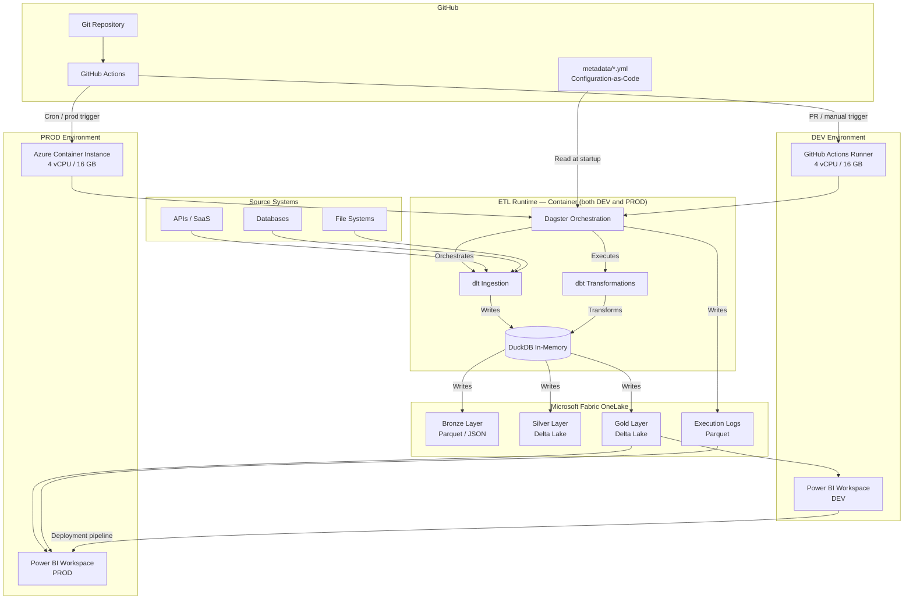
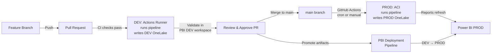
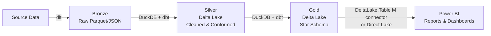
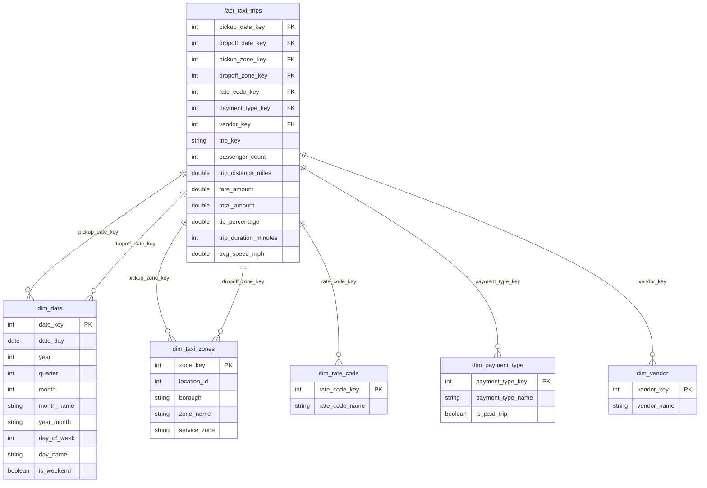

# The Modern Data Platform Handbook

## A Practical Guide to Building a Budget-Conscious, Metadata-Driven Data Platform

**Version 9.3 — 19 February 2026**


## Table of Contents

- [Part I — Platform Architecture](#part-i-platform-architecture)
  - [Chapter 1: Executive Summary](#chapter-1-executive-summary)
  - [Chapter 2: Architecture Overview](#chapter-2-architecture-overview)
  - [Chapter 3: Daily Execution Sequence](#chapter-3-daily-execution-sequence)
- [Part II — Component Deep Dives](#part-ii-component-deep-dives)
  - [Chapter 4: Storage — Microsoft Fabric OneLake](#chapter-4-storage-microsoft-fabric-onelake)
  - [Chapter 5: Compute — DuckDB](#chapter-5-compute-duckdb)
  - [Chapter 6: Transformation — dbt](#chapter-6-transformation-dbt)
  - [Chapter 7: Ingestion — dlt (data load tool)](#chapter-7-ingestion-dlt-data-load-tool)
  - [Chapter 8: Orchestration — Dagster](#chapter-8-orchestration-dagster)
  - [Chapter 9: Reporting — Power BI (Pro/PPU/Fabric)](#chapter-9-reporting-power-bi-proppufabric)
  - [Chapter 10: CI/CD & Runtime — GitHub Actions, Codespaces, and Azure Container Instances](#chapter-10-cicd-runtime-github-actions-codespaces-and-azure-container-instances)
  - [Chapter 11: Metadata — YAML Configuration and Parquet Execution Logs](#chapter-11-metadata-yaml-configuration-and-parquet-execution-logs)
  - [Chapter 12: Delete Handling in the Silver Layer](#chapter-12-delete-handling-in-the-silver-layer)
- [Part III — Working Example: NYC Yellow Taxi Datamart](#part-iii-working-example-nyc-yellow-taxi-datamart)
  - [Chapter 13: Dataset Overview](#chapter-13-dataset-overview)
  - [Chapter 14: Ingestion — dlt Pipeline](#chapter-14-ingestion-dlt-pipeline)
  - [Chapter 15: Transformation — dbt Models](#chapter-15-transformation-dbt-models)
  - [Chapter 16: Orchestration — Dagster](#chapter-16-orchestration-dagster)
  - [Chapter 17: Running the Full Pipeline](#chapter-17-running-the-full-pipeline)
- [Part IV — Operations and Evolution](#part-iv-operations-and-evolution)
  - [Chapter 18: Advantages and Limitations](#chapter-18-advantages-and-limitations)
  - [Chapter 19: Cost Breakdown](#chapter-19-cost-breakdown)
  - [Chapter 20: Upgrade Path](#chapter-20-upgrade-path)
  - [Chapter 21: Implementation Checklist](#chapter-21-implementation-checklist)
  - [Chapter 22: Operational Concerns](#chapter-22-operational-concerns)
  - [Chapter 23: The Data Engineering Dashboard](#chapter-23-the-data-engineering-dashboard)
- [Appendix A: VS Code Development Setup](#appendix-a-vs-code-development-setup)
- [Appendix B: Additional Resources](#appendix-b-additional-resources)
- [Appendix C: Alternative Orchestrator — Apache Hop](#appendix-c-alternative-orchestrator-apache-hop)

## Revision Notes

- **v9.3 (2026-02-19):** Editorial pass: TOC expanded to include Appendices A–C; cost figures reconciled to ~€80/month throughout; component count corrected to ten; duplicate section separator removed; minor prose improvements (parallel voice, word choice).
- **v9.2 (2026-02-19):** Gold serving layer converted from Parquet to Delta Lake. `gold_parquet_export` Dagster asset replaced with `gold_delta_export` (delta-rs `write_deltalake`). Chapter 9 Pattern B M connector refined with parameterized template and taxi-dataset concrete example. Chapter 17 gains a dedicated "Connecting Power BI" section with working M queries for each Gold table. Sample DuckDB queries in Chapter 17 updated to `delta_scan()`. Chapter 2 data-flow diagram and Chapter 4 folder structure updated to reflect `Gold Layer — Delta Lake`.
- **v9.1:** Introduced Delta serving pattern and removed reliance on a SQL endpoint. Rewrote Part III as a complete, runnable end-to-end taxi datamart example.

---

# Part I — Platform Architecture

---

## Chapter 1: Executive Summary

This handbook describes a modern, metadata-driven data platform designed for small companies seeking enterprise-grade capabilities on a minimal budget. The platform leverages primarily free-tier services and open-source tools to deliver a complete medallion architecture with comprehensive observability and governance.

The platform runs two separate environments — **DEV** (GitHub Actions runner) and **PROD** (Azure Container Instances) — each with 4 vCPU and 16 GB memory. Power BI uses matching **DEV** and **PROD** workspaces with a deployment pipeline for controlled artifact promotion. Pipeline metadata lives as YAML files in Git, not in a database — keeping configuration-as-code pure and eliminating an infrastructure dependency. The total monthly cost for a **3-user team** (1 developer, 2 analysts) is on the order of **~€80/month** (highly sensitive to Power BI licensing, Fabric capacity choices, and run frequency) — a fraction of what commercial alternatives like Snowflake, Databricks, or Fivetran would cost (€800–3,000/month for comparable functionality).

The architecture combines ten components into a cohesive stack:

| Layer | Technology | Cost | Purpose |
|-------|-----------|------|---------|
| Storage | Microsoft Fabric OneLake | Included with Power BI PPU | Data lake (Bronze, Silver, Gold) |
| Compute | DuckDB | Free (open source) | In-process analytical engine |
| Transformation | dbt-core + dbt-duckdb | Free (open source) | SQL-based transformations |
| Ingestion | dlt (data load tool) | Free (open source) | Python-based ELT pipelines |
| Orchestration | Dagster | Free (open source) | Python-native orchestration with built-in UI |
| Reporting | Power BI Pro / PPU (or Fabric capacity) | Pro €12,10 / PPU €20,80 per user/month (annual billing, NL list; verify for your tenant) | Business intelligence (DEV + PROD workspaces) |
| DEV Runtime | GitHub Actions runner (4 vCPU, 16 GB) | Included with GitHub Pro | Automated DEV pipeline on PR |
| PROD Runtime | Azure Container Instances (4 vCPU, 16 GB) | ~€7/month | Production pipeline execution |
| CI/CD | GitHub Actions + GitHub Pro | €5/user/month | Automation, version control |
| Metadata | YAML files in Git + JSON execution logs | Free | Configuration and observability |

This handbook is structured in four parts: Part I covers the overall platform architecture and design decisions. Part II examines each component in depth, including Silver layer delete handling patterns. Part III provides a complete, end-to-end working example building a taxi analytics datamart using the NYC Yellow Taxi dataset — exercising every component in the stack (dlt, Dagster, dbt, DuckDB, Delta Lake). Part IV covers operational concerns, cost analysis, and upgrade paths.

### Scope and Assumptions

This handbook is an **architecture blueprint**, not a turnkey repository you can clone and run. It documents the design decisions, component interactions, and implementation patterns for a modern data platform at small-company scale. The NYC Yellow Taxi dataset example (Part III) is fully concrete and runnable. The ERP examples used throughout the handbook (inventory, sales orders, products) are **illustrative** — they demonstrate patterns like tag-based scheduling and multi-source ingestion, but are not backed by a working ERP connector.

A few areas deserve particular attention during implementation:

**DuckDB ↔ OneLake ↔ Delta Lake integration.** This is the most novel part of the stack and the area where you will spend the most implementation effort. DuckDB's `azure` extension for ABFS authentication, Delta Lake writes from dbt-duckdb to OneLake, and a Lakehouse SQL endpoint for Power BI DirectQuery — these components work, but the integration pattern is not yet broadly validated in production across the community. Test this path thoroughly in your DEV environment before committing to it.

**Azure Container Instances.** ACI is a straightforward, low-cost container runtime that works well for this use case — per-second billing, 4 vCPU / 16 GB, no cluster management. However, Microsoft is increasingly positioning **Azure Container Apps** (ACA) for new workloads. Note that ACA's default Consumption plan is limited to 4 vCPU / 8 GB — not enough for this pipeline. To get 16 GB on ACA, you need a **D4 dedicated workload profile**, which changes the billing model (per-node instead of per-second). For a batch job running ~1 hour/day, ACI is likely cheaper and simpler. Chapter 10 discusses this trade-off and lists alternative container runtimes on other clouds.

**Security and networking.** This handbook focuses on architecture and data engineering patterns. It does not cover network security (VNet integration, private endpoints, NSGs), identity governance beyond service principal basics, or data classification and encryption at rest. For a production deployment handling sensitive data, layer these controls on top of the architecture described here. The Azure Well-Architected Framework provides comprehensive guidance.

**Log collection in ephemeral containers.** The Data Engineering Dashboard (Chapter 23) reads native JSON logs from each component — dbt's `run_results.json`, Dagster event logs, and dlt run summaries. In the ACI ephemeral container pattern, these files must be copied to OneLake before the container terminates. The `run_pipeline.sh` script handles this, but if the pipeline crashes before reaching the log upload step, the logs for that failed run will only be available in the ACI container logs (retrieved by the GitHub Actions workflow).

---

## Chapter 2: Architecture Overview

The platform follows a medallion architecture (Bronze → Silver → Gold) within Microsoft Fabric OneLake. Data flows from source systems through dlt ingestion pipelines into the Bronze landing zone; DuckDB and dbt process it through the Silver and Gold layers; and Power BI consumes it for reporting.

The platform runs two parallel environments. The **DEV environment** runs directly on the GitHub Actions runner (4 vCPU, 16 GB) when a pull request is opened or manually triggered — no Codespace SSH indirection needed. The **PROD environment** uses Azure Container Instances (4 vCPU, 16 GB) for the scheduled daily ETL run. Both environments share the same codebase — only the runtime and target OneLake paths differ. Power BI mirrors this with separate DEV and PROD workspaces and a deployment pipeline for controlled promotion.

Pipeline metadata (source definitions, model configuration, quality rules) lives as YAML files in Git. No external metadata database is needed — Git history provides the full audit trail, and the PR workflow provides governance. Execution logs are written as Parquet files to OneLake, where Power BI reads them for pipeline health dashboards.

### Architecture Diagram



### Development Cycle — DEV to PROD

The development workflow follows a structured path from code change to production deployment. Developers work in feature branches, test in the DEV environment via GitHub Codespaces, merge to main, and GitHub Actions automatically deploys to PROD via ACI. Power BI artifacts follow a separate promotion path through Power BI deployment pipelines.



### Data Flow — Medallion Layers



---

## Chapter 3: Daily Execution Sequence

The platform runs multiple schedules defined by dbt tags. Each schedule triggers the same pipeline with a different `RUN_TAGS` value, running only the dlt sources and dbt models relevant to that schedule.

### PROD — Nightly Full Run (ACI, tag: nightly)

GitHub Actions fires a cron trigger at 02:00 UTC, creates an ACI container (4 vCPU, 16 GB), and runs all models tagged `nightly` — which is the complete data model:

| Step | Time | Component | Action |
|------|------|-----------|--------|
| 1 | 02:00 | GitHub Actions | Cron trigger fires, resolves to tag `nightly` |
| 2 | 02:01 | ACI (4 vCPU, 16 GB) | Container starts with RUN_TAGS=nightly |
| 3 | 02:02 | Dagster | Resolves `nightly_full_refresh` job, selects all assets |
| 4 | 02:03 | dlt | Ingests all source systems into Bronze |
| 5 | 02:15 | dbt | `dbt run --select tag:nightly` (all staging + marts) |
| 6 | 02:35 | dbt | `dbt test --select tag:nightly` |
| 7 | 02:50 | Pipeline | Execution logs written as Parquet to OneLake |
| 8 | 03:00 | ACI | Container deleted |
| 9 | 08:00+ | Power BI PROD | All reports refreshed with latest data |

### PROD — Intraday Inventory (ACI, tag: intraday_inventory)

Every 4 hours (06:00, 10:00, 14:00, 18:00 UTC), a lighter run refreshes only inventory-related data and its surrounding dimensions:

| Step | Time | Component | Action |
|------|------|-----------|--------|
| 1 | 06:00 | GitHub Actions | Cron trigger fires, resolves to tag `intraday_inventory` |
| 2 | 06:01 | ACI | Container starts with RUN_TAGS=intraday_inventory |
| 3 | 06:02 | Dagster | Resolves `intraday_inventory_refresh` job, selects 4 sources |
| 4 | 06:03 | dlt | Ingests only: inventory_transactions, products, storage_locations, warehouses |
| 5 | 06:08 | dbt | `dbt run --select tag:intraday_inventory` (inventory staging + dims + fact) |
| 6 | 06:12 | dbt | `dbt test --select tag:intraday_inventory` |
| 7 | 06:14 | Pipeline | Execution logs written |
| 8 | 06:15 | ACI | Container deleted (~15 min runtime vs ~60 min nightly) |
| 9 | 06:30+ | Power BI PROD | Inventory dashboards refreshed |

The intraday run is significantly faster because it only processes inventory-related sources and models. ACI billing is per-second, so the shorter runtime (~15 min) costs roughly one-quarter of the nightly run.

### DEV — On-Demand Testing (GitHub Actions Runner)

The DEV pipeline runs directly on the GitHub Actions runner (4 vCPU, 16 GB). Developers can specify which tag to test:

| Step | Trigger | Component | Action |
|------|---------|-----------|--------|
| 1 | PR / Manual | GitHub Actions | Workflow dispatch with optional tag input |
| 2 | ~2 min | Actions Runner | Installs Python, Java, Hop, dependencies |
| 3 | ~1 min | Dagster | Resolves job for selected tag + DEV environment |
| 4–7 | ~15–30 min | dlt → dbt | ETL cycle against DEV OneLake (scope depends on tag) |
| 8 | After run | Power BI DEV | Developer validates reports against DEV data |
| 9 | After validation | GitHub | PR approved and merged to main |

Interactive development (exploring data in DuckDB CLI, iterating on dbt models, debugging dlt pipelines) is done in a GitHub Codespace. The Codespace is configured with the same dependencies via `devcontainer.json` and provides a full VS Code environment. It is not used for automated pipeline runs.

---

# Part II — Component Deep Dives

---

## Chapter 4: Storage — Microsoft Fabric OneLake

OneLake is the unified data lake that underpins the entire platform. Think of it as the "OneDrive for data" — a single storage layer shared across the Fabric ecosystem. In this architecture, OneLake serves as the persistent file system for all three medallion layers.

### Why OneLake

The primary reason for choosing OneLake is economic: it comes included with Power BI Premium Per User licenses. Since you already need Power BI PPU for reporting, the storage is effectively free. OneLake supports direct Parquet and Delta Lake file access through the Azure Blob Filesystem (ABFS) protocol, which means DuckDB and dbt can read and write files using standard cloud storage paths.

### Folder Structure

```
abfss://<workspace>@onelake.dfs.fabric.microsoft.com/<item>.<itemtype>/Files/  # OneLake via ABFS (example)
├── bronze/
│   ├── nyc_taxi/
│   │   ├── yellow_tripdata_2025-01.parquet
│   │   ├── yellow_tripdata_2025-02.parquet
│   │   └── yellow_tripdata_2025-03.parquet
│   └── other_source/
│       └── ...
├── silver/
│   ├── silver_taxi_trips/       (Delta table — SCD2 insert-only)
│   └── silver_taxi_zones/       (Delta table — SCD2 insert-only)
├── gold/
│   ├── fact_taxi_trips/     (Delta table — Power BI M connector or Direct Lake)
│   ├── dim_taxi_zones/      (Delta table — Power BI M connector or Direct Lake)
│   ├── dim_date/            (Delta table — Power BI M connector or Direct Lake)
│   ├── dim_rate_code/       (Delta table — Power BI M connector or Direct Lake)
│   ├── dim_payment_type/    (Delta table — Power BI M connector or Direct Lake)
│   └── dim_vendor/          (Delta table — Power BI M connector or Direct Lake)
└── logs/
    ├── dagster/                  # Dagster event JSON logs
    │   └── 2025-01-15/events_001.json
    ├── dbt/                      # dbt run_results.json per invocation
    │   └── 2025-01-15/run_results.json
    └── dlt/                      # dlt pipeline run summaries
        └── 2025-01-15/run_001.json
└── warehouse/
    └── executions/               # Delta Lake star schema (Chapter 23)
        ├── dim_tool/
        ├── dim_workload/
        ├── dim_execution_status/
        ├── dim_environment/
        ├── dim_trigger/
        ├── dim_date/
        ├── dim_time_minute/
        └── fact_execution/
```

### Access Pattern

All access to OneLake happens through an Azure App Registration (service principal). The service principal is granted Contributor access to the Fabric workspace. Credentials are stored as GitHub Actions secrets and injected into the container environment at runtime. DuckDB connects to OneLake through the Azure extension to read and write files directly — Parquet for Bronze and Delta Lake (via delta-rs) for Silver and Gold.

> **Implementation note:** The DuckDB → ABFS → OneLake → Delta Lake path is the most integration-heavy part of this architecture. DuckDB's `azure` extension, ABFS authentication via service principal, and Delta Lake writes via delta-rs all work, but this specific combination is newer than traditional cloud warehouse setups. Allocate extra time for testing authentication, file locking behavior, and Delta Lake transaction log compatibility. A practical sequencing strategy: validate the Bronze Parquet writes and basic dbt → DuckDB flow first, then layer in the Silver Delta export (dbt Python models), and finally confirm Gold Delta export and Power BI connectivity end to end.

---

## Chapter 5: Compute — DuckDB

DuckDB is the analytical engine at the heart of the platform. It runs as an in-process database — no server to manage, no cluster to provision, no always-on warehouse cost; compute is ephemeral and pay-per-use. Despite its simplicity, DuckDB delivers remarkable performance on analytical workloads, processing millions of rows per second on a single core.

### Why DuckDB

DuckDB occupies the sweet spot for small-company analytics. It reads and writes Parquet and Delta Lake files natively, which means it integrates directly with the OneLake storage layer. There is no ETL between storage and compute — DuckDB queries the files directly without loading them into a separate system. For datasets that fit in memory (up to several hundred GB on modern hardware), DuckDB outperforms many distributed systems simply because it avoids the overhead of network communication and query coordination.

### Integration with dbt

DuckDB integrates with dbt through the `dbt-duckdb` adapter. This means all transformation logic is written in standard SQL, managed in Git, and executed locally by DuckDB. The dbt models create views and tables inside a DuckDB database file; a Dagster asset then reads those tables and writes each one as a Delta Lake table for the Gold layer.

### Extensions

DuckDB extensions are critical for this architecture:

```sql
INSTALL azure;   -- Azure Blob / OneLake access
INSTALL delta;   -- Delta Lake read support (writes via delta-rs in Python)
INSTALL httpfs;  -- HTTP(S) file access
LOAD azure;
LOAD delta;
LOAD httpfs;
```

---

## Chapter 6: Transformation — dbt

dbt (data build tool) provides the transformation framework. It brings software engineering practices — version control, testing, documentation, modularity — to SQL-based data transformations.

### Project Structure

```
dbt_project/
├── dbt_project.yml           # Project configuration
├── profiles.yml              # Connection profiles (DuckDB)
├── packages.yml              # Package dependencies
├── models/
│   ├── staging/              # Bronze → Silver (1:1 with sources)
│   │   ├── _staging.yml      # Source and model definitions
│   │   ├── stg_taxi_trips.sql
│   │   └── stg_taxi_zones.sql
│   ├── silver/               # SCD2 historized Delta Lake
│   └── marts/                # Silver → Gold (business models)
│       ├── dim_date.sql
│       ├── dim_taxi_zones.sql
│       ├── dim_rate_code.sql
│       ├── dim_payment_type.sql
│       ├── dim_vendor.sql
│       └── fact_taxi_trips.sql
├── macros/
│   └── generate_hash.sql     # Row hash macro for CDC
└── tests/
    └── assert_positive_fares.sql
```

### Hash-Based Change Detection

For change detection between loads, the platform uses a dual-hash approach. A business key hash identifies a unique record across loads, while a separate row hash detects whether any attribute value has changed. Column names are included in the hash string to detect schema changes — an important safeguard when working with wide tables.

```sql
-- macros/generate_hash.sql

    SHA1(
        CONCAT_WS('|',
            
            '{{ col }}', COALESCE(CAST({{ col }} AS VARCHAR), '^^NULL^^')
            , 
            
        )
    )

```

For wide tables (300+ columns), `CONCAT_WS()` is used because it handles NULLs automatically (treating them as empty strings) and avoids the argument limits and NULL-propagation issues of the `+` operator.

### Tag-Based Run Definitions

In real-world data platforms, not every model needs to run on the same schedule. A full refresh of all source systems might run nightly, but high-frequency data like inventory positions may need refreshing every 4 hours — along with the surrounding dimension tables that the inventory fact depends on.

> **Note:** The ERP examples below (inventory, products, storage locations, sales orders) are illustrative — they demonstrate the tag-based scheduling pattern using a realistic scenario. The NYC Yellow Taxi dataset in Part III is the runnable reference implementation. Apply the same tagging pattern to your actual source systems.

dbt tags solve this problem. By tagging models with schedule identifiers, you can run different subsets of the dbt project at different frequencies, all from the same codebase. The pipeline script passes the tag to `dbt run --select tag:<tag>`, and dbt handles the rest.

#### Defining Tags in dbt Models

Tags are assigned either in the model's YAML definition or in the model's `config` block. The YAML approach is preferred because it keeps the schedule metadata in one visible place:

```yaml
# dbt_project/models/staging/_staging.yml
version: 2

sources:
  - name: erp
    description: ERP source system (SAP)
    schema: bronze_erp
    tables:
      - name: sales_orders
      - name: purchase_orders
      - name: inventory_transactions
      - name: products
      - name: storage_locations
      - name: warehouses
      - name: customers
      - name: vendors

models:
  # ── Nightly-only models (full ERP sync) ──
  - name: stg_erp_sales_orders
    tags: [nightly]
    description: Cleaned sales order headers and lines

  - name: stg_erp_purchase_orders
    tags: [nightly]
    description: Cleaned purchase order records

  - name: stg_erp_customers
    tags: [nightly]
    description: Customer master data

  - name: stg_erp_vendors
    tags: [nightly]
    description: Vendor master data

  # ── Intraday models (inventory + surrounding dimensions) ──
  - name: stg_erp_inventory_transactions
    tags: [nightly, intraday_inventory]
    description: Inventory movement records (receipts, issues, transfers)

  - name: stg_erp_products
    tags: [nightly, intraday_inventory]
    description: Product master — needed for inventory context

  - name: stg_erp_storage_locations
    tags: [nightly, intraday_inventory]
    description: Storage location master — needed for inventory context

  - name: stg_erp_warehouses
    tags: [nightly, intraday_inventory]
    description: Warehouse master — needed for inventory context
```

```yaml
# dbt_project/models/marts/_marts.yml
version: 2

models:
  # ── Nightly-only mart models ──
  - name: dim_customer
    tags: [nightly]
    description: Customer dimension

  - name: dim_vendor
    tags: [nightly]
    description: Vendor dimension

  - name: fact_sales
    tags: [nightly]
    description: Sales order fact table
    tests:
      - dbt_expectations.expect_row_count_to_be_between:
          min_value: 100

  - name: fact_purchases
    tags: [nightly]
    description: Purchase order fact table

  # ── Intraday mart models (inventory + surrounding dims) ──
  - name: dim_product
    tags: [nightly, intraday_inventory]
    description: Product dimension — refreshed with inventory

  - name: dim_storage_location
    tags: [nightly, intraday_inventory]
    description: Storage location dimension — refreshed with inventory

  - name: dim_warehouse
    tags: [nightly, intraday_inventory]
    description: Warehouse dimension — refreshed with inventory

  - name: fact_inventory
    tags: [nightly, intraday_inventory]
    description: Current inventory position per product/location
    tests:
      - dbt_expectations.expect_column_values_to_be_between:
          column_name: quantity_on_hand
          min_value: 0
          mostly: 0.99
```

#### How Tag Selection Works

The key insight is that a model can have **multiple tags**. The `fact_inventory` model is tagged with both `nightly` and `intraday_inventory`, so it runs in both schedules. The surrounding dimensions (`dim_product`, `dim_storage_location`, `dim_warehouse`) are also dual-tagged — because if inventory is refreshed, its dimensional context must be refreshed too.

```bash
# Nightly: runs EVERY model in the project (all tags)
dbt run --target prod --select tag:nightly
# This runs: stg_erp_sales_orders, stg_erp_purchase_orders, stg_erp_customers,
#            stg_erp_vendors, stg_erp_inventory_transactions, stg_erp_products,
#            stg_erp_storage_locations, stg_erp_warehouses,
#            dim_customer, dim_vendor, dim_product, dim_storage_location,
#            dim_warehouse, fact_sales, fact_purchases, fact_inventory

# Intraday (every 4 hours): runs ONLY inventory-related models
dbt run --target prod --select tag:intraday_inventory
# This runs: stg_erp_inventory_transactions, stg_erp_products,
#            stg_erp_storage_locations, stg_erp_warehouses,
#            dim_product, dim_storage_location, dim_warehouse,
#            fact_inventory
```

#### Defining Tags in dbt_project.yml

You can also set default tags per directory, so you do not have to tag every model individually:

```yaml
# dbt_project.yml
name: data_platform
version: '1.0.0'

models:
  data_platform:
    staging:
      +materialized: view
      erp:
        # All ERP staging models get the nightly tag by default
        +tags: [nightly]
        # Override specific models for intraday in their YAML definition
    marts:
      +materialized: table
```

When a model has tags defined both in `dbt_project.yml` and in the model YAML, dbt **merges** them. So a model in the `staging/erp/` directory automatically gets `nightly`, and if the YAML also specifies `intraday_inventory`, it ends up with both tags.

#### Visualizing the Tag Strategy

A well-designed tag strategy mirrors your business refresh requirements:

| Tag | Schedule | What Runs | Why |
|-----|----------|-----------|-----|
| `nightly` | 02:00 UTC daily | All models (full ERP + all dims + all facts) | Complete data refresh, all reports up to date |
| `intraday_inventory` | Every 4h (06:00, 10:00, 14:00, 18:00) | Inventory transactions + product, storage location, warehouse dims + fact_inventory | Warehouse operations need near-current stock levels |
| `intraday_sales` | Every 2h (future) | Sales orders + customer dim + fact_sales | If sales dashboards need fresher data later |

Additional tags can be added over time without changing the pipeline architecture — just tag the models, add a schedule in the metadata, and create a GitHub Actions cron entry.

#### Testing with Tags

Tests inherit the tags of the model they belong to. When running `dbt test --select tag:intraday_inventory`, only tests on inventory-related models execute:

```bash
# Test only what was refreshed
dbt test --target prod --select tag:intraday_inventory

# Test everything (nightly validation)
dbt test --target prod --select tag:nightly
```

---

## Chapter 7: Ingestion — dlt (data load tool)

dlt is a lightweight Python library for building data ingestion pipelines. It handles schema inference, incremental loading, data type mapping, and error handling with minimal code.

### Why dlt

dlt sits between writing raw Python requests and deploying a full managed connector platform like Fivetran. It provides automatic schema inference, built-in incremental loading with state management, and flexible destinations (Parquet files, databases, cloud storage). For this architecture, it writes Parquet files directly to the Bronze layer in OneLake.

### Pipeline Structure

```python
# pipelines/nyc_taxi_pipeline.py
import dlt
from dlt.sources.rest_api import rest_api_source

@dlt.source
def nyc_taxi_source(start_year: int = 2024, start_month: int = 1):
    """Source that yields NYC Yellow Taxi trip data month by month."""

    @dlt.resource(
        name="yellow_taxi_trips",
        write_disposition="append",
        primary_key=["pickup_datetime", "dropoff_datetime",
                      "pickup_location_id", "dropoff_location_id"]
    )
    def yellow_taxi_trips(
        last_month=dlt.sources.incremental(
            "pickup_month", initial_value=f"{start_year}-{start_month:02d}"
        )
    ):
        """Load yellow taxi trips from TLC Parquet files."""
        import pandas as pd
        from datetime import datetime, timedelta

        base_url = "https://d37ci6vzurychx.cloudfront.net/trip-data"
        current = datetime.now()
        latest_available = current - timedelta(days=60)

        load_year, load_month = map(int, last_month.last_value.split("-"))

        while (load_year < latest_available.year or
               (load_year == latest_available.year and
                load_month <= latest_available.month)):

            url = f"{base_url}/yellow_tripdata_{load_year}-{load_month:02d}.parquet"
            try:
                df = pd.read_parquet(url)
                df["pickup_month"] = f"{load_year}-{load_month:02d}"
                df["_loaded_at"] = datetime.now().isoformat()
                yield df.to_dict(orient="records")
            except Exception as e:
                print(f"Skipping {load_year}-{load_month:02d}: {e}")

            load_month += 1
            if load_month > 12:
                load_month = 1
                load_year += 1

    return yellow_taxi_trips


def run_pipeline():
    pipeline = dlt.pipeline(
        pipeline_name="nyc_taxi",
        destination="filesystem",
        dataset_name="bronze/nyc_taxi"
    )
    load_info = pipeline.run(nyc_taxi_source())
    print(load_info)
```

---

## Chapter 8: Orchestration — Dagster

Dagster is the orchestration layer that ties all the pieces together. It is a Python-native orchestration framework built around the concept of **software-defined assets** — data artifacts declared as Python functions with explicit dependencies. Dagster has first-class integrations with both dbt (`dagster-dbt`) and dlt (`dagster-dlt`), making it a natural fit for this stack.

### Why Dagster

Dagster takes a code-first approach: pipelines are defined as Python functions decorated with `@asset`, `@job`, and `@schedule`. This makes orchestration logic reviewable in PRs, testable with pytest, and free from external runtime dependencies like Java. Since the rest of the stack (dlt, dbt, DuckDB) is already Python-based, Dagster adds no new language or runtime to the mix.

The most significant benefit for daily use is automatic lineage. When `dagster-dbt` parses the dbt manifest, every `ref()` call becomes a dependency edge in Dagster's asset graph. When dlt assets feed into dbt staging models, Dagster understands the full Bronze → Silver → Gold flow — without manual wiring. The built-in Dagster UI renders this lineage as an interactive, zoomable graph.

### Project Structure

Dagster's orchestration code lives in an `orchestration/` directory alongside the existing dlt and dbt code:

```
data-platform/
├── orchestration/                # Dagster definitions
│   ├── __init__.py
│   ├── definitions.py            # Main entry point
│   ├── assets/
│   │   ├── __init__.py
│   │   ├── dlt_assets.py         # dlt sources as Dagster assets
│   │   └── dbt_assets.py         # dbt models as Dagster assets
│   ├── schedules.py              # Tag-based schedule definitions
│   ├── resources.py              # OneLake, DuckDB resource config
│   └── sensors.py                # Optional: event-driven triggers
├── pipelines/                    # dlt ingestion scripts (unchanged)
├── dbt_project/                  # dbt models (unchanged)
├── metadata/                     # YAML configuration (unchanged)
└── run_pipeline.sh               # Calls dagster job execute
```

### Defining Assets — dlt Ingestion

Each dlt source becomes a Dagster asset. The `@asset` decorator declares what data the function produces, and Dagster tracks its materialization state. Tags control which schedules include the asset:

```python
# orchestration/assets/dlt_assets.py
"""dlt ingestion sources as Dagster assets."""
import os
import yaml
import dlt
from dagster import asset, AssetExecutionContext
from pathlib import Path


def load_sources() -> list[dict]:
    """Read active sources from metadata."""
    with open(Path("metadata/sources.yml")) as f:
        data = yaml.safe_load(f)
    return [s for s in data["sources"] if s.get("enabled", True)]


@asset(
    group_name="bronze",
    tags={"schedule": "nightly"},
    description="NYC Yellow Taxi trip data — Bronze layer",
)
def bronze_nyc_taxi(context: AssetExecutionContext) -> None:
    """Ingest NYC taxi data using dlt into Bronze."""
    env = os.environ.get("ENVIRONMENT", "dev")
    context.log.info(f"Ingesting NYC taxi data to {env}/bronze")

    pipeline = dlt.pipeline(
        pipeline_name="nyc_taxi",
        destination="filesystem",
        dataset_name=f"{env}/bronze/taxi",
    )
    from pipelines.ingest_taxi import taxi_source
    info = pipeline.run(taxi_source())
    context.log.info(f"Loaded {info.loads_ids}")


@asset(
    group_name="bronze",
    tags={"schedule": "nightly,intraday_inventory"},
    description="ERP inventory transactions — Bronze layer (refreshed every 4h)",
)
def bronze_erp_inventory(context: AssetExecutionContext) -> None:
    """Ingest ERP inventory transactions using dlt."""
    env = os.environ.get("ENVIRONMENT", "dev")
    pipeline = dlt.pipeline(
        pipeline_name="erp_inventory",
        destination="filesystem",
        dataset_name=f"{env}/bronze/erp/inventory_transactions",
    )
    from pipelines.ingest import erp_inventory_source
    pipeline.run(erp_inventory_source())


@asset(
    group_name="bronze",
    tags={"schedule": "nightly,intraday_inventory"},
    description="ERP product master — Bronze layer (refreshed with inventory)",
)
def bronze_erp_products(context: AssetExecutionContext) -> None:
    """Ingest ERP product master."""
    env = os.environ.get("ENVIRONMENT", "dev")
    pipeline = dlt.pipeline(
        pipeline_name="erp_products",
        destination="filesystem",
        dataset_name=f"{env}/bronze/erp/products",
    )
    from pipelines.ingest import erp_products_source
    pipeline.run(erp_products_source())


@asset(
    group_name="bronze",
    tags={"schedule": "nightly,intraday_inventory"},
    description="ERP storage locations — Bronze layer",
)
def bronze_erp_storage_locations(context: AssetExecutionContext) -> None:
    """Ingest ERP storage location master."""
    env = os.environ.get("ENVIRONMENT", "dev")
    pipeline = dlt.pipeline(
        pipeline_name="erp_storage_locations",
        destination="filesystem",
        dataset_name=f"{env}/bronze/erp/storage_locations",
    )
    from pipelines.ingest import erp_storage_locations_source
    pipeline.run(erp_storage_locations_source())


@asset(
    group_name="bronze",
    tags={"schedule": "nightly"},
    description="ERP sales orders — Bronze layer (nightly only)",
)
def bronze_erp_sales_orders(context: AssetExecutionContext) -> None:
    """Ingest ERP sales orders."""
    env = os.environ.get("ENVIRONMENT", "dev")
    pipeline = dlt.pipeline(
        pipeline_name="erp_sales",
        destination="filesystem",
        dataset_name=f"{env}/bronze/erp/sales_orders",
    )
    from pipelines.ingest import erp_sales_source
    pipeline.run(erp_sales_source())
```

Assets tagged `nightly,intraday_inventory` run in both the nightly full run and the 4-hourly inventory refresh — mirroring the dbt tag strategy from Chapter 6.

> **Note:** The ERP asset definitions above are illustrative — they show the pattern for multi-source, multi-schedule ingestion. Replace the `erp_*_source()` functions with your actual source connectors. The `bronze_nyc_taxi` asset corresponds to the working example in Part III.

### Defining Assets — dbt Models

The `dagster-dbt` integration automatically maps every dbt model to a Dagster asset by parsing the dbt manifest. Dependencies between models (via `ref()` calls) become asset dependencies. Tags from the dbt YAML definitions are preserved:

```python
# orchestration/assets/dbt_assets.py
"""dbt models as Dagster assets via dagster-dbt."""
import os
from pathlib import Path
from dagster import AssetExecutionContext
from dagster_dbt import DbtCliResource, dbt_assets, DbtProject

dbt_project = DbtProject(project_dir=Path("dbt_project"))
dbt_project.prepare_if_dev()


@dbt_assets(manifest=dbt_project.manifest_path)
def all_dbt_assets(context: AssetExecutionContext, dbt: DbtCliResource):
    """All dbt models exposed as Dagster assets.

    Dagster reads the dbt manifest and creates one asset per model.
    Dependencies between models (ref() calls) become asset dependencies.
    Tags from the dbt YAML definitions are preserved.
    """
    env = os.environ.get("ENVIRONMENT", "dev")
    yield from dbt.cli(["run", "--target", env], context=context).stream()
```

That is the entire dbt integration — `dagster-dbt` handles the rest. Every staging model, dimension, and fact table from your dbt project appears as a node in the Dagster asset graph with correct dependencies.

### Schedules — Tag-Based Run Definitions

Dagster schedules replace the GitHub Actions cron-to-tag mapping. The `nightly` schedule runs all assets, while `intraday_inventory` runs only inventory-related assets:

```python
# orchestration/schedules.py
"""Schedule definitions mapping to dbt tags."""
from dagster import ScheduleDefinition, define_asset_job, AssetSelection

# ── Nightly: all assets ──
nightly_job = define_asset_job(
    name="nightly_full_refresh",
    selection=AssetSelection.all(),
    description="Full nightly refresh — all sources, all models",
)

nightly_schedule = ScheduleDefinition(
    job=nightly_job,
    cron_schedule="0 2 * * *",  # 02:00 UTC daily
    name="nightly_schedule",
    default_status="RUNNING",
)

# ── Intraday inventory: inventory-related assets only ──
intraday_inventory_job = define_asset_job(
    name="intraday_inventory_refresh",
    selection=(
        AssetSelection.assets(
            "bronze_erp_inventory",
            "bronze_erp_products",
            "bronze_erp_storage_locations",
        )
        | AssetSelection.tag("schedule", "nightly,intraday_inventory")
    ),
    description="Intraday inventory — inventory sources + related dims + fact",
)

intraday_schedule = ScheduleDefinition(
    job=intraday_inventory_job,
    cron_schedule="0 6,10,14,18 * * *",  # Every 4 hours
    name="intraday_inventory_schedule",
    default_status="RUNNING",
)
```

### Resources and Definitions Entry Point

```python
# orchestration/resources.py
"""Dagster resource definitions."""
import os
from dagster_dbt import DbtCliResource
from pathlib import Path

environment = os.environ.get("ENVIRONMENT", "dev")

dbt_resource = DbtCliResource(
    project_dir=Path("dbt_project"),
    target=environment,
)
```

```python
# orchestration/definitions.py
"""Main Dagster definitions — the single entry point."""
from dagster import Definitions, load_assets_from_modules

from orchestration.assets import dlt_assets, dbt_assets
from orchestration.schedules import (
    nightly_job, nightly_schedule,
    intraday_inventory_job, intraday_schedule,
)
from orchestration.resources import dbt_resource

all_assets = load_assets_from_modules([dlt_assets, dbt_assets])

defs = Definitions(
    assets=all_assets,
    jobs=[nightly_job, intraday_inventory_job],
    schedules=[nightly_schedule, intraday_schedule],
    resources={"dbt": dbt_resource},
)
```

### Visualizing DAGs in the Dagster UI

Unlike tools that require you to draw pipelines in a GUI, Dagster generates visualizations automatically from your Python code. The Dagster UI is a web application for observing and operating your pipelines.

#### Starting the UI

```bash
# Local development (Codespace or local machine)
dagster dev -m orchestration.definitions
# Opens at http://localhost:3000
```

In the Codespace, forward port 3000 to access the UI in your browser. In production (ACI), the UI is not needed — Dagster runs headless via `dagster job execute`.

#### The Asset Graph

The **Asset Graph** is Dagster's primary visualization. It renders every asset (dlt source, dbt model) as a node, with directed edges showing data dependencies. The graph is generated automatically from the code.

What you see in the asset graph:

- **Bronze assets** (dlt ingestion) appear as root nodes at the top: `bronze_nyc_taxi`, `bronze_erp_inventory`, `bronze_erp_products`, etc.
- **Staging models** (dbt) appear as the next layer, connected to their Bronze sources.
- **Dimension and fact models** fan out from staging: `fact_inventory` depends on `dim_product`, `dim_storage_location`, `dim_warehouse`, and `stg_erp_inventory_transactions`.
- **Color coding** shows materialization status: green (up to date), grey (never materialized), yellow (stale — upstream changed since last run).
- **Filtering by tag** lets you isolate the `intraday_inventory` subgraph, showing only inventory-related assets and their dependencies.

The asset graph for the inventory schedule looks like this:

```
bronze_erp_inventory ──→ stg_erp_inventory_transactions ──┐
bronze_erp_products ───→ stg_erp_products ──→ dim_product ──┤
bronze_erp_storage  ───→ stg_erp_storage  ──→ dim_storage ──┼──→ fact_inventory
bronze_erp_warehouses → stg_erp_warehouses → dim_warehouse ─┘
```

In the Dagster UI, this is an interactive, zoomable graph where clicking any node shows its metadata, run history, and logs.

#### Run Timeline and Launchpad

The **Runs** tab shows a timeline of all pipeline executions with duration, status (success/failure/in-progress), and which assets were materialized. You can filter by job name or time range.

The **Launchpad** lets you manually trigger runs with custom configuration — equivalent to `workflow_dispatch` in GitHub Actions. Select the job (`nightly_full_refresh` or `intraday_inventory_refresh`), override parameters, and launch.

#### Freshness Monitoring

Dagster tracks freshness policies for assets. Define expectations like "fact_inventory should be materialized within the last 4 hours" and the UI alerts when an asset goes stale:

```python
from dagster import FreshnessPolicy

@asset(
    group_name="marts",
    tags={"schedule": "nightly,intraday_inventory"},
    freshness_policy=FreshnessPolicy(maximum_lag_minutes=240),  # 4 hours
)
def fact_inventory(context: AssetExecutionContext) -> None:
    ...
```

The **Asset Health** dashboard shows all assets with their freshness status — green if within policy, red if stale. This provides built-in monitoring that complements the execution observability star schema described in Chapter 23.

### Testing Dagster Pipelines

Dagster assets can be tested with pytest using in-memory materialization — no external systems needed:

```python
# tests/test_assets.py
from dagster import materialize_to_memory
from orchestration.assets.dlt_assets import bronze_erp_inventory


def test_bronze_erp_inventory_runs():
    """Verify the inventory ingestion asset executes without errors."""
    result = materialize_to_memory(assets=[bronze_erp_inventory])
    assert result.success


def test_nightly_job_includes_all_assets():
    """Verify the nightly job selects all expected assets."""
    from orchestration.schedules import nightly_job
    # Job selection should include all bronze and dbt assets
    assert nightly_job.selection is not None
```

### CLI Execution (Production)

In production, Dagster runs headless — no UI needed. The `run_pipeline.sh` script calls `dagster job execute`:

```bash
# Nightly full run
dagster job execute -m orchestration.definitions -j nightly_full_refresh

# Intraday inventory
dagster job execute -m orchestration.definitions -j intraday_inventory_refresh
```

---

## Chapter 9: Reporting — Power BI (Pro/PPU/Fabric)

Power BI is the consumption layer where business users explore curated datasets, build reports, and operationalize KPIs.

This handbook uses **dbt-authored Gold models** and a **Delta serving schema** for Power BI:
- Gold models are authored and tested in dbt (DuckDB).
- A small “serving” export step writes the **published tables** as **Delta tables** in OneLake (or ADLS Gen2).
- Power BI connects to those Delta tables **without relying on a Lakehouse SQL endpoint**.

### Licensing Reality Check (What Actually Works)

Power BI licensing is governed by two levers:

1. **Per-user licenses** (Pro / Premium Per User).
2. **Capacity** (Fabric F SKUs / Power BI Premium P SKUs).

The practical question is always: **who needs to view the content, and where is it hosted**?

**Per-user (no capacity):**
- **Pro** is the baseline for publishing and sharing in the Power BI service. If content is *not* in capacity, **viewers also need Pro (or PPU)**.
- **Premium Per User (PPU)** unlocks premium features *per user* (XMLA read/write, larger model limits, deployment pipelines, etc.). If content is hosted in a PPU workspace, **viewers also need PPU** unless you move the content to a capacity-backed workspace.

**Capacity-backed (Fabric / Premium):**
- A workspace on **Fabric capacity (F SKU)** (or legacy **Premium P SKU**) supports “one-to-many” sharing patterns: you can publish to a capacity-backed workspace and allow **Free viewers** to consume content (subject to tenant settings and org policy).
- Fabric items (Lakehouse/Warehouse/Notebooks) and **Direct Lake** semantic models require capacity. “Fabric (Free)” is an account state, not free compute.

References:
- Sharing rules: https://learn.microsoft.com/en-us/power-bi/collaborate-share/service-share-dashboards  
- Feature matrix by license type: https://learn.microsoft.com/en-us/power-bi/fundamentals/service-features-license-type  

### Pricing References (Verify Before Purchase)

Do not treat any price in this handbook as authoritative. Power BI and Fabric pricing changes over time, and list prices vary by region, currency, and billing model (monthly vs annual).

Use these pages as the source of truth:
- Power BI pricing (locale-aware): https://www.microsoft.com/nl-nl/power-platform/products/power-bi/pricing  
- Microsoft announcement for the April 1, 2025 list price update: https://powerbi.microsoft.com/blog/important-update-to-microsoft-power-bi-pricing/  


### Connection Pattern: Power BI → Delta Tables (No SQL Endpoint)

This handbook intentionally **does not** route reporting through a Lakehouse SQL endpoint. Instead, Power BI reads the serving layer **directly from Delta**.

There are two robust options:

- **Pattern A — Direct Lake semantic model (preferred when you have Fabric capacity):** best interactivity and lowest operational overhead.
- **Pattern B — Power Query Delta connector (DeltaLake.Table in Import mode):** works without Direct Lake, but requires scheduled refresh.

#### Pattern A — Direct Lake semantic model (Fabric capacity)

If your workspace runs on **Fabric capacity**, prefer **Direct Lake** storage mode for semantic models. Direct Lake reads Delta tables in OneLake without import refresh for the common case, and it avoids any dependency on a SQL endpoint.

High-level steps (Power BI Desktop):
1. Open **OneLake catalog** in Power BI Desktop.
2. Select the **Lakehouse** (or other Fabric item that exposes the Delta tables) and choose **Connect**.
3. Pick the Delta tables to include in the semantic model and publish to the workspace.
4. Build reports against the published semantic model.

References:
- Direct Lake overview: https://learn.microsoft.com/en-us/fabric/fundamentals/direct-lake-overview  
- Direct Lake in Power BI Desktop: https://learn.microsoft.com/en-us/fabric/fundamentals/direct-lake-power-bi-desktop  

#### Pattern B — Power Query Delta connector (DeltaLake.Table / Import)

When you cannot (or do not want to) use Direct Lake, Power Query can read Delta tables using the built-in **DeltaLake.Table** function. This pattern runs in **Import** mode and therefore needs a refresh schedule.

Important nuance: `DeltaLake.Table()` takes a **directory listing table** (a table of files) produced by a file-system connector, not a string path. There is no overload that accepts a plain string.

High-level steps (Power BI Desktop):
1. **Get Data → Azure → Azure Data Lake Storage Gen2** (or another connector that can list the files in the Delta folder).
2. Point to the storage endpoint that exposes the serving Delta table folder (OneLake supports ABFS/HTTPS access via its DFS endpoint: `https://onelake.dfs.fabric.microsoft.com`).
3. Navigate to the table folder (the folder that contains `_delta_log/`).
4. In Power Query, call `DeltaLake.Table(<directory-table>)`.

##### Generic parameterized M template

Define two M parameters in your semantic model — `WorkspaceName` (e.g., `DataPlatform-PROD`) and `LakehouseName` (e.g., `gold_lakehouse`) — then use this shared navigation helper to connect to any Gold Delta table:

```powerquery
// Shared query: OneLakeRoot  (mark as "Enable load: off")
let
    Source =
        AzureStorage.DataLake(
            "https://onelake.dfs.fabric.microsoft.com",
            [HierarchicalNavigation = true]
        )
in
    Source
```

```powerquery
// Shared function: fnGoldTable  (mark as "Enable load: off")
//   tableName — the subfolder name inside Files/gold/, e.g. "fact_taxi_trips"
let
    fnGoldTable = (tableName as text) as table =>
        let
            GoldFolder =
                OneLakeRoot
                    {[Name = WorkspaceName]}[Data]
                    {[Name = LakehouseName & ".Lakehouse"]}[Data]
                    {[Name = "Files"]}[Data]
                    {[Name = "gold"]}[Data]
                    {[Name = tableName]}[Data]
        in
            DeltaLake.Table(GoldFolder)
in
    fnGoldTable
```

Each table query becomes a single call:

```powerquery
// Query: fact_taxi_trips
let Result = fnGoldTable("fact_taxi_trips") in Result
```

```powerquery
// Query: dim_taxi_zones
let Result = fnGoldTable("dim_taxi_zones") in Result
```

##### Concrete taxi-example M queries (no helper function)

If you prefer self-contained queries without a shared helper, use one M block per table. The pattern is identical for every table — only the final navigation step differs:

```powerquery
// fact_taxi_trips — replace <WorkspaceName> and <LakehouseName> with your values
let
    Root =
        AzureStorage.DataLake(
            "https://onelake.dfs.fabric.microsoft.com",
            [HierarchicalNavigation = true]
        ),
    TableFolder =
        Root
            {[Name = "<WorkspaceName>"]}[Data]
            {[Name = "<LakehouseName>.Lakehouse"]}[Data]
            {[Name = "Files"]}[Data]
            {[Name = "gold"]}[Data]
            {[Name = "fact_taxi_trips"]}[Data],
    DeltaTable =
        DeltaLake.Table(TableFolder)
in
    DeltaTable
```

Repeat the same block for each dimension, changing only the final `{[Name = "..."]}` step:

| Table | Final navigation step |
|---|---|
| `fact_taxi_trips` | `{[Name = "fact_taxi_trips"]}[Data]` |
| `dim_taxi_zones` | `{[Name = "dim_taxi_zones"]}[Data]` |
| `dim_date` | `{[Name = "dim_date"]}[Data]` |
| `dim_rate_code` | `{[Name = "dim_rate_code"]}[Data]` |
| `dim_payment_type` | `{[Name = "dim_payment_type"]}[Data]` |
| `dim_vendor` | `{[Name = "dim_vendor"]}[Data]` |

> **Authentication:** On first connect, Power BI Desktop prompts for credentials. Choose **Organizational account** and sign in with an account that has at least Viewer access on the Fabric workspace. For service-principal authentication (scheduled refresh on the Power BI service), register an app in Entra ID and grant it workspace access — then configure the data source credentials in the Power BI service using service principal.

References:
- `DeltaLake.Table` function reference: https://learn.microsoft.com/en-us/powerquery-m/deltalake-table
- Accessing-data functions list (includes DeltaLake.Table): https://learn.microsoft.com/en-us/powerquery-m/accessing-data-functions

##### Refresh and incremental refresh (Import)

For larger fact tables, use **incremental refresh** in the semantic model and ensure your Power Query query filters on a partition column that aligns with the Delta layout. The `fact_taxi_trips` table can be partitioned on `pickup_date_key` (YYYYMMDD integer) — add a `RangeStart`/`RangeEnd` filter in Power Query before calling `DeltaLake.Table` to enable fold-friendly incremental refresh.

Additional reading:
- Incremental refresh on Delta tables (community testing): https://blog.crossjoin.co.uk/2023/12/17/incremental-refresh-on-delta-tables-in-power-bi/

#### Decision matrix

| Requirement | Recommended option |
|---|---|
| Fast interactivity on large Delta tables with minimal refresh ops | **Direct Lake** (Pattern A) |
| No Fabric capacity / can tolerate scheduled refresh | **DeltaLake.Table + Import** (Pattern B) |
| Many consumers without per-user licenses | **Capacity-backed workspace** (Fabric F / Premium P) + either pattern |
| Strict separation of DEV/PROD with remapped storage paths | Either; prefer **parameterized** navigation + deployment rules |


### DEV/PROD Workspaces and Deployment

Use separate workspaces for DEV and PROD to isolate experimentation from stable consumption:

- **DataPlatform-DEV**: used by the developer / analysts to iterate.
- **DataPlatform-PROD**: used by consumers and for controlled release.

If you use **deployment pipelines**, note that this is a premium capability (PPU or capacity-backed). Pipelines let you promote reports, datasets/semantic models, and dataflows from DEV to PROD with controlled rules.

#### Deployment rules (remapping DEV to PROD storage)

You typically parameterize your connector path (or storage account / workspace / item), then override it per stage in the pipeline.

Example parameters to keep stable across environments:
- `WorkspaceName` (DEV vs PROD)
- `ItemName` (lakehouse/warehouse name)
- `WarehousePath` (e.g., `Files/warehouse/`)

The key is that the semantic model’s storage reference changes per stage, while report logic stays identical.

---
## Chapter 10: CI/CD & Runtime — GitHub Actions, Codespaces, and Azure Container Instances

The platform uses two runtime environments, both triggered and managed by GitHub Actions. The **DEV environment** runs the pipeline directly on the GitHub Actions runner when a PR is opened or a manual trigger is fired. The **PROD environment** uses Azure Container Instances for the scheduled daily ETL. Both environments target 4 vCPU and 16 GB memory, ensuring parity between development and production. A GitHub Codespace is available for interactive development (VS Code, DuckDB CLI, dbt iteration) but is not used for automated pipeline runs.

### Environment Configuration

| Aspect | DEV (Actions Runner) | PROD (Azure Container Instances) |
|--------|---------------------|----------------------------------|
| Runtime | ubuntu-latest (4 vCPU, 16 GB) | 4 vCPU, 16 GB |
| Trigger | PR or workflow_dispatch | Cron schedule (02:00 UTC daily) |
| OneLake target | /dev/bronze/, /dev/silver/, /dev/gold/ | /prod/bronze/, /prod/silver/, /prod/gold/ |
| Power BI workspace | DataPlatform-DEV | DataPlatform-PROD |
| Cost | Included with GitHub Pro | ~€7/month |
| SLA | None (CI runner) | 99.9% uptime |
| Metadata | Reads metadata/*.yml from checkout | Reads metadata/*.yml from Docker image |
| Image | No image needed (installs deps) | Docker image from ghcr.io |

The pipeline code is identical in both environments. An `ENVIRONMENT` variable (set to `dev` or `prod`) determines the OneLake target paths.

### DEV Environment — GitHub Actions Runner

The DEV pipeline runs directly on the Actions runner. This is simpler and faster than SSH-ing into a Codespace — the runner has 4 vCPU and 16 GB RAM, matching the PROD spec. Dependencies are installed at workflow start, then the pipeline runs natively.

#### GitHub Actions Workflow — DEV Pipeline

```yaml
# .github/workflows/dev-etl-pipeline.yml
name: DEV ETL Pipeline

on:
  workflow_dispatch:
    inputs:
      run_tags:
        description: 'dbt tag to run (nightly, intraday_inventory)'
        required: false
        default: 'nightly'
  pull_request:
    branches: [main]
    paths:
      - 'pipelines/**'
      - 'dbt_project/**'
      - 'metadata/**'
      - 'orchestration/**'

env:
  ENVIRONMENT: dev

jobs:
  dev-etl-execution:
    runs-on: ubuntu-latest
    timeout-minutes: 90

    steps:
      - uses: actions/checkout@v4

      - uses: actions/setup-python@v5
        with:
          python-version: '3.11'

      - name: Install dependencies
        run: |
          pip install -r requirements.txt
          cd dbt_project && dbt parse --profiles-dir . && cd ..

      - name: Run DEV ETL Pipeline
        env:
          ENVIRONMENT: dev
          RUN_TAGS: ${{ github.event.inputs.run_tags || 'nightly' }}
          AZURE_TENANT_ID: ${{ secrets.AZURE_TENANT_ID }}
          AZURE_CLIENT_ID: ${{ secrets.AZURE_CLIENT_ID }}
          AZURE_CLIENT_SECRET: ${{ secrets.AZURE_CLIENT_SECRET }}
          AZURE_STORAGE_ACCOUNT_NAME: ${{ secrets.AZURE_STORAGE_ACCOUNT }}
        run: bash run_pipeline.sh
        timeout-minutes: 70

      - name: Upload execution logs
        if: always()
        uses: actions/upload-artifact@v4
        with:
          name: dev-pipeline-logs
          path: logs/
```

### Interactive Development — GitHub Codespaces

The Codespace is reserved for interactive work: editing dbt models, exploring data in DuckDB CLI, debugging dlt pipelines, running the Dagster UI locally, and iterating on asset definitions. It is not used for automated CI/CD runs.

#### devcontainer.json

```json
{
    "name": "Data Platform — Interactive Dev",
    "image": "mcr.microsoft.com/devcontainers/python:3.11",
    "hostRequirements": {
        "cpus": 4,
        "memory": "16gb"
    },
    "postCreateCommand": "bash .devcontainer/setup.sh",
    "forwardPorts": [3000],
    "containerEnv": {
        "ENVIRONMENT": "dev"
    },
    "customizations": {
        "vscode": {
            "extensions": [
                "innoverio.vscode-dbt-power-user",
                "ms-python.python",
                "ms-toolsai.jupyter"
            ]
        }
    }
}
```

#### setup.sh

```bash
#!/bin/bash
# .devcontainer/setup.sh — Installs all ETL dependencies
set -e

# Python packages (includes Dagster, dbt, dlt, DuckDB)
pip install -r requirements.txt

# Parse dbt manifest for Dagster asset discovery
cd dbt_project && dbt parse --profiles-dir . && cd ..

echo "Interactive dev environment ready."
echo "Use 'dagster dev -m orchestration.definitions' to start the Dagster UI."
echo "Use 'dbt run --select model_name' for individual model iteration."
echo "Use 'duckdb dbt_project/data/nyc_taxi.duckdb' for ad-hoc queries."
```

### PROD Environment — Azure Container Instances

Azure Container Instances provides the production runtime for the scheduled daily ETL pipeline. ACI is billed per-second for vCPU and memory, making it cost-effective for short-lived batch workloads. ACI offers a 99.9% uptime SLA.

### Azure Container Apps — Can It Replace ACI?

Azure Container Apps (ACA) is Microsoft's newer container platform, built on Kubernetes but fully managed. It adds features like built-in revision management, Dapr integration, KEDA-based autoscaling, and native job scheduling (`az containerapp job create`). However, there is a memory constraint to be aware of.

The default **Consumption plan** on ACA is limited to **4 vCPU and 8 GB** of memory — half of what this pipeline needs. To get 16 GB, you must create a **Dedicated workload profile** using the **D4 profile** (4 vCPU, 16 GiB). This changes the billing model: instead of per-second billing for actual container usage, you pay for the D4 node while it is running (approximately €0.17/hour in West Europe). The node can scale to zero between runs, but you need to account for the startup time when the node spins up (~2–3 minutes). For a batch job running ~1 hour per day, the cost works out to roughly €5–8/month — comparable to ACI, but with more operational complexity (workload profile environment setup, node scaling configuration, VNet subnet requirements).

**When ACA makes sense over ACI:** If you plan to run multiple container-based workloads (not just the ETL pipeline), ACA's shared environment becomes cost-effective. You also get built-in job scheduling (replacing the GitHub Actions cron trigger), automatic retries, and a richer observability story. If the ETL pipeline is your only container workload, ACI is simpler and cheaper.

### Alternative Container Runtimes

The Docker image built for this platform is portable — it runs anywhere that supports Linux containers. If you are not committed to Azure, or want to evaluate cost and simplicity trade-offs, consider these alternatives:

| Platform | Spec | Billing Model | Approx. Cost (1h/day, 4 vCPU, 16 GB) | Notes |
|----------|------|--------------|---------------------------------------|-------|
| **Azure Container Instances** | 4 vCPU, 16 GB | Per-second | ~€7/month | Default choice in this handbook. Simplest setup. |
| **Azure Container Apps (D4)** | 4 vCPU, 16 GB (dedicated) | Per-node | ~€5–8/month | Requires dedicated workload profile. Better if running multiple workloads. |
| **Google Cloud Run Jobs** | Up to 8 vCPU, 32 GB | Per-second (vCPU-s + GiB-s) | ~€5–10/month | Generous free tier (50h vCPU/month free). Max execution time 24h. Good for multi-cloud or GCP-native teams. |
| **AWS Fargate (ECS)** | Up to 16 vCPU, 120 GB | Per-second (vCPU + GB) | ~€8–12/month | Deep AWS integration. Lowest per-second compute prices of the hyperscalers. More setup than ACI (task definitions, clusters). |
| **GitHub Actions runner** | 4 vCPU, 16 GB (Linux) | Per-minute | ~€0/month (within free tier) | Already used for DEV. Could run PROD too if within the 2,000 free minutes/month (GitHub Pro) or 3,000 minutes (Team). No SLA guarantees. |
| **Hetzner Cloud + cron** | CCX23: 4 vCPU, 16 GB dedicated | Monthly | ~€16/month (always-on) | Cheapest dedicated option. No serverless scaling. You manage the server, install Docker, run via cron. Best for teams comfortable with Linux administration. |

A few considerations when choosing:

**Stay on Azure** if you are already invested in the Microsoft ecosystem (OneLake, Power BI, Entra ID). ACI or ACA keeps authentication simple — the same service principal works across all services. Cross-cloud adds credential management complexity.

**Google Cloud Run Jobs** is worth evaluating if cost is the primary driver. The free tier covers roughly 50 hours of vCPU time per month, which means a pipeline running 1 hour per day at 4 vCPU would consume ~120 vCPU-hours/month — partially covered by the free tier. The per-second billing is transparent and predictable.

**GitHub Actions as PROD runtime** is the zero-cost option if your pipeline fits within the included minutes. The DEV workflow already proves the pipeline runs on the Actions runner. The risk is that GitHub Actions does not offer an SLA for job start times — during peak hours, jobs may queue for minutes. For a nightly batch run at 02:00 UTC, this is rarely a problem in practice.

**Self-hosted (Hetzner, DigitalOcean, or any VPS)** is the cheapest option for always-on workloads. A 4 vCPU / 16 GB server on Hetzner costs roughly €16/month. You install Docker, set up a cron job, and the pipeline runs natively. The trade-off is that you manage the server — updates, monitoring, disk space, and network configuration are your responsibility. This option makes sense if you are comfortable with Linux sysadmin work and want full control.

#### Dockerfile

```dockerfile
# Dockerfile
FROM python:3.11-slim

RUN apt-get update && apt-get install -y --no-install-recommends \
    curl git \
    && rm -rf /var/lib/apt/lists/*

# Python dependencies (includes Dagster, dbt, dlt, DuckDB)
COPY requirements.txt /app/requirements.txt
RUN pip install --no-cache-dir -r /app/requirements.txt

# Application code (includes metadata/*.yml, orchestration/, dbt_project/)
COPY . /app
WORKDIR /app

# Parse dbt manifest at build time for faster Dagster startup
RUN cd dbt_project && dbt parse --profiles-dir . && cd ..

# Default: run nightly job in PROD mode
ENV ENVIRONMENT=prod
ENTRYPOINT ["dagster", "job", "execute", "-m", "orchestration.definitions", "-j", "nightly_full_refresh"]
```

#### requirements.txt

```
dlt>=0.5.0
dbt-core>=1.8.0
dbt-duckdb>=1.8.0
duckdb>=1.1.0
deltalake>=0.15.0
pandas>=2.0.0
pyarrow>=14.0.0
pyyaml>=6.0

# Orchestration
dagster>=1.7.0
dagster-dbt>=0.23.0
dagster-webserver>=1.7.0    # Only needed for local dev (not required in PROD image)
```

#### Building and Pushing the Image

Use GitHub Container Registry (included with GitHub Pro, no extra cost):

```bash
# Build the image
docker build -t ghcr.io/<your-org>/etl-runner:latest .

# Authenticate to GitHub Container Registry
echo $GITHUB_TOKEN | docker login ghcr.io -u <your-username> --password-stdin

# Push the image
docker push ghcr.io/<your-org>/etl-runner:latest
```

#### Docker Image CI — Automated Build

The Docker image must be rebuilt whenever the Dockerfile, requirements.txt, or pipeline code changes. This workflow builds and pushes automatically on merge to main:

```yaml
# .github/workflows/build-image.yml
name: Build and Push Docker Image

on:
  push:
    branches: [main]
    paths:
      - 'Dockerfile'
      - 'requirements.txt'
      - 'pipelines/**'
      - 'dbt_project/**'
      - 'orchestration/**'
      - 'metadata/**'
      - 'run_pipeline.sh'

jobs:
  build:
    runs-on: ubuntu-latest
    permissions:
      packages: write
      contents: read

    steps:
      - uses: actions/checkout@v4

      - name: Log in to GitHub Container Registry
        run: echo "${{ secrets.GITHUB_TOKEN }}" | docker login ghcr.io -u ${{ github.actor }} --password-stdin

      - name: Build and push
        run: |
          IMAGE=ghcr.io/${{ github.repository_owner }}/etl-runner
          docker build -t ${IMAGE}:latest -t ${IMAGE}:${{ github.sha }} .
          docker push ${IMAGE}:latest
          docker push ${IMAGE}:${{ github.sha }}
```

#### ACI Pricing Estimate (West Europe)

ACI charges per-second based on vCPU and memory allocation. For the PROD environment with 4 vCPU / 16 GB:

| Configuration | Daily Runtime | vCPU Cost | Memory Cost | Monthly Total |
|---------------|--------------|-----------|-------------|---------------|
| 4 vCPU, 16 GB | 1 hour/day | ~€4.80 | ~€1.92 | **~€6.72** |
| 4 vCPU, 16 GB | 2 hours/day | ~€9.60 | ~€3.84 | **~€13.44** |

Rate basis: ~$0.04/hour per vCPU, ~$0.004/hour per GB (Linux, West Europe). At 1 hour/day the monthly cost is approximately **€7/month**.

#### GitHub Actions Workflow — PROD Pipeline

```yaml
# .github/workflows/prod-etl-pipeline.yml
name: PROD ETL Pipeline (ACI)

on:
  schedule:
    - cron: '0 2 * * *'     # 02:00 UTC — nightly full run
    - cron: '0 6,10,14,18 * * *'  # Every 4h — intraday inventory
  workflow_dispatch:
    inputs:
      run_tags:
        description: 'dbt tag to run (nightly, intraday_inventory)'
        required: false
        default: 'nightly'

env:
  RESOURCE_GROUP: rg-data-platform
  IMAGE: ghcr.io/${{ github.repository_owner }}/etl-runner:latest
  LOCATION: westeurope

jobs:
  determine-tags:
    runs-on: ubuntu-latest
    outputs:
      run_tags: ${{ steps.set-tags.outputs.run_tags }}
      container_name: ${{ steps.set-tags.outputs.container_name }}
    steps:
      - name: Determine run tags from schedule
        id: set-tags
        run: |
          if [ "${{ github.event_name }}" = "workflow_dispatch" ]; then
            TAGS="${{ github.event.inputs.run_tags }}"
          elif [ "${{ github.event.schedule }}" = "0 2 * * *" ]; then
            TAGS="nightly"
          else
            TAGS="intraday_inventory"
          fi
          echo "run_tags=${TAGS}" >> $GITHUB_OUTPUT
          echo "container_name=etl-${TAGS}-$(date +%s)" >> $GITHUB_OUTPUT
          echo "Resolved run tags: ${TAGS}"

  prod-etl-execution:
    needs: determine-tags
    runs-on: ubuntu-latest
    timeout-minutes: 90

    steps:
      - uses: actions/checkout@v4

      - name: Azure Login
        uses: azure/login@v2
        with:
          creds: ${{ secrets.AZURE_CREDENTIALS }}

      - name: Create and run ACI container
        run: |
          az container create \
            --resource-group ${{ env.RESOURCE_GROUP }} \
            --name ${{ needs.determine-tags.outputs.container_name }} \
            --image ${{ env.IMAGE }} \
            --cpu 4 \
            --memory 16 \
            --os-type Linux \
            --location ${{ env.LOCATION }} \
            --restart-policy Never \
            --environment-variables \
              ENVIRONMENT="prod" \
              RUN_TAGS="${{ needs.determine-tags.outputs.run_tags }}" \
              AZURE_STORAGE_ACCOUNT_NAME="${{ secrets.AZURE_STORAGE_ACCOUNT }}" \
              AZURE_TENANT_ID="${{ secrets.AZURE_TENANT_ID }}" \
              AZURE_CLIENT_ID="${{ secrets.AZURE_CLIENT_ID }}" \
              AZURE_CLIENT_SECRET="${{ secrets.AZURE_CLIENT_SECRET }}" \
            --command-line "bash run_pipeline.sh" \
            --registry-login-server ghcr.io \
            --registry-username ${{ github.repository_owner }} \
            --registry-password ${{ secrets.GHCR_TOKEN }}

      - name: Wait for container to complete
        run: |
          echo "Waiting for PROD ETL container (${{ needs.determine-tags.outputs.run_tags }})..."
          while true; do
            STATE=$(az container show \
              --resource-group ${{ env.RESOURCE_GROUP }} \
              --name ${{ needs.determine-tags.outputs.container_name }} \
              --query 'instanceView.state' -o tsv 2>/dev/null)
            echo "  Container state: $STATE"
            if [[ "$STATE" == "Succeeded" ]]; then
              echo "Container completed successfully."
              break
            elif [[ "$STATE" == "Failed" ]]; then
              echo "::error::Container failed!"
              az container logs \
                --resource-group ${{ env.RESOURCE_GROUP }} \
                --name ${{ needs.determine-tags.outputs.container_name }}
              exit 1
            fi
            sleep 30
          done

      - name: Retrieve container logs
        if: always()
        run: |
          az container logs \
            --resource-group ${{ env.RESOURCE_GROUP }} \
            --name ${{ needs.determine-tags.outputs.container_name }}

      - name: Delete container (cleanup)
        if: always()
        run: |
          az container delete \
            --resource-group ${{ env.RESOURCE_GROUP }} \
            --name ${{ needs.determine-tags.outputs.container_name }} \
            --yes
```

The workflow uses a `determine-tags` job that maps the cron schedule to a dbt tag. The 02:00 UTC cron resolves to `nightly` (full refresh), while the 4-hourly cron resolves to `intraday_inventory`. Manual triggers accept the tag as input. The `RUN_TAGS` environment variable is passed to the ACI container, where `run_pipeline.sh` uses it to select the right dbt models and dlt sources.

### Environment-Aware Pipeline Script

The `run_pipeline.sh` script reads both `ENVIRONMENT` and `RUN_TAGS` to determine which Dagster job to execute:

```bash
#!/bin/bash
# run_pipeline.sh — Runs the ETL pipeline via Dagster
# ENVIRONMENT: "dev" or "prod" (determines OneLake paths)
# RUN_TAGS: schedule tag (default: "nightly" = full refresh)
set -euo pipefail

ENV="${ENVIRONMENT:-dev}"
TAGS="${RUN_TAGS:-nightly}"
echo "=== Running Dagster pipeline: env=${ENV}, tags=${TAGS} ==="

export ONELAKE_BRONZE="abfss://lakehouse@onelake.dfs.fabric.microsoft.com/${ENV}/bronze"
export ONELAKE_SILVER="abfss://lakehouse@onelake.dfs.fabric.microsoft.com/${ENV}/silver"
export ONELAKE_GOLD="abfss://lakehouse@onelake.dfs.fabric.microsoft.com/${ENV}/gold"
export ONELAKE_LOGS="abfss://lakehouse@onelake.dfs.fabric.microsoft.com/${ENV}/logs"

echo "[1/5] Validating metadata..."
python scripts/validate_metadata.py

echo "[2/5] Executing Dagster job (${TAGS})..."
if [ "${TAGS}" = "nightly" ]; then
    dagster job execute -m orchestration.definitions -j nightly_full_refresh
elif [ "${TAGS}" = "intraday_inventory" ]; then
    dagster job execute -m orchestration.definitions -j intraday_inventory_refresh
else
    echo "Unknown RUN_TAGS: ${TAGS}" && exit 1
fi

echo "[3/5] Copying logs to OneLake..."
az storage blob upload-batch \
  --source dbt_project/target/ \
  --destination "${ONELAKE_LOGS}/dbt/$(date -u +%Y-%m-%d)/" \
  --pattern "run_results.json" --overwrite

echo "[4/5] Building observability models..."
cd dbt_project
dbt run --select staging intermediate marts.executions --exclude tag:delta_export
dbt run --select tag:delta_export
cd ..

echo "[5/5] Pipeline complete: env=${ENV}, tags=${TAGS}"
```

### Running PROD Image Locally for Development

```bash
# Build Docker image
docker build -t etl-runner:dev .

# Run in DEV mode locally
docker run --rm \
  -e ENVIRONMENT=dev \
  -e AZURE_TENANT_ID="<tenant-id>" \
  -e AZURE_CLIENT_ID="<client-id>" \
  -e AZURE_CLIENT_SECRET="<secret>" \
  -v $(pwd)/data:/app/data \
  etl-runner:dev

# Interactive shell for debugging
docker run --rm -it \
  -e ENVIRONMENT=dev \
  -v $(pwd)/data:/app/data \
  etl-runner:dev /bin/bash
```

### DEV vs PROD Summary

| Aspect | DEV (Actions Runner) | PROD (ACI) |
|--------|---------------------|------------|
| Spec | 4 vCPU, 16 GB | 4 vCPU, 16 GB |
| Cost | Included with GitHub Pro | ~€7/month |
| Trigger | PR / manual | Cron (02:00 UTC) |
| SLA | None | 99.9% |
| OneLake paths | /dev/bronze, silver, gold/ | /prod/bronze, silver, gold/ |
| Power BI | DataPlatform-DEV workspace | DataPlatform-PROD workspace |
| Metadata | Reads YAML from checkout | Reads YAML from Docker image |
| Interactive dev | Codespace (VS Code + Dagster UI) | Docker run locally |

---

## Chapter 11: Metadata — YAML Configuration and Parquet Execution Logs

The metadata layer transforms the platform from a collection of scripts into a governed, self-describing system. All pipeline configuration lives as YAML files in the Git repository. Execution history is written as Parquet files to OneLake, where Power BI reads them for monitoring dashboards.

This approach keeps configuration-as-code pure: Git history provides the full audit trail, the PR workflow provides governance, and there is no external database dependency during pipeline runs.

### Configuration-as-Code

All pipeline metadata is stored as YAML files in the `metadata/` directory. Dagster (and the pipeline script) reads these files at the start of each run using Python's `yaml.safe_load()`.

```yaml
# metadata/sources.yml
sources:
  - name: nyc_taxi
    description: NYC Yellow Taxi trip data
    type: parquet
    base_url: https://d37ci6vzurychx.cloudfront.net/trip-data
    file_pattern: yellow_tripdata_{year}-{month:02d}.parquet
    enabled: true
    ingestion:
      mode: incremental
      cursor_field: pickup_datetime
      start_date: "2024-01-01"
    target:
      bronze_path: taxi/yellow_tripdata
      file_format: parquet

  - name: taxi_zones
    description: NYC Taxi zone lookup table
    type: csv
    base_url: https://d37ci6vzurychx.cloudfront.net/misc
    file_pattern: taxi_zone_lookup.csv
    enabled: true
    ingestion:
      mode: full_refresh
    target:
      bronze_path: taxi/zones
      file_format: parquet

  - name: weather_api
    description: Historical weather for NYC
    type: rest_api
    base_url: https://api.openweathermap.org/data/3.0
    enabled: false  # Disabled sources are skipped
    ingestion:
      mode: incremental
      cursor_field: dt
```

```yaml
# metadata/models.yml
models:
  staging:
    - name: stg_taxi_trips
      materialization: view
      description: Cleaned taxi trip records
      tests: [not_null_pk, accepted_values_vendor]

    - name: stg_taxi_zones
      materialization: view
      description: Zone lookup with borough mapping

  marts:
    - name: dim_date
      materialization: table
      description: Date dimension with fiscal calendar
      grain: one row per calendar date

    - name: dim_taxi_zones
      materialization: table
      description: Zone dimension (roleplaying for pickup/dropoff)

    - name: dim_vendor
      materialization: table

    - name: dim_rate_code
      materialization: table

    - name: dim_payment_type
      materialization: table

    - name: fact_taxi_trips
      materialization: incremental
      description: Trip fact table at grain of one taxi ride
      depends_on: [dim_date, dim_taxi_zones, dim_vendor, dim_rate_code, dim_payment_type]
      tests: [not_null_pk, referential_integrity, row_count_anomaly]
```

```yaml
# metadata/quality_rules.yml
quality_rules:
  - name: row_count_anomaly
    description: Alert if row count drops more than 50% vs previous run
    severity: warning
    applies_to: [fact_taxi_trips]

  - name: avg_fare_anomaly
    description: Alert if average fare deviates more than 3 std devs from 30-day mean
    severity: warning
    applies_to: [fact_taxi_trips]

  - name: null_key_check
    description: Fail pipeline if any surrogate key is NULL
    severity: error
    applies_to: [fact_taxi_trips]
```

```yaml
# metadata/schedules.yml
# Maps dbt tags to their schedule and the dlt sources they need.
# The pipeline script reads this file to determine which sources to ingest
# when a specific tag is requested.
schedules:
  - tag: nightly
    description: Full refresh of all source systems
    cron: "0 2 * * *"
    sources: all  # Ingest everything
    dbt_select: "tag:nightly"

  - tag: intraday_inventory
    description: Inventory position refresh every 4 hours
    cron: "0 6,10,14,18 * * *"
    sources:
      - erp_inventory_transactions
      - erp_products
      - erp_storage_locations
      - erp_warehouses
    dbt_select: "tag:intraday_inventory"

  # Future schedule example (not yet active):
  # - tag: intraday_sales
  #   description: Sales order refresh every 2 hours
  #   cron: "0 */2 * * *"
  #   sources:
  #     - erp_sales_orders
  #     - erp_customers
  #   dbt_select: "tag:intraday_sales"
```

The `schedules.yml` file is the single source of truth for which sources and models belong to which schedule. The dlt ingestion script reads it to determine which sources to extract for a given tag — avoiding unnecessary re-extraction of sources that have not changed since the last nightly run.

### Reading Metadata in Python

The pipeline reads YAML files at startup. A simple validation script ensures schema correctness before the pipeline runs:

```python
# scripts/validate_metadata.py
"""Validate metadata YAML files before pipeline execution."""
import yaml
import sys
from pathlib import Path

def validate_sources(path: Path) -> list[str]:
    """Validate sources.yml schema."""
    errors = []
    with open(path) as f:
        data = yaml.safe_load(f)

    for src in data.get("sources", []):
        if "name" not in src:
            errors.append("Source missing required 'name' field")
        if "type" not in src:
            errors.append(f"Source '{src.get('name', '?')}' missing 'type'")
        if src.get("enabled", True) and "target" not in src:
            errors.append(f"Enabled source '{src['name']}' missing 'target'")
    return errors

def load_sources(path: Path = Path("metadata/sources.yml")) -> list[dict]:
    """Load active sources from YAML."""
    with open(path) as f:
        data = yaml.safe_load(f)
    return [s for s in data["sources"] if s.get("enabled", True)]

if __name__ == "__main__":
    errors = validate_sources(Path("metadata/sources.yml"))
    if errors:
        for e in errors:
            print(f"ERROR: {e}", file=sys.stderr)
        sys.exit(1)
    print(f"Metadata valid. {len(load_sources())} active sources.")
```

### Audit Trail — Git History

Git history provides a complete audit trail of every metadata change — who changed what, when, and why. This replaces the SQL Server temporal table pattern with zero additional infrastructure:

```bash
# Who changed the taxi source configuration?
git log --oneline -- metadata/sources.yml

# What was the configuration on January 15th?
git show 'HEAD@{2026-01-15}':metadata/sources.yml

# What changed in the last PR that touched metadata?
git log -1 --format="%H %s" -- metadata/
git diff HEAD~1 -- metadata/sources.yml
```

### Execution Logs — JSON to OneLake

Pipeline execution observability is handled entirely within dbt, not through separate Python collector scripts. Each component produces structured log files natively — dbt writes `run_results.json`, Dagster writes event logs as JSON, and dlt writes pipeline run summaries. The pipeline script copies these native JSON files to OneLake's `/{env}/logs/` directory after each run, and dbt staging models read them directly using `read_json_auto()` with glob patterns. Chapter 23 describes the full dimensional model, Delta Lake export layer, and Power BI dashboard built on these logs.

### When to Add a Database

The YAML + Parquet approach is optimal for small teams (1–5 users) with moderate pipeline complexity (under ~50 sources). Consider migrating to Azure SQL or PostgreSQL when:

- You need concurrent read/write access to configuration during pipeline runs (e.g., one pipeline updates state that another reads).
- You have 50+ source definitions and the YAML files become unwieldy.
- You need runtime-queryable configuration (e.g., a web UI for non-developers to toggle sources).
- You need cross-pipeline coordination (e.g., pipeline B should only run after pipeline A succeeds).

At that point, the metadata layer upgrade is straightforward: replace `yaml.safe_load()` with SQL queries and add the database as a dependency in your Docker image.

---

## Chapter 12: Delete Handling in the Silver Layer

The Silver Delta export models (described in the Part III working example) handle inserts and updates. Deletes are harder. In a traditional database you would `DELETE FROM` the table; in the insert-only Silver layer, a delete is recorded as a new appended row with `_cdc_action = 'delete'`. The record is never physically removed — the current-state view simply filters it out because the most recent row for that business key says "deleted."

This chapter covers two methods for detecting deletes, the complication of re-inserts after deletes, and the resulting lifecycle that the Silver layer must support.

### The Full Lifecycle

A business key in the Silver layer can go through any sequence of insert → update → delete → re-insert → update → delete and so on. Each transition is recorded as a new appended row. The current-state view always reflects the latest action: if the most recent row is a delete, the Gold layer does not see the record; if the most recent row is an insert or update, the Gold layer sees it.

```
Timeline for business_key = 'abc123':

_valid_from          _cdc_action    _record_hash    borough
────────────────────────────────────────────────────────────
2025-01-15 02:00     insert         hash_v1         Manhattan
2025-02-01 02:00     update         hash_v2         Brooklyn     ← borough changed
2025-03-10 02:00     delete         hash_v2         Brooklyn     ← removed from source
2025-04-01 02:00     insert         hash_v3         Queens       ← re-appeared with new data
2025-04-15 02:00     update         hash_v4         Queens       ← minor correction

Current-state view → shows Queens (hash_v4), _cdc_action = 'update'
```

The critical row is the re-insert on April 1st. After the March 10th delete, the business key no longer appears in the current-state view. When it reappears in Bronze on April 1st, the export must recognize that the latest Silver action is `'delete'` and treat the incoming row as a fresh `'insert'` rather than an `'update'`. This is already handled by the Silver Delta export models in Chapter 15 — the classification logic catches exactly this case.

### Method 1: Full-Load Delete Detection

When Bronze always contains the **complete current state** of the source system (a full extract every run, not a CDC stream), detecting deletes is straightforward: any business key that exists in Silver's current state but is absent from the incoming Bronze batch has been deleted at the source.

This is the simplest and most reliable approach. It requires no manual intervention and no external delete lists. The trade-off is that Bronze must be a full load — if Bronze only contains incremental changes, this method produces false deletes for every record that simply was not in the delta.

The extended export model adds a delete-detection pass after the insert/update classification. Both passes run in a single DuckDB query — an anti-join detects business keys that exist in Silver but are absent from the incoming Bronze batch.

```python
# models/silver/delta_export/export_silver_taxi_zones_full_load.py
"""Full-load Silver export with automatic delete detection.
   Use this pattern when Bronze contains the complete source state every run."""
import os
import pyarrow as pa


def _silver_path(dbt, table_name: str) -> str:
    base = dbt.config.get("onelake_silver_base") or os.getenv(
        "ONELAKE_SILVER", "data/silver"
    )
    return os.path.join(base, table_name)


def model(dbt, session):
    dbt.config(
        materialized="table",
        tags=["silver_export"],
        packages=["deltalake==0.20.0", "pyarrow==17.0.0"],
        onelake_silver_base="{{ var('onelake_silver_base') }}",
    )

    from deltalake import DeltaTable, write_deltalake

    incoming_rel = dbt.ref("silver_taxi_zones_vw")
    path = _silver_path(dbt, "silver_taxi_zones")
    os.makedirs(path, exist_ok=True)

    # First run: write full batch as inserts
    try:
        dt = DeltaTable(path)
    except Exception:
        tbl = session.sql(f"SELECT * FROM {incoming_rel}").arrow()
        write_deltalake(path, tbl, mode="overwrite")
        return session.sql(f"SELECT * FROM {incoming_rel} LIMIT 0").arrow()

    # Both passes in one query:
    #   Pass 1 — classify incoming rows (insert / update / re-insert)
    #   Pass 2 — detect deletes (in Silver current state but absent from Bronze)
    to_append = session.sql(f"""
        WITH incoming AS (
            SELECT * FROM {incoming_rel}
        ),
        ranked AS (
            SELECT *,
                   row_number() OVER (
                       PARTITION BY _business_key
                       ORDER BY _valid_from DESC
                   ) AS rn
            FROM delta_scan('{path}')
        ),
        silver AS (
            SELECT * EXCLUDE (rn) FROM ranked WHERE rn = 1
        ),

        -- Pass 1: inserts, updates, re-inserts
        classified AS (
            SELECT i.* EXCLUDE (_cdc_action),
                CASE
                    WHEN s._business_key IS NULL          THEN 'insert'
                    WHEN s._cdc_action = 'delete'         THEN 'insert'
                    WHEN s._record_hash != i._record_hash THEN 'update'
                    ELSE NULL
                END AS _cdc_action
            FROM incoming i
            LEFT JOIN silver s ON s._business_key = i._business_key
        ),
        pass1 AS (
            SELECT * FROM classified WHERE _cdc_action IS NOT NULL
        ),

        -- Pass 2: delete detection (anti-join)
        pass2 AS (
            SELECT
                s.* EXCLUDE (_cdc_action, _valid_from, _batch_id),
                'delete'::VARCHAR          AS _cdc_action,
                current_timestamp          AS _valid_from,
                (SELECT _batch_id FROM incoming LIMIT 1) AS _batch_id
            FROM silver s
            LEFT JOIN incoming i ON i._business_key = s._business_key
            WHERE i._business_key IS NULL
              AND s._cdc_action != 'delete'
        )

        SELECT * FROM pass1
        UNION ALL
        SELECT * FROM pass2
    """).arrow()

    if to_append.num_rows > 0:
        write_deltalake(path, to_append, mode="append")

    return session.sql(f"SELECT * FROM {incoming_rel} LIMIT 0").arrow()
```

The delete marker carries the business columns from the last known version of the record — this preserves the full audit trail of what the record looked like at the moment of deletion.

Note the `silver_row["_cdc_action"] != "delete"` guard in Pass 2: without it, a key that was already deleted in a previous run would receive a redundant delete marker every run (because it will never appear in Bronze again). The guard ensures that once a key is marked as deleted, no further delete rows are appended until the key reappears.

### Method 2: Manual Delete List

When Bronze is incremental (only changed records) or when the source system does not expose deleted records through its extract, you need an external signal. The manual delete list is a historized table that records which business keys have been deleted and when. This list can be maintained by the data team, provided by the source system as a separate feed, or derived from a change log.

#### Delete Requests Source

The delete list is stored as a simple CSV or Parquet file on OneLake with two columns: the business key to delete and the effective date. New entries are appended — the list is itself historized, never overwritten.

```yaml
# models/staging/sources.yml (additions)
  - name: delete_requests
    tables:
      - name: silver_taxi_zones_deletes
        meta:
          path_glob: "{{ env_var('ONELAKE_DELETE_REQUESTS',
            'data/delete_requests/silver_taxi_zones_deletes.csv') }}"
```

```sql
-- models/staging/stg_delete_requests_taxi_zones.sql
-- Historized list of business keys marked for deletion.
{{ config(materialized='view') }}

select
  _business_key::varchar as _business_key,
  deleted_at::timestamp  as _deleted_at
from read_csv_auto(
  '{{ source("delete_requests", "silver_taxi_zones_deletes").meta.path_glob }}'
)
```

The CSV file looks like this — one row per delete event, appended over time:

```csv
_business_key,deleted_at
c4ca4238a0b923820dcc509a6f75849b,2025-03-10T02:00:00Z
c81e728d9d4c2f636f067f89cc14862c,2025-03-10T02:00:00Z
eccbc87e4b5ce2fe28308fd9f2a7baf3,2025-04-05T02:00:00Z
```

#### Export with Manual Delete List

The export model reads the delete request list and compares it against the Silver current state. For each requested delete where the Silver record is still active and the delete timestamp is newer than the Silver record's `_valid_from`, a delete marker is appended.

```python
# models/silver/delta_export/export_silver_taxi_zones_manual_deletes.py
"""Silver export with manual delete list.
   Use this pattern when Bronze is incremental (no full load available)."""
import os
import pyarrow as pa


def _silver_path(dbt, table_name: str) -> str:
    base = dbt.config.get("onelake_silver_base") or os.getenv(
        "ONELAKE_SILVER", "data/silver"
    )
    return os.path.join(base, table_name)


def model(dbt, session):
    dbt.config(
        materialized="table",
        tags=["silver_export"],
        packages=["deltalake==0.20.0", "pyarrow==17.0.0"],
        onelake_silver_base="{{ var('onelake_silver_base') }}",
    )

    from deltalake import DeltaTable, write_deltalake

    incoming_rel = dbt.ref("silver_taxi_zones_vw")
    deletes_rel = dbt.ref("stg_delete_requests_taxi_zones")
    path = _silver_path(dbt, "silver_taxi_zones")
    os.makedirs(path, exist_ok=True)

    try:
        dt = DeltaTable(path)
    except Exception:
        tbl = session.sql(f"SELECT * FROM {incoming_rel}").arrow()
        write_deltalake(path, tbl, mode="overwrite")
        return session.sql(f"SELECT * FROM {incoming_rel} LIMIT 0").arrow()

    # Both passes in one query:
    #   Pass 1 — classify incoming rows (insert / update / re-insert)
    #   Pass 2 — process delete requests (timestamp-guarded)
    to_append = session.sql(f"""
        WITH incoming AS (
            SELECT * FROM {incoming_rel}
        ),
        delete_requests AS (
            SELECT * FROM {deletes_rel}
        ),
        ranked AS (
            SELECT *,
                   row_number() OVER (
                       PARTITION BY _business_key
                       ORDER BY _valid_from DESC
                   ) AS rn
            FROM delta_scan('{path}')
        ),
        silver AS (
            SELECT * EXCLUDE (rn) FROM ranked WHERE rn = 1
        ),

        -- Pass 1: inserts, updates, re-inserts
        classified AS (
            SELECT i.* EXCLUDE (_cdc_action),
                CASE
                    WHEN s._business_key IS NULL          THEN 'insert'
                    WHEN s._cdc_action = 'delete'         THEN 'insert'
                    WHEN s._record_hash != i._record_hash THEN 'update'
                    ELSE NULL
                END AS _cdc_action
            FROM incoming i
            LEFT JOIN silver s ON s._business_key = i._business_key
        ),
        pass1 AS (
            SELECT * FROM classified WHERE _cdc_action IS NOT NULL
        ),

        -- Pass 2: process delete requests
        -- Latest delete request per business key
        del_ranked AS (
            SELECT *,
                   row_number() OVER (
                       PARTITION BY _business_key
                       ORDER BY _deleted_at DESC
                   ) AS drn
            FROM delete_requests
        ),
        del_latest AS (
            SELECT _business_key, _deleted_at FROM del_ranked WHERE drn = 1
        ),
        pass2 AS (
            SELECT
                s.* EXCLUDE (_cdc_action, _valid_from, _batch_id),
                'delete'::VARCHAR          AS _cdc_action,
                d._deleted_at              AS _valid_from,
                (SELECT _batch_id FROM incoming LIMIT 1) AS _batch_id
            FROM del_latest d
            INNER JOIN silver s ON s._business_key = d._business_key
            WHERE s._cdc_action != 'delete'
              AND d._deleted_at > s._valid_from
        )

        SELECT * FROM pass1
        UNION ALL
        SELECT * FROM pass2
    """).arrow()

    if to_append.num_rows > 0:
        write_deltalake(path, to_append, mode="append")

    return session.sql(f"SELECT * FROM {incoming_rel} LIMIT 0").arrow()
```

The timestamp comparison `deleted_at > silver_valid` is critical for re-insert handling. Consider this scenario:

```
Jan 15: Zone 'abc' inserted in Silver (_valid_from = Jan 15)
Mar 10: Zone 'abc' appears in delete list (_deleted_at = Mar 10)
Mar 10: Export appends delete marker (_valid_from = Mar 10)
Apr 01: Zone 'abc' reappears in Bronze with new data
Apr 01: Export appends re-insert (_valid_from = Apr 01, _cdc_action = 'insert')
```

At this point the delete list still contains `abc, 2025-03-10`. On the next run, the export sees that `abc` is active in Silver with `_valid_from = Apr 01`, and the delete request timestamp is `Mar 10` — older than the Silver record. The delete request is ignored because the re-insert is more recent. Without this timestamp guard, the export would re-delete the record on every run, undoing the re-insert.

### Choosing Between Methods

| | Full-Load Detection | Manual Delete List |
|---|---|---|
| **Bronze pattern** | Full extract every run | Incremental / CDC |
| **Delete detection** | Automatic (set difference) | Manual (external list) |
| **False deletes** | Impossible if Bronze is truly full | Impossible (explicit requests) |
| **Missed deletes** | Impossible | Possible (list not maintained) |
| **Re-insert handling** | Automatic (key reappears in Bronze) | Requires timestamp comparison |
| **Operational overhead** | None | Maintaining the delete list |
| **Best for** | Small-to-medium sources where full load is feasible | Large sources, API-based ingestion, sources without full-load capability |

For the NYC Taxi example, Bronze receives a full Parquet file per month from the TLC. The full-load method is the natural fit. For ERP integrations where only changed records arrive through an API, the manual delete list is the practical choice.

### Querying the Full Lifecycle

The Silver Delta table preserves the complete change history including deletes and re-inserts. This is useful for auditing, compliance, and debugging data issues.

```sql
-- Full lifecycle view for a specific business key
SELECT
    _business_key,
    _cdc_action,
    _valid_from,
    LEAD(_valid_from) OVER (
        PARTITION BY _business_key
        ORDER BY _valid_from
    ) AS _valid_to,
    _batch_id,
    _record_hash,
    borough,
    zone_name
FROM delta_scan('data/silver/silver_taxi_zones')
WHERE _business_key = 'c4ca4238a0b923820dcc509a6f75849b'
ORDER BY _valid_from;
```

```
_cdc_action  _valid_from          _valid_to            borough     zone_name
──────────────────────────────────────────────────────────────────────────────
insert       2025-01-15 02:00     2025-02-01 02:00     Manhattan   East Harlem
update       2025-02-01 02:00     2025-03-10 02:00     Brooklyn    East Harlem   ← borough corrected
delete       2025-03-10 02:00     2025-04-01 02:00     Brooklyn    East Harlem   ← zone removed
insert       2025-04-01 02:00     2025-04-15 02:00     Queens      Jamaica Bay   ← zone re-added elsewhere
update       2025-04-15 02:00     NULL                 Queens      Jamaica Bay   ← minor correction
```

The `_valid_to = NULL` row is the current active version. The delete row on March 10th created a gap — between March 10th and April 1st, this business key did not exist in the Gold layer. The re-insert on April 1st created a new active version with completely different business data, which is perfectly valid: the same location ID was reassigned to a different zone.

### Point-in-Time Queries

Because the Silver layer preserves the full lifecycle, you can answer "what did the data look like on a specific date?" — including correctly reflecting records that were deleted at that point in time.

```sql
-- What was the active state of all taxi zones on March 15, 2025?
-- (Between the delete on Mar 10 and the re-insert on Apr 1,
--  zone 'abc' should NOT appear in results.)
WITH validity AS (
    SELECT
        *,
        LEAD(_valid_from) OVER (
            PARTITION BY _business_key
            ORDER BY _valid_from
        ) AS _valid_to
    FROM delta_scan('data/silver/silver_taxi_zones')
)
SELECT
    _business_key,
    _cdc_action,
    location_id,
    borough,
    zone_name
FROM validity
WHERE _valid_from <= TIMESTAMP '2025-03-15'
  AND (_valid_to IS NULL OR _valid_to > TIMESTAMP '2025-03-15')
  AND _cdc_action != 'delete';
```

---

# Part III — Working Example: NYC Yellow Taxi Datamart

---

This part builds a complete data pipeline from raw source data to a queryable star schema using every component described in Parts I and II. Unlike the illustrative ERP examples used elsewhere in this handbook, every line of code in Part III is runnable. By the end of this section you will have:

- **dlt** downloading NYC taxi Parquet files and landing them in Bronze.
- **Dagster** orchestrating the full flow from ingestion through transformation to export.
- **dbt + DuckDB** transforming Bronze into an SCD2 Silver layer (Delta Lake) and a Gold star schema.
- **Delta Lake exports** of the Gold layer, readable by Power BI via the `DeltaLake.Table` M connector.

The dimensional model is deliberately simple — five dimensions and one fact table — so the focus stays on the integration pattern rather than modeling complexity.

---

## Chapter 13: Dataset Overview

The NYC Yellow Taxi dataset contains trip-level records for every yellow taxi ride in New York City. The NYC Taxi & Limousine Commission (TLC) publishes the data monthly as Parquet files, typically with a two-month delay.

### Data Source

Trip data follows a consistent URL pattern:

```
https://d37ci6vzurychx.cloudfront.net/trip-data/yellow_tripdata_{YYYY}-{MM}.parquet
```

A companion lookup table maps location IDs to zone names and boroughs:

```
https://d37ci6vzurychx.cloudfront.net/misc/taxi_zone_lookup.csv
```

### Source Schema (2024+)

| Column | Type | Description |
|--------|------|-------------|
| VendorID | int | TPEP provider (1 = Creative Mobile, 2 = VeriFone) |
| tpep_pickup_datetime | timestamp | Meter engaged time |
| tpep_dropoff_datetime | timestamp | Meter disengaged time |
| passenger_count | long | Driver-reported passenger count |
| trip_distance | double | Trip distance in miles |
| RatecodeID | long | Rate code (1=Standard, 2=JFK, 3=Newark, etc.) |
| store_and_fwd_flag | string | Whether trip was held in memory before sending (Y/N) |
| PULocationID | int | TLC Taxi Zone for pickup |
| DOLocationID | int | TLC Taxi Zone for dropoff |
| payment_type | long | Payment method (1=Credit, 2=Cash, 3=No charge, etc.) |
| fare_amount | double | Time-and-distance fare |
| extra | double | Miscellaneous extras/surcharges |
| mta_tax | double | MTA tax |
| tip_amount | double | Tip (auto-populated for credit card) |
| tolls_amount | double | Total tolls |
| improvement_surcharge | double | $0.30 improvement surcharge |
| total_amount | double | Total charged to passenger |
| congestion_surcharge | double | Congestion surcharge |
| Airport_fee | double | Airport fee |

### What We Build

```
NYC TLC CDN                 Bronze              Silver (Delta)         Gold (Delta)
┌──────────────┐    dlt    ┌──────────┐  dbt   ┌──────────────┐ dbt  ┌──────────────┐
│ .parquet per │──────────►│ Parquet  │───────►│ SCD2 insert- │─────►│ fact_taxi_   │
│ month (trips)│           │ files    │        │ only Delta   │      │   trips/     │
│              │           │          │        │ tables       │      │ dim_date/    │
│ zone_lookup  │──────────►│ Parquet  │───────►│              │      │ dim_zones/   │
│ .csv         │           │          │        │ _current     │      │ dim_rate_    │
└──────────────┘           └──────────┘        │ views ───────│──┐   │   code/      │
                                               └──────────────┘  │   │ dim_payment/ │
                                                                 └──►│ dim_vendor/  │
                                                                     └──────┬───────┘
                                  Dagster orchestrates the entire flow       │
                                                                    Power BI M connector
                                                                    (DeltaLake.Table)
```

---

## Chapter 14: Ingestion — dlt Pipeline

The ingestion layer uses dlt (data load tool) to download the TLC Parquet files and land them in the Bronze layer. dlt handles schema inference, state management for incremental loading, and Parquet file writes to the local filesystem (or OneLake in production).

### Pipeline Code

The pipeline defines two resources: `yellow_taxi_trips` (monthly trip data with incremental state tracking) and `taxi_zones` (static zone lookup, full-replaced each run).

```python
# pipelines/nyc_taxi.py
"""
NYC Yellow Taxi dlt ingestion pipeline.

Two resources:
  - yellow_taxi_trips:  Monthly Parquet files from TLC CDN (incremental)
  - taxi_zones:         Zone lookup CSV (full replace each run)

dlt state tracks the last loaded month so subsequent runs only
download newly published files.
"""

import dlt
from dlt.sources.helpers import requests
from datetime import datetime, timedelta

# TLC publishes data with approximately a two-month delay.
PUBLICATION_DELAY_DAYS = 60
TRIP_BASE_URL = "https://d37ci6vzurychx.cloudfront.net/trip-data"
ZONE_URL = "https://d37ci6vzurychx.cloudfront.net/misc/taxi_zone_lookup.csv"


def _latest_available_month() -> tuple[int, int]:
    """Return the most recent month likely to be published."""
    cutoff = datetime.now() - timedelta(days=PUBLICATION_DELAY_DAYS)
    return cutoff.year, cutoff.month


def _next_month(year: int, month: int) -> tuple[int, int]:
    month += 1
    if month > 12:
        return year + 1, 1
    return year, month


@dlt.source(name="nyc_taxi")
def nyc_taxi_source(start_month: str = "2024-01"):
    """
    NYC Yellow Taxi data source.

    Args:
        start_month: YYYY-MM string for initial load start.
                     On subsequent runs, dlt state takes over.
    """

    @dlt.resource(
        name="yellow_taxi_trips",
        write_disposition="append",
        columns={"_load_month": {"data_type": "text"}},
    )
    def yellow_taxi_trips():
        """
        Yield monthly Parquet files as PyArrow tables.

        dlt resource state tracks the last successfully loaded month.
        On the first run, starts from `start_month`. On subsequent runs,
        picks up from where it left off.
        """
        import pyarrow.parquet as pq
        import pyarrow as pa
        import io

        state = dlt.current.resource_state()
        last_loaded = state.get("last_month")

        if last_loaded:
            year, month = map(int, last_loaded.split("-"))
            year, month = _next_month(year, month)
        else:
            year, month = map(int, start_month.split("-"))

        max_year, max_month = _latest_available_month()
        loaded_any = False

        while (year < max_year) or (year == max_year and month <= max_month):
            month_str = f"{year}-{month:02d}"
            url = f"{TRIP_BASE_URL}/yellow_tripdata_{month_str}.parquet"

            try:
                response = requests.get(url, timeout=120)
                response.raise_for_status()
                table = pq.read_table(io.BytesIO(response.content))

                # Add metadata columns
                n = table.num_rows
                table = table.append_column(
                    "_load_month",
                    pa.array([month_str] * n, type=pa.string()),
                )
                table = table.append_column(
                    "_source_file",
                    pa.array(
                        [f"yellow_tripdata_{month_str}.parquet"] * n,
                        type=pa.string(),
                    ),
                )
                table = table.append_column(
                    "_loaded_at",
                    pa.array(
                        [datetime.now().isoformat()] * n,
                        type=pa.string(),
                    ),
                )

                yield table
                state["last_month"] = month_str
                loaded_any = True
                print(f"  Loaded {month_str}: {n:,} rows")

            except Exception as e:
                print(f"  Skipping {month_str}: {e}")
                break

            year, month = _next_month(year, month)

        if not loaded_any and not last_loaded:
            raise RuntimeError(
                f"No data loaded. Check start_month ({start_month}) "
                f"and network connectivity."
            )

    @dlt.resource(
        name="taxi_zones",
        write_disposition="replace",
    )
    def taxi_zones():
        """
        Download the zone lookup CSV. Full replace each run — the dataset
        is tiny (~260 rows) and rarely changes.
        """
        import csv
        import io

        response = requests.get(ZONE_URL, timeout=30)
        response.raise_for_status()

        reader = csv.DictReader(io.StringIO(response.text))
        for row in reader:
            yield row

    return yellow_taxi_trips, taxi_zones


def run_pipeline(start_month: str = "2024-01"):
    """
    Execute the dlt pipeline. Called directly for testing,
    or from Dagster in production.
    """
    pipeline = dlt.pipeline(
        pipeline_name="nyc_taxi",
        destination=dlt.destinations.filesystem(
            bucket_url="data/bronze",
        ),
        dataset_name="nyc_taxi",
    )

    source = nyc_taxi_source(start_month=start_month)
    load_info = pipeline.run(source)
    print(load_info)
    return load_info


if __name__ == "__main__":
    import argparse

    parser = argparse.ArgumentParser(description="NYC Taxi dlt pipeline")
    parser.add_argument(
        "--start-month",
        type=str,
        default="2024-01",
        help="Start month for initial load (YYYY-MM). Ignored on incremental runs.",
    )
    args = parser.parse_args()
    run_pipeline(start_month=args.start_month)
```

### dlt Configuration

dlt uses a `.dlt/` directory for pipeline-level configuration and state tracking. The pipeline creates this automatically on first run. For local development, the default settings work. In production, override the filesystem destination to point to OneLake:

```toml
# .dlt/config.toml (optional — overrides for production)
[destination.filesystem]
bucket_url = "az://lakehouse@onelake.dfs.fabric.microsoft.com/prod/bronze"
```

### Bronze Output Structure

After a successful run, dlt writes Parquet files to the Bronze layer with this structure:

```
data/bronze/nyc_taxi/
├── yellow_taxi_trips/
│   ├── 0000.parquet          # Jan 2024 (~3M rows)
│   ├── 0001.parquet          # Feb 2024
│   └── ...                   # One file per loaded month
├── taxi_zones/
│   └── 0000.parquet          # ~260 rows (full replace)
└── _dlt_pipeline_state/      # dlt internal state (tracks last_month)
    └── ...
```

### Running Standalone

```bash
# First run — downloads from January 2024 onwards
python pipelines/nyc_taxi.py --start-month 2024-01

# Subsequent runs — only loads newly published months
python pipelines/nyc_taxi.py
```

---

## Chapter 15: Transformation — dbt Models

With raw data in Bronze, dbt builds the transformation layer. The dbt project implements a three-layer flow: **staging** views clean and type-cast Bronze data, the **Silver layer** historizes it as insert-only SCD2 Delta Lake tables, and the **Gold marts** build the star schema from current-state Silver views.

### dbt Configuration

```yaml
# dbt_project/dbt_project.yml
name: nyc_taxi_datamart
version: '1.0.0'
profile: nyc_taxi

models:
  nyc_taxi_datamart:
    staging:
      +materialized: view
    silver:
      +materialized: view
      delta_export:
        +materialized: table
        +tags: ["silver_export"]
    marts:
      +materialized: table

vars:
  onelake_silver_base: "{{ env_var('ONELAKE_SILVER', 'data/silver') }}"
  bronze_base: "{{ env_var('BRONZE_BASE', 'data/bronze/nyc_taxi') }}"
```

```yaml
# dbt_project/profiles.yml
nyc_taxi:
  target: dev
  outputs:
    dev:
      type: duckdb
      path: data/nyc_taxi.duckdb
      extensions:
        - parquet
        - delta
        - httpfs
    prod:
      type: duckdb
      path: data/nyc_taxi.duckdb
      extensions:
        - parquet
        - delta
        - httpfs
        - azure
```

```yaml
# dbt_project/packages.yml
packages:
  - package: calogica/dbt_expectations
    version: ">=0.10.0"
```

### Hash Macro

All SCD2 hashing uses a single reusable macro.

```sql
-- dbt_project/macros/generate_row_hash.sql

    sha1(
        concat_ws('|',
            
            '{{ col }}', coalesce(cast({{ col }} as varchar), '^^NULL^^')
            , 
            
        )
    )

```

### Staging Models

Staging models are views that clean and type-cast raw Bronze data. They read from the Parquet files written by dlt using glob patterns.

```sql
-- dbt_project/models/staging/stg_taxi_trips.sql
{{ config(materialized='view') }}

with source as (
    select *
    from read_parquet(
        '{{ var("bronze_base") }}/yellow_taxi_trips/*.parquet',
        union_by_name = true
    )
)

select
    VendorID::int                           as vendor_id,
    tpep_pickup_datetime::timestamp         as pickup_datetime,
    tpep_dropoff_datetime::timestamp        as dropoff_datetime,
    passenger_count::int                    as passenger_count,
    trip_distance::double                   as trip_distance_miles,
    RatecodeID::int                         as rate_code_id,
    store_and_fwd_flag::varchar             as store_and_fwd_flag,
    PULocationID::int                       as pickup_location_id,
    DOLocationID::int                       as dropoff_location_id,
    payment_type::int                       as payment_type_id,
    fare_amount::double                     as fare_amount,
    extra::double                           as extra_amount,
    mta_tax::double                         as mta_tax,
    tip_amount::double                      as tip_amount,
    tolls_amount::double                    as tolls_amount,
    improvement_surcharge::double           as improvement_surcharge,
    total_amount::double                    as total_amount,
    congestion_surcharge::double            as congestion_surcharge,
    Airport_fee::double                     as airport_fee,
    _source_file::varchar                   as _source_file,
    _loaded_at::varchar                     as _loaded_at
from source
where fare_amount >= 0
  and trip_distance >= 0
  and tpep_pickup_datetime is not null
  and tpep_dropoff_datetime is not null
  and tpep_pickup_datetime < tpep_dropoff_datetime
```

```sql
-- dbt_project/models/staging/stg_taxi_zones.sql
{{ config(materialized='view') }}

select
    LocationID::int       as location_id,
    Borough::varchar      as borough,
    Zone::varchar         as zone_name,
    service_zone::varchar as service_zone
from read_parquet('{{ var("bronze_base") }}/taxi_zones/*.parquet')
```

```yaml
# dbt_project/models/staging/_staging.yml
version: 2

models:
  - name: stg_taxi_trips
    description: >
      Cleaned and type-cast yellow taxi trip records.
      Reads from dlt Bronze Parquet output via glob pattern.
      Filters out invalid records (negative fares, missing timestamps,
      pickup after dropoff).
    columns:
      - name: vendor_id
        tests: [not_null]
      - name: pickup_datetime
        tests: [not_null]

  - name: stg_taxi_zones
    description: >
      TLC taxi zone lookup. One row per zone (~260 zones).
    columns:
      - name: location_id
        tests: [unique, not_null]
```

### Silver Layer — Insert-Only SCD2 Delta Lake

The Silver layer preserves the full change history of every record. The pattern is **insert-only**: no updates or deletes to existing rows. History is maintained by appending new versions with a `_cdc_action` classification.

Each Silver table has:

- `_business_key` — stable sha1 identifier for the entity.
- `_record_hash` — sha1 over all business columns for change detection.
- `_valid_from` — timestamp when this version was observed.
- `_batch_id` — the dbt invocation that produced it.
- `_cdc_action` — one of `'insert'`, `'update'`, or `'delete'`.

`_valid_to` and `_is_current` are **not stored** — they are computed at query time by window functions. Storing `_valid_to` would require updating the previous row, which breaks the insert-only contract.

#### Silver Keyed Views

These views prepare incoming data with business keys and record hashes. The Delta export models compare them against the existing Delta table to determine what has changed.

```sql
-- dbt_project/models/silver/silver_taxi_trips_vw.sql
-- Prepares incoming trip data with business key and record hash
-- for SCD2 comparison by the Delta export model.
{{ config(materialized='view') }}

with source as (
    select * from {{ ref('stg_taxi_trips') }}
)

select
    -- Business key: composite natural key for the trip
    sha1(
        coalesce(vendor_id::varchar, '') || '|' ||
        coalesce(pickup_datetime::varchar, '') || '|' ||
        coalesce(dropoff_datetime::varchar, '') || '|' ||
        coalesce(pickup_location_id::varchar, '') || '|' ||
        coalesce(dropoff_location_id::varchar, '')
    ) as _business_key,

    -- Record hash: all non-key business columns
    {{ generate_row_hash([
        'passenger_count', 'trip_distance_miles', 'rate_code_id',
        'store_and_fwd_flag', 'payment_type_id', 'fare_amount',
        'extra_amount', 'mta_tax', 'tip_amount', 'tolls_amount',
        'improvement_surcharge', 'total_amount',
        'congestion_surcharge', 'airport_fee'
    ]) }} as _record_hash,

    -- Validity metadata
    current_timestamp as _valid_from,
    '{{ invocation_id }}'::varchar as _batch_id,
    'insert'::varchar as _cdc_action,  -- default; export reclassifies

    -- Business columns
    vendor_id,
    pickup_datetime,
    dropoff_datetime,
    passenger_count,
    trip_distance_miles,
    rate_code_id,
    store_and_fwd_flag,
    pickup_location_id,
    dropoff_location_id,
    payment_type_id,
    fare_amount,
    extra_amount,
    mta_tax,
    tip_amount,
    tolls_amount,
    improvement_surcharge,
    total_amount,
    congestion_surcharge,
    airport_fee,
    _source_file,
    _loaded_at
from source
```

```sql
-- dbt_project/models/silver/silver_taxi_zones_vw.sql
-- Prepares incoming zone data with business key and record hash.
-- Business key: location_id (stable zone identifier).
{{ config(materialized='view') }}

with source as (
    select * from {{ ref('stg_taxi_zones') }}
)

select
    sha1(location_id::varchar) as _business_key,

    {{ generate_row_hash(['borough', 'zone_name', 'service_zone']) }}
        as _record_hash,

    current_timestamp as _valid_from,
    '{{ invocation_id }}'::varchar as _batch_id,
    'insert'::varchar as _cdc_action,

    location_id,
    borough,
    zone_name,
    service_zone
from source
```

#### Delta Export Models

These Python dbt models handle the comparison between incoming data and the existing Delta table. They push all classification logic into DuckDB SQL, return a PyArrow table of rows to append, and write them via delta-rs. No pandas dependency.

On the first run the Delta table does not exist, so the full incoming batch is written with `_cdc_action = 'insert'`. On subsequent runs only genuinely new or changed rows are appended: new business keys get `'insert'`, keys that reappear after a delete get `'insert'`, and keys with a changed record hash get `'update'`. Unchanged rows are skipped entirely.

```python
# dbt_project/models/silver/delta_export/export_silver_taxi_trips.py
"""Append new/changed trip versions to Silver Delta table (insert-only SCD2)."""
import os


def _silver_path(dbt, table_name: str) -> str:
    base = dbt.config.get("onelake_silver_base") or os.getenv(
        "ONELAKE_SILVER", "data/silver"
    )
    return os.path.join(base, table_name)


def model(dbt, session):
    dbt.config(
        materialized="table",
        tags=["silver_export"],
        packages=["deltalake==0.20.0", "pyarrow==17.0.0"],
        onelake_silver_base="{{ var('onelake_silver_base') }}",
    )

    from deltalake import DeltaTable, write_deltalake

    incoming_rel = dbt.ref("silver_taxi_trips_vw")
    path = _silver_path(dbt, "silver_taxi_trips")
    os.makedirs(path, exist_ok=True)

    # First run: Delta table does not exist — write full batch
    try:
        dt = DeltaTable(path)
    except Exception:
        tbl = session.sql(f"SELECT * FROM {incoming_rel}").arrow()
        write_deltalake(path, tbl, mode="overwrite")
        return session.sql(f"SELECT * FROM {incoming_rel} LIMIT 0").arrow()

    # Subsequent runs: classify in SQL, append only changed rows
    to_append = session.sql(f"""
        WITH incoming AS (
            SELECT * FROM {incoming_rel}
        ),
        ranked AS (
            SELECT _business_key, _record_hash, _cdc_action,
                   row_number() OVER (
                       PARTITION BY _business_key
                       ORDER BY _valid_from DESC
                   ) AS rn
            FROM delta_scan('{path}')
        ),
        silver AS (
            SELECT _business_key, _record_hash, _cdc_action
            FROM ranked WHERE rn = 1
        ),
        classified AS (
            SELECT i.* EXCLUDE (_cdc_action),
                CASE
                    WHEN s._business_key IS NULL          THEN 'insert'
                    WHEN s._cdc_action = 'delete'         THEN 'insert'
                    WHEN s._record_hash != i._record_hash THEN 'update'
                    ELSE NULL
                END AS _cdc_action
            FROM incoming i
            LEFT JOIN silver s ON s._business_key = i._business_key
        )
        SELECT * FROM classified
        WHERE _cdc_action IS NOT NULL
    """).arrow()

    if to_append.num_rows > 0:
        write_deltalake(path, to_append, mode="append")

    return session.sql(f"SELECT * FROM {incoming_rel} LIMIT 0").arrow()
```

```python
# dbt_project/models/silver/delta_export/export_silver_taxi_zones.py
"""Append new/changed zone versions to Silver Delta table (insert-only SCD2)."""
import os


def _silver_path(dbt, table_name: str) -> str:
    base = dbt.config.get("onelake_silver_base") or os.getenv(
        "ONELAKE_SILVER", "data/silver"
    )
    return os.path.join(base, table_name)


def model(dbt, session):
    dbt.config(
        materialized="table",
        tags=["silver_export"],
        packages=["deltalake==0.20.0", "pyarrow==17.0.0"],
        onelake_silver_base="{{ var('onelake_silver_base') }}",
    )

    from deltalake import DeltaTable, write_deltalake

    incoming_rel = dbt.ref("silver_taxi_zones_vw")
    path = _silver_path(dbt, "silver_taxi_zones")
    os.makedirs(path, exist_ok=True)

    try:
        dt = DeltaTable(path)
    except Exception:
        tbl = session.sql(f"SELECT * FROM {incoming_rel}").arrow()
        write_deltalake(path, tbl, mode="overwrite")
        return session.sql(f"SELECT * FROM {incoming_rel} LIMIT 0").arrow()

    to_append = session.sql(f"""
        WITH incoming AS (
            SELECT * FROM {incoming_rel}
        ),
        ranked AS (
            SELECT _business_key, _record_hash, _cdc_action,
                   row_number() OVER (
                       PARTITION BY _business_key
                       ORDER BY _valid_from DESC
                   ) AS rn
            FROM delta_scan('{path}')
        ),
        silver AS (
            SELECT _business_key, _record_hash, _cdc_action
            FROM ranked WHERE rn = 1
        ),
        classified AS (
            SELECT i.* EXCLUDE (_cdc_action),
                CASE
                    WHEN s._business_key IS NULL          THEN 'insert'
                    WHEN s._cdc_action = 'delete'         THEN 'insert'
                    WHEN s._record_hash != i._record_hash THEN 'update'
                    ELSE NULL
                END AS _cdc_action
            FROM incoming i
            LEFT JOIN silver s ON s._business_key = i._business_key
        )
        SELECT * FROM classified
        WHERE _cdc_action IS NOT NULL
    """).arrow()

    if to_append.num_rows > 0:
        write_deltalake(path, to_append, mode="append")

    return session.sql(f"SELECT * FROM {incoming_rel} LIMIT 0").arrow()
```

#### Current-State Views

These views filter the Silver Delta tables to the latest active version per business key. The Gold mart models read exclusively from these — they see a clean, deduplicated, active-only dataset while the full history (including any deletes) is preserved in the Delta files.

```sql
-- dbt_project/models/silver/silver_taxi_trips_current.sql
-- Current-state view: latest active version of each trip.
-- depends_on: {{ ref('export_silver_taxi_trips') }}
{{ config(materialized='view') }}

select * from (
    select
        *,
        row_number() over (
            partition by _business_key
            order by _valid_from desc
        ) as _rn
    from delta_scan('{{ var("onelake_silver_base") }}/silver_taxi_trips')
)
where _rn = 1
  and _cdc_action != 'delete'
```

```sql
-- dbt_project/models/silver/silver_taxi_zones_current.sql
-- Current-state view: latest active version of each zone.
-- depends_on: {{ ref('export_silver_taxi_zones') }}
{{ config(materialized='view') }}

select * from (
    select
        *,
        row_number() over (
            partition by _business_key
            order by _valid_from desc
        ) as _rn
    from delta_scan('{{ var("onelake_silver_base") }}/silver_taxi_zones')
)
where _rn = 1
  and _cdc_action != 'delete'
```

### Gold Layer — Star Schema

The Gold layer builds a classic star schema from the Silver current-state views. Five dimensions surround one fact table. The star schema is materialized as DuckDB tables inside the dbt database, then exported to **Delta Lake tables** by a Dagster asset (Chapter 16). Power BI connects to these Gold Delta tables using the `DeltaLake.Table` M connector or Direct Lake (Chapter 9, and the "Connecting Power BI" section of Chapter 17).

#### Dimension Models

```sql
-- dbt_project/models/marts/dim_date.sql
with date_spine as (
    select unnest(generate_series(
        DATE '2024-01-01',
        DATE '2026-12-31',
        INTERVAL 1 DAY
    ))::date as date_day
)

select
    cast(strftime(date_day, '%Y%m%d') as int)   as date_key,
    date_day,
    extract(year from date_day)::int             as year,
    extract(quarter from date_day)::int          as quarter,
    extract(month from date_day)::int            as month,
    strftime(date_day, '%B')                     as month_name,
    strftime(date_day, '%Y-%m')                  as year_month,
    extract(dow from date_day)::int              as day_of_week,
    strftime(date_day, '%A')                     as day_name,
    extract(doy from date_day)::int              as day_of_year,
    case when extract(dow from date_day) in (0, 6)
        then true else false end                 as is_weekend
from date_spine
```

```sql
-- dbt_project/models/marts/dim_taxi_zones.sql
-- Reads from Silver current-state (latest active version per zone).
select
    location_id as zone_key,
    location_id,
    borough,
    zone_name,
    service_zone
from {{ ref('silver_taxi_zones_current') }}
```

```sql
-- dbt_project/models/marts/dim_rate_code.sql
select rate_code_key, rate_code_name
from (values
    (1, 'Standard rate'),
    (2, 'JFK'),
    (3, 'Newark'),
    (4, 'Nassau/Westchester'),
    (5, 'Negotiated fare'),
    (6, 'Group ride'),
    (99, 'Unknown')
) as t(rate_code_key, rate_code_name)
```

```sql
-- dbt_project/models/marts/dim_payment_type.sql
select payment_type_key, payment_type_name, is_paid_trip
from (values
    (1, 'Credit card',  true),
    (2, 'Cash',         true),
    (3, 'No charge',    false),
    (4, 'Dispute',      false),
    (5, 'Unknown',      false),
    (6, 'Voided trip',  false),
    (99, 'Unknown',     false)
) as t(payment_type_key, payment_type_name, is_paid_trip)
```

```sql
-- dbt_project/models/marts/dim_vendor.sql
select vendor_key, vendor_name
from (values
    (1, 'Creative Mobile Technologies'),
    (2, 'VeriFone Inc.'),
    (99, 'Unknown')
) as t(vendor_key, vendor_name)
```

#### Fact Table

The fact table reads from the Silver current-state view. The SCD2 layer guarantees the fact table always sees the latest corrected version of each trip, while the full history of corrections is preserved in the Silver Delta table.

```sql
-- dbt_project/models/marts/fact_taxi_trips.sql
-- Reads from Silver current-state (latest version per trip).
select
    -- Dimension keys
    cast(strftime(t.pickup_datetime, '%Y%m%d') as int)  as pickup_date_key,
    cast(strftime(t.dropoff_datetime, '%Y%m%d') as int) as dropoff_date_key,
    coalesce(t.pickup_location_id, 0)                   as pickup_zone_key,
    coalesce(t.dropoff_location_id, 0)                  as dropoff_zone_key,
    coalesce(t.rate_code_id, 99)                        as rate_code_key,
    coalesce(t.payment_type_id, 99)                     as payment_type_key,
    coalesce(t.vendor_id, 99)                           as vendor_key,

    -- Measures
    t.passenger_count,
    t.trip_distance_miles,
    t.fare_amount,
    t.extra_amount,
    t.mta_tax,
    t.tip_amount,
    t.tolls_amount,
    t.improvement_surcharge,
    t.congestion_surcharge,
    t.airport_fee,
    t.total_amount,

    -- Derived measures
    datediff('minute', t.pickup_datetime, t.dropoff_datetime)
        as trip_duration_minutes,
    case
        when datediff('minute', t.pickup_datetime, t.dropoff_datetime) > 0
        then t.trip_distance_miles
             / (datediff('minute', t.pickup_datetime, t.dropoff_datetime) / 60.0)
        else null
    end as avg_speed_mph,
    case
        when t.fare_amount > 0
        then round(t.tip_amount / t.fare_amount * 100, 2)
        else 0
    end as tip_percentage,

    -- Audit
    t._business_key as trip_key,
    t._source_file,
    t._loaded_at

from {{ ref('silver_taxi_trips_current') }} t
```

#### Schema Tests

```yaml
# dbt_project/models/marts/_marts.yml
version: 2

models:
  - name: dim_date
    columns:
      - name: date_key
        tests: [unique, not_null]

  - name: dim_taxi_zones
    columns:
      - name: zone_key
        tests: [unique, not_null]

  - name: dim_rate_code
    columns:
      - name: rate_code_key
        tests: [unique, not_null]

  - name: dim_payment_type
    columns:
      - name: payment_type_key
        tests: [unique, not_null]

  - name: dim_vendor
    columns:
      - name: vendor_key
        tests: [unique, not_null]

  - name: fact_taxi_trips
    description: >
      Grain: one row per taxi trip. Reads from Silver current-state view.
    tests:
      - dbt_expectations.expect_row_count_to_be_between:
          min_value: 1000
      - dbt_expectations.expect_column_mean_to_be_between:
          column_name: fare_amount
          min_value: 5.0
          max_value: 50.0
    columns:
      - name: trip_key
        tests: [not_null]
      - name: pickup_date_key
        tests:
          - not_null
          - relationships:
              to: ref('dim_date')
              field: date_key
      - name: pickup_zone_key
        tests:
          - not_null
```

#### Star Schema ER Diagram



---

## Chapter 16: Orchestration — Dagster

Dagster ties the pipeline together. Each logical step — dlt ingestion, dbt Silver, dbt Gold, and Gold Delta export — becomes a Dagster asset with explicit dependencies. Dagster manages execution order, tracks materialization state, and provides the asset graph visualization described in Chapter 8.

### Asset Definitions — dlt Ingestion

Each dlt resource becomes a Dagster asset. The `@asset` decorator declares what data the function produces. Dagster does not replace dlt — it wraps the `pipeline.run()` call and tracks its execution.

```python
# orchestration/assets/dlt_assets.py
"""dlt ingestion sources as Dagster assets."""
import os
from dagster import asset, AssetExecutionContext, MaterializeResult, MetadataValue


@asset(
    group_name="bronze",
    description="NYC Yellow Taxi trip data — Bronze layer (dlt incremental)",
    compute_kind="dlt",
)
def bronze_taxi_trips(context: AssetExecutionContext) -> MaterializeResult:
    """
    Run the dlt pipeline for yellow taxi trips.
    On first execution, loads from the configured start month.
    On subsequent executions, loads only newly published months.
    """
    import dlt

    start_month = os.environ.get("DLT_START_MONTH", "2024-01")
    bronze_path = os.environ.get("BRONZE_BASE", "data/bronze")

    pipeline = dlt.pipeline(
        pipeline_name="nyc_taxi",
        destination=dlt.destinations.filesystem(bucket_url=bronze_path),
        dataset_name="nyc_taxi",
    )

    from pipelines.nyc_taxi import nyc_taxi_source

    source = nyc_taxi_source(start_month=start_month)
    load_info = pipeline.run(source.yellow_taxi_trips)

    row_counts = {
        p.name: p.row_counts.get("yellow_taxi_trips", 0)
        for p in (load_info.load_packages or [])
    }

    context.log.info(f"dlt load complete: {load_info}")

    return MaterializeResult(
        metadata={
            "load_id": MetadataValue.text(str(load_info.loads_ids)),
            "row_counts": MetadataValue.json(row_counts),
        }
    )


@asset(
    group_name="bronze",
    description="NYC Taxi zone lookup — Bronze layer (dlt full replace)",
    compute_kind="dlt",
)
def bronze_taxi_zones(context: AssetExecutionContext) -> MaterializeResult:
    """
    Run the dlt pipeline for the zone lookup table.
    Full replace each run (the dataset is ~260 rows).
    """
    import dlt

    bronze_path = os.environ.get("BRONZE_BASE", "data/bronze")

    pipeline = dlt.pipeline(
        pipeline_name="nyc_taxi",
        destination=dlt.destinations.filesystem(bucket_url=bronze_path),
        dataset_name="nyc_taxi",
    )

    from pipelines.nyc_taxi import nyc_taxi_source

    source = nyc_taxi_source()
    load_info = pipeline.run(source.taxi_zones)

    context.log.info(f"Zone lookup loaded: {load_info}")

    return MaterializeResult(
        metadata={
            "load_id": MetadataValue.text(str(load_info.loads_ids)),
        }
    )
```

### Asset Definitions — dbt Models

The `dagster-dbt` integration automatically maps every dbt model to a Dagster asset by parsing the dbt manifest. Dependencies between models (via `ref()` calls) become asset dependencies. Tags from the dbt YAML definitions are preserved.

```python
# orchestration/assets/dbt_assets.py
"""dbt models as Dagster assets via dagster-dbt."""
import os
from pathlib import Path
from dagster import AssetExecutionContext, AssetKey
from dagster_dbt import DbtCliResource, dbt_assets, DbtProject

DBT_PROJECT_DIR = Path(__file__).parent.parent.parent / "dbt_project"

dbt_project = DbtProject(project_dir=DBT_PROJECT_DIR)
dbt_project.prepare_if_dev()


@dbt_assets(
    manifest=dbt_project.manifest_path,
    dagster_dbt_translator=None,  # use defaults
)
def all_dbt_assets(context: AssetExecutionContext, dbt: DbtCliResource):
    """
    All dbt models exposed as Dagster assets.

    Dagster reads the dbt manifest and creates one asset per model.
    Dependencies between models (ref() calls) become asset dependencies.

    Execution order within dbt is handled by dbt itself — Dagster
    invokes `dbt run` and dbt resolves the DAG internally. The Silver
    export models (tagged silver_export) run after the Silver views,
    and the Gold marts run after the Silver current-state views.
    """
    env = os.environ.get("ENVIRONMENT", "dev")
    yield from dbt.cli(
        ["run", "--target", env],
        context=context,
    ).stream()
```

### Asset Definition — Gold Delta Export

After dbt materializes the Gold star schema as DuckDB tables, this asset exports each table to a **Delta Lake table** on OneLake (or locally to `data/gold/`). Writing Gold as Delta ensures Power BI can connect using the `DeltaLake.Table` M connector (Pattern B, Chapter 9) or Direct Lake (Pattern A), without any dependency on a Lakehouse SQL endpoint.

Each Gold table is written with `mode="overwrite"` and `overwrite_schema=True` — the Gold layer is rebuilt from scratch on every run, so there is no need for a merge or append strategy. Delta provides ACID guarantees and transaction-log history as a by-product.

```python
# orchestration/assets/export_assets.py
"""Export Gold layer DuckDB tables to Delta Lake tables for Power BI."""
import os
from pathlib import Path
from dagster import asset, AssetExecutionContext, MaterializeResult, MetadataValue
import duckdb


GOLD_TABLES = [
    "dim_date",
    "dim_taxi_zones",
    "dim_rate_code",
    "dim_payment_type",
    "dim_vendor",
    "fact_taxi_trips",
]


@asset(
    group_name="gold_export",
    description=(
        "Export Gold star schema tables to Delta Lake tables for Power BI. "
        "Each table is written to a dedicated Delta folder (contains _delta_log/). "
        "Power BI connects via DeltaLake.Table M connector or Direct Lake."
    ),
    compute_kind="duckdb",
    deps=[
        # Explicit dependencies on all Gold mart models.
        # Dagster ensures dbt completes before this asset runs.
        "dim_date",
        "dim_taxi_zones",
        "dim_rate_code",
        "dim_payment_type",
        "dim_vendor",
        "fact_taxi_trips",
    ],
)
def gold_delta_export(context: AssetExecutionContext) -> MaterializeResult:
    """
    Read each Gold table from DuckDB and write it as a Delta Lake table.

    In production, GOLD_EXPORT_PATH is an ABFS path pointing at OneLake
    (e.g. abfss://lakehouse@onelake.dfs.fabric.microsoft.com/prod/gold).
    Locally it defaults to data/gold/.

    Each Gold table lands in its own subfolder (e.g. data/gold/fact_taxi_trips/)
    containing the Parquet data files and a _delta_log/ directory. Power BI
    connects to this folder using DeltaLake.Table() in Power Query.
    """
    from deltalake import write_deltalake

    db_path = os.environ.get("DUCKDB_PATH", "dbt_project/data/nyc_taxi.duckdb")
    gold_base = Path(os.environ.get("GOLD_EXPORT_PATH", "data/gold"))

    con = duckdb.connect(str(db_path), read_only=True)
    row_counts: dict[str, int] = {}

    for table in GOLD_TABLES:
        table_path = gold_base / table
        table_path.mkdir(parents=True, exist_ok=True)

        arrow_table = con.execute(f"SELECT * FROM main.{table}").arrow()
        row_counts[table] = arrow_table.num_rows

        write_deltalake(
            str(table_path),
            arrow_table,
            mode="overwrite",
            overwrite_schema=True,
        )
        context.log.info(
            f"Exported {table}: {arrow_table.num_rows:,} rows → {table_path}"
        )

    con.close()

    return MaterializeResult(
        metadata={
            "tables_exported": MetadataValue.int(len(GOLD_TABLES)),
            "row_counts": MetadataValue.json(row_counts),
            "gold_base": MetadataValue.text(str(gold_base)),
        }
    )
```

### Resources, Jobs, and Schedules

```python
# orchestration/resources.py
"""Dagster resource definitions."""
import os
from pathlib import Path
from dagster_dbt import DbtCliResource

environment = os.environ.get("ENVIRONMENT", "dev")

dbt_resource = DbtCliResource(
    project_dir=Path(__file__).parent.parent / "dbt_project",
    target=environment,
)
```

```python
# orchestration/schedules.py
"""Job and schedule definitions."""
from dagster import ScheduleDefinition, define_asset_job, AssetSelection

# ── Nightly: full pipeline (ingest → transform → export) ──
nightly_job = define_asset_job(
    name="nightly_full_pipeline",
    selection=AssetSelection.all(),
    description="Full nightly pipeline — dlt ingest, dbt Silver+Gold, Gold Delta export",
)

nightly_schedule = ScheduleDefinition(
    job=nightly_job,
    cron_schedule="0 2 * * *",  # 02:00 UTC daily
    name="nightly_schedule",
    default_status="RUNNING",
)
```

### Definitions Entry Point

```python
# orchestration/definitions.py
"""Main Dagster definitions — the single entry point."""
from dagster import Definitions, load_assets_from_modules

from orchestration.assets import dlt_assets, dbt_assets, export_assets
from orchestration.schedules import nightly_job, nightly_schedule
from orchestration.resources import dbt_resource

# Loads: bronze_taxi_trips, bronze_taxi_zones (dlt_assets)
#        all_dbt_assets — stg_*, silver_*, dim_*, fact_* (dbt_assets)
#        gold_delta_export (export_assets)
all_assets = load_assets_from_modules([dlt_assets, dbt_assets, export_assets])

defs = Definitions(
    assets=all_assets,
    jobs=[nightly_job],
    schedules=[nightly_schedule],
    resources={"dbt": dbt_resource},
)
```

### The Asset Graph

With these definitions, Dagster generates the following asset graph automatically:

```
bronze_taxi_trips ───┐
                     ├──► stg_taxi_trips ──► silver_taxi_trips_vw ──► export_silver_taxi_trips
bronze_taxi_zones ───┤                                                      │
                     └──► stg_taxi_zones ──► silver_taxi_zones_vw ──► export_silver_taxi_zones
                                                                            │
                                            silver_taxi_trips_current ◄─────┤
                                            silver_taxi_zones_current ◄─────┘
                                                     │
                     ┌───────────────────────────────┤
                     │                               │
                dim_date    dim_taxi_zones    dim_rate_code    dim_payment_type    dim_vendor
                     │              │              │                 │                │
                     └──────────────┴──────────────┴─────────────────┴────────────────┘
                                                   │
                                          fact_taxi_trips
                                                   │
                                          gold_delta_export
                                    (Delta Lake tables → Power BI)
```

In the Dagster UI this is an interactive, zoomable graph. Clicking any node shows its metadata, run history, materialization timestamps, and logs.

### Running the Dagster UI (Development)

```bash
# Start the Dagster dev server — opens at http://localhost:3000
dagster dev -m orchestration.definitions

# In the UI:
# 1. Click "Materialize all" to run the full pipeline
# 2. Or click individual assets to run them in isolation
# 3. Use the Launchpad to trigger nightly_full_pipeline with custom config
```

In a Codespace, forward port 3000 to access the UI in your browser. The UI is for development and observation only — production runs headless via `dagster job execute`.

---

## Chapter 17: Running the Full Pipeline

### Project Directory Structure

```
nyc-taxi-datamart/
├── .devcontainer/
│   ├── devcontainer.json             # Codespace config (4 vCPU / 16 GB)
│   └── setup.sh                      # Codespace setup script
├── .github/
│   └── workflows/
│       ├── dev-pipeline.yml          # DEV — runs on GitHub Actions runner
│       ├── prod-pipeline.yml         # PROD — ACI container
│       └── build-image.yml           # Docker image CI
├── Dockerfile
├── requirements.txt
├── run_pipeline.sh                   # Entrypoint — calls dagster job execute
├── metadata/
│   ├── sources.yml                   # Source system configuration
│   └── schedules.yml                 # Tag-to-schedule mapping
├── pipelines/
│   └── nyc_taxi.py                   # dlt ingestion (Chapter 14)
├── orchestration/
│   ├── __init__.py
│   ├── definitions.py                # Dagster entry point
│   ├── assets/
│   │   ├── __init__.py
│   │   ├── dlt_assets.py             # dlt → Dagster assets (Chapter 16)
│   │   ├── dbt_assets.py             # dbt → Dagster assets (Chapter 16)
│   │   └── export_assets.py          # Gold export asset (Chapter 16)
│   ├── schedules.py                  # Job + schedule definitions
│   └── resources.py                  # Resource configuration
├── dbt_project/
│   ├── dbt_project.yml
│   ├── profiles.yml
│   ├── packages.yml
│   ├── macros/
│   │   └── generate_row_hash.sql     # SCD2 hash macro
│   ├── models/
│   │   ├── staging/
│   │   │   ├── _staging.yml
│   │   │   ├── stg_taxi_trips.sql
│   │   │   └── stg_taxi_zones.sql
│   │   ├── silver/
│   │   │   ├── silver_taxi_trips_vw.sql
│   │   │   ├── silver_taxi_zones_vw.sql
│   │   │   ├── silver_taxi_trips_current.sql
│   │   │   ├── silver_taxi_zones_current.sql
│   │   │   └── delta_export/
│   │   │       ├── export_silver_taxi_trips.py
│   │   │       └── export_silver_taxi_zones.py
│   │   └── marts/
│   │       ├── _marts.yml
│   │       ├── dim_date.sql
│   │       ├── dim_taxi_zones.sql
│   │       ├── dim_rate_code.sql
│   │       ├── dim_payment_type.sql
│   │       ├── dim_vendor.sql
│   │       └── fact_taxi_trips.sql
│   └── tests/
│       └── assert_positive_fares.sql
├── data/                             # Created at runtime
│   ├── bronze/nyc_taxi/              # dlt output (Parquet)
│   │   ├── yellow_taxi_trips/
│   │   └── taxi_zones/
│   ├── silver/                       # SCD2 Delta Lake tables
│   │   ├── silver_taxi_trips/
│   │   └── silver_taxi_zones/
│   ├── gold/                         # Delta Lake tables (Power BI reads via M connector)
│   │   ├── fact_taxi_trips/          #   Each subfolder is a Delta table (contains _delta_log/)
│   │   ├── dim_taxi_zones/
│   │   ├── dim_date/
│   │   ├── dim_rate_code/
│   │   ├── dim_payment_type/
│   │   └── dim_vendor/
│   └── nyc_taxi.duckdb               # DuckDB database file
├── .dlt/                             # dlt internal state (auto-created)
└── scripts/
    └── validate_metadata.py          # YAML schema validation
```

### Dependencies

```
# requirements.txt

# Ingestion
dlt[filesystem]>=0.5.0
pyarrow>=14.0.0

# Transformation
dbt-core>=1.8.0
dbt-duckdb>=1.8.0
duckdb>=1.1.0
deltalake>=0.20.0   # Used for Silver SCD2 export (dbt Python models)
                    # and Gold Delta export (gold_delta_export Dagster asset)

# Orchestration
dagster>=1.7.0
dagster-dbt>=0.23.0
dagster-webserver>=1.7.0     # Only needed for local dev (not in PROD image)

# Utilities
pyyaml>=6.0
```

### Pipeline Script

The `run_pipeline.sh` script is the container entrypoint. It calls `dagster job execute` to run the full pipeline headless — Dagster handles execution order, dependency resolution, and error propagation.

```bash
#!/bin/bash
# run_pipeline.sh — Runs the full pipeline via Dagster (headless)
#
# ENVIRONMENT: "dev" or "prod" (determines OneLake paths + dbt target)
# DLT_START_MONTH: YYYY-MM for initial dlt load (default: 2024-01)
set -euo pipefail

ENV="${ENVIRONMENT:-dev}"
echo "╔══════════════════════════════════════════╗"
echo "║   NYC Taxi Datamart Pipeline             ║"
echo "║   env=${ENV}                             ║"
echo "║   $(date -u '+%Y-%m-%d %H:%M:%S UTC')                 ║"
echo "╚══════════════════════════════════════════╝"

# ── Configure paths ──
export BRONZE_BASE="${BRONZE_BASE:-data/bronze}"
export ONELAKE_SILVER="${ONELAKE_SILVER:-data/silver}"
export GOLD_EXPORT_PATH="${GOLD_EXPORT_PATH:-data/gold}"
export DUCKDB_PATH="${DUCKDB_PATH:-dbt_project/data/nyc_taxi.duckdb}"
export DLT_START_MONTH="${DLT_START_MONTH:-2024-01}"

echo ""
echo "[1/4] Validating metadata..."
python scripts/validate_metadata.py

echo ""
echo "[2/4] Installing dbt packages..."
cd dbt_project && dbt deps 2>/dev/null || true && cd ..

echo ""
echo "[3/4] Executing Dagster pipeline..."
dagster job execute \
    -m orchestration.definitions \
    -j nightly_full_pipeline

echo ""
echo "[4/4] Pipeline complete."
echo ""
echo "Bronze: $(find ${BRONZE_BASE} -name '*.parquet' 2>/dev/null | wc -l) Parquet files"
echo "Silver: $(find ${ONELAKE_SILVER} -type d -name '_delta_log' 2>/dev/null | wc -l) Delta tables"
echo "Gold:   $(find ${GOLD_EXPORT_PATH} -type d -name '_delta_log' 2>/dev/null | wc -l) Delta tables"
```

### Dagster Execution Flow

When `dagster job execute -j nightly_full_pipeline` runs, Dagster resolves the asset dependency graph and executes in this order:

| Step | Dagster Asset | Component | Action |
|------|--------------|-----------|--------|
| 1 | `bronze_taxi_trips` | dlt | Downloads new monthly Parquet files to Bronze |
| 2 | `bronze_taxi_zones` | dlt | Downloads zone lookup CSV to Bronze (full replace) |
| 3 | `stg_taxi_trips` | dbt (view) | Cleans and type-casts Bronze trip data |
| 4 | `stg_taxi_zones` | dbt (view) | Cleans and type-casts Bronze zone data |
| 5 | `silver_taxi_trips_vw` | dbt (view) | Adds business key + record hash |
| 6 | `silver_taxi_zones_vw` | dbt (view) | Adds business key + record hash |
| 7 | `export_silver_taxi_trips` | dbt (Python) | Compares with Delta, appends changed rows |
| 8 | `export_silver_taxi_zones` | dbt (Python) | Compares with Delta, appends changed rows |
| 9 | `silver_taxi_trips_current` | dbt (view) | Latest active version per trip |
| 10 | `silver_taxi_zones_current` | dbt (view) | Latest active version per zone |
| 11 | `dim_date` | dbt (table) | Date dimension spine |
| 12 | `dim_taxi_zones` | dbt (table) | Zone dimension from Silver current |
| 13 | `dim_rate_code` | dbt (table) | Static rate code dimension |
| 14 | `dim_payment_type` | dbt (table) | Static payment type dimension |
| 15 | `dim_vendor` | dbt (table) | Static vendor dimension |
| 16 | `fact_taxi_trips` | dbt (table) | Fact table from Silver current |
| 17 | `gold_delta_export` | delta-rs | Writes each Gold table as a Delta Lake table for Power BI |

Steps 3–16 run as a single `dbt run` invocation — dbt resolves the internal DAG. Dagster understands the dependencies between dbt models because `dagster-dbt` parses the dbt manifest.

### First Run

```bash
# Install dependencies
pip install -r requirements.txt

# Install dbt packages
cd dbt_project && dbt deps && cd ..

# Parse the dbt manifest (needed for Dagster to discover dbt assets)
cd dbt_project && dbt parse --profiles-dir . && cd ..

# Run the full pipeline
bash run_pipeline.sh
```

On the first run:

- dlt downloads all available months from January 2024 to the latest published month (approximately 12–18 Parquet files, ~50–100 MB each).
- The Silver Delta export writes the full batch with `_cdc_action = 'insert'` for all records.
- The Gold star schema materializes from the Silver current-state views.
- `gold_delta_export` writes six Delta Lake tables to `data/gold/` — one subfolder per table, each containing Parquet data files and a `_delta_log/` directory.

Expect the first run to take 10–20 minutes depending on network speed (the taxi data download is the bottleneck).

### Incremental Runs

```bash
# Subsequent runs — only loads newly published months
bash run_pipeline.sh
```

On incremental runs:

- dlt checks its state and downloads only months not yet loaded. If no new months are available, the ingestion completes instantly.
- The Silver Delta export compares incoming records against the existing Delta table and appends only genuinely new or changed rows. For append-only taxi data with no corrections at the source, this means the export appends only the new month's records.
- The Gold star schema rebuilds from the Silver current-state views (which now include the new month).
- `gold_delta_export` overwrites each Gold Delta table with the updated data (`mode="overwrite"`). Because Gold is a fully-derived layer with no history requirement, overwrite is correct and keeps the Delta log small.

Incremental runs take 2–5 minutes when there is one new month, and under a minute when there is no new data.

### Interactive Development with Dagster UI

For iterative development, use the Dagster UI instead of the headless pipeline:

```bash
# Start Dagster dev server
dagster dev -m orchestration.definitions
# Opens at http://localhost:3000
```

The Dagster UI lets you:

- **Materialize individual assets** — run just `bronze_taxi_trips` to test ingestion, or just the dbt models to test transformations without re-downloading data.
- **View the asset graph** — see the full Bronze → Silver → Gold flow with dependency edges.
- **Inspect run logs** — click any run to see stdout/stderr from each step.
- **Monitor freshness** — see when each asset was last materialized and whether it is stale.

### Testing

```bash
# Run all dbt tests
cd dbt_project && dbt test --profiles-dir . && cd ..

# Run Dagster asset tests with pytest
pytest tests/ -v
```

```python
# tests/test_assets.py
"""Smoke tests for Dagster assets."""
from dagster import materialize
from orchestration.definitions import defs


def test_dbt_assets_parse():
    """Verify dbt manifest is parsed and all assets are discovered."""
    asset_keys = [a.key for a in defs.get_all_asset_checks_and_assets()[1]]
    # Check that key Gold models are present
    assert any("fact_taxi_trips" in str(k) for k in asset_keys)
    assert any("dim_date" in str(k) for k in asset_keys)


def test_gold_tables_exist():
    """After a full run, verify Gold Delta Lake tables exist.

    Each Gold table is a subfolder containing a _delta_log/ directory.
    This mirrors what Power BI's DeltaLake.Table M connector reads.
    """
    from pathlib import Path

    gold = Path("data/gold")
    if not gold.exists():
        return  # Skip if pipeline hasn't run yet

    expected_tables = {
        "dim_date",
        "dim_taxi_zones",
        "dim_rate_code",
        "dim_payment_type",
        "dim_vendor",
        "fact_taxi_trips",
    }

    for table in expected_tables:
        table_path = gold / table
        assert table_path.is_dir(), f"Missing Gold Delta table folder: {table_path}"
        delta_log = table_path / "_delta_log"
        assert delta_log.is_dir(), (
            f"Delta table {table} is missing _delta_log/ — "
            "write_deltalake may have failed"
        )
```

### Sample Queries on the Gold Layer

After the pipeline completes, query the Gold star schema directly in DuckDB:

```bash
duckdb dbt_project/data/nyc_taxi.duckdb
```

```sql
-- Top 10 busiest pickup zones by trip count
SELECT
    z.borough,
    z.zone_name,
    COUNT(*)                        AS trip_count,
    ROUND(AVG(f.total_amount), 2)   AS avg_fare,
    ROUND(AVG(f.tip_percentage), 1) AS avg_tip_pct
FROM fact_taxi_trips f
JOIN dim_taxi_zones z ON f.pickup_zone_key = z.zone_key
JOIN dim_date d       ON f.pickup_date_key = d.date_key
WHERE d.year = 2024
GROUP BY z.borough, z.zone_name
ORDER BY trip_count DESC
LIMIT 10;
```

```sql
-- Revenue by day of week and payment type
SELECT
    d.day_name,
    p.payment_type_name,
    COUNT(*)                             AS trips,
    ROUND(SUM(f.total_amount), 2)        AS total_revenue,
    ROUND(AVG(f.trip_distance_miles), 2) AS avg_distance
FROM fact_taxi_trips f
JOIN dim_date d          ON f.pickup_date_key  = d.date_key
JOIN dim_payment_type p  ON f.payment_type_key = p.payment_type_key
WHERE d.year = 2024
  AND p.is_paid_trip = TRUE
GROUP BY d.day_of_week, d.day_name, p.payment_type_name
ORDER BY d.day_of_week;
```

```sql
-- Monthly trend: trips, revenue, average speed
SELECT
    d.year_month,
    COUNT(*)                               AS trips,
    ROUND(SUM(f.total_amount), 0)          AS revenue,
    ROUND(AVG(f.avg_speed_mph), 1)         AS avg_speed,
    ROUND(AVG(f.trip_duration_minutes), 1) AS avg_duration_min,
    ROUND(AVG(f.tip_percentage), 1)        AS avg_tip_pct
FROM fact_taxi_trips f
JOIN dim_date d ON f.pickup_date_key = d.date_key
GROUP BY d.year_month
ORDER BY d.year_month;
```

Or query the exported Gold Delta tables directly with DuckDB (this is exactly what the `DeltaLake.Table` M connector reads in Power BI):

```sql
-- Load the delta extension first (one-time per session)
LOAD delta;

-- Query Gold Delta tables (same result, no DuckDB database needed)
SELECT
    z.borough,
    COUNT(*) AS trips
FROM delta_scan('data/gold/fact_taxi_trips') f
JOIN delta_scan('data/gold/dim_taxi_zones') z
    ON f.pickup_zone_key = z.zone_key
GROUP BY z.borough
ORDER BY trips DESC;
```

### Querying Silver History

The Silver Delta tables preserve the full change history. While the Gold layer always shows the latest state, you can query Silver directly for audit or debugging:

```sql
-- How many versions exist per zone?
SELECT
    _business_key,
    COUNT(*) AS versions,
    MIN(_valid_from) AS first_seen,
    MAX(_valid_from) AS last_seen,
    MAX(_cdc_action) AS latest_action
FROM delta_scan('data/silver/silver_taxi_zones')
GROUP BY _business_key
ORDER BY versions DESC
LIMIT 10;
```

```sql
-- Full SCD2 history with computed validity windows
SELECT
    _business_key,
    _cdc_action,
    _valid_from,
    LEAD(_valid_from) OVER (
        PARTITION BY _business_key
        ORDER BY _valid_from
    ) AS _valid_to,
    CASE
        WHEN LEAD(_valid_from) OVER (
            PARTITION BY _business_key ORDER BY _valid_from
        ) IS NULL THEN TRUE
        ELSE FALSE
    END AS _is_current,
    borough,
    zone_name,
    service_zone
FROM delta_scan('data/silver/silver_taxi_zones')
ORDER BY _business_key, _valid_from;
```

### Connecting Power BI

With `gold_delta_export` complete, six Delta Lake tables sit in the Gold folder. This section shows the exact steps and M queries to connect Power BI Desktop to those tables using the **Power Query Delta connector** (Pattern B from Chapter 9). Once imported, build your star schema relationships and publish to the Power BI service.

#### Prerequisites

- Power BI Desktop (latest, any month from 2023-03 onwards).
- An account with at least **Viewer** access on the Fabric workspace (for OneLake); or, for local development, no credentials are needed — navigate directly to `data/gold/`.
- For scheduled refresh on the Power BI service: an Entra ID service principal with workspace access, configured as a data source credential in the Power BI service.

#### Step 1 — Define two M parameters

In Power BI Desktop, go to **Home → Transform data → Manage parameters** and create:

| Parameter | Type | Suggested value (PROD) | Suggested value (DEV) |
|---|---|---|---|
| `WorkspaceName` | Text | `DataPlatform-PROD` | `DataPlatform-DEV` |
| `LakehouseName` | Text | `gold_lakehouse` | `gold_lakehouse` |

These parameters are overridden per deployment stage in the Power BI deployment pipeline (Chapter 9, DEV/PROD section).

#### Step 2 — Create the shared navigation queries

In **Power Query Editor**, add two new blank queries and paste the following M. Mark both as **"Enable load: off"** so they do not appear as tables in the semantic model.

```powerquery
// Query name: OneLakeRoot  (Enable load: off)
let
    Source =
        AzureStorage.DataLake(
            "https://onelake.dfs.fabric.microsoft.com",
            [HierarchicalNavigation = true]
        )
in
    Source
```

```powerquery
// Query name: fnGoldTable  (Enable load: off)
// Usage: fnGoldTable("fact_taxi_trips")
let
    fnGoldTable = (tableName as text) as table =>
        let
            GoldFolder =
                OneLakeRoot
                    {[Name = WorkspaceName]}[Data]
                    {[Name = LakehouseName & ".Lakehouse"]}[Data]
                    {[Name = "Files"]}[Data]
                    {[Name = "gold"]}[Data]
                    {[Name = tableName]}[Data]
        in
            DeltaLake.Table(GoldFolder)
in
    fnGoldTable
```

> **Local development:** When working with a local pipeline run, replace `OneLakeRoot` with a local path source. Create a helper that navigates the local `data/gold/` folder instead of calling `AzureStorage.DataLake`. Use the `WorkspaceName` parameter to switch between local and OneLake paths via a conditional expression.

#### Step 3 — Create one query per Gold table

Add six new blank queries, one per Gold table. Each query is a single line:

```powerquery
// Query name: fact_taxi_trips
let Result = fnGoldTable("fact_taxi_trips") in Result
```

```powerquery
// Query name: dim_taxi_zones
let Result = fnGoldTable("dim_taxi_zones") in Result
```

```powerquery
// Query name: dim_date
let Result = fnGoldTable("dim_date") in Result
```

```powerquery
// Query name: dim_rate_code
let Result = fnGoldTable("dim_rate_code") in Result
```

```powerquery
// Query name: dim_payment_type
let Result = fnGoldTable("dim_payment_type") in Result
```

```powerquery
// Query name: dim_vendor
let Result = fnGoldTable("dim_vendor") in Result
```

Click **Close & Apply**. Power BI loads all six tables.

#### Step 4 — Create star schema relationships

In the **Model view**, draw the following relationships (all many-to-one, single-direction):

| From (many) | To (one) | Join columns |
|---|---|---|
| `fact_taxi_trips` | `dim_date` (role: Pickup) | `pickup_date_key` → `date_key` |
| `fact_taxi_trips` | `dim_date` (role: Dropoff) | `dropoff_date_key` → `date_key` |
| `fact_taxi_trips` | `dim_taxi_zones` (role: Pickup) | `pickup_zone_key` → `zone_key` |
| `fact_taxi_trips` | `dim_taxi_zones` (role: Dropoff) | `dropoff_zone_key` → `zone_key` |
| `fact_taxi_trips` | `dim_rate_code` | `rate_code_key` → `rate_code_key` |
| `fact_taxi_trips` | `dim_payment_type` | `payment_type_key` → `payment_type_key` |
| `fact_taxi_trips` | `dim_vendor` | `vendor_key` → `vendor_key` |

`dim_date` and `dim_taxi_zones` each have **two active relationships** to `fact_taxi_trips` (pickup and dropoff). In Power BI, only one relationship per pair can be active; make the pickup relationship active and use `USERELATIONSHIP()` in DAX measures for dropoff context:

```dax
// Revenue for dropoff borough (uses the inactive relationship)
Revenue by Dropoff Borough =
    CALCULATE(
        SUM(fact_taxi_trips[total_amount]),
        USERELATIONSHIP(fact_taxi_trips[dropoff_zone_key], dim_taxi_zones[zone_key])
    )
```

#### Step 5 — Core DAX measures

Add the following measures to `fact_taxi_trips`:

```dax
Total Trips =
    COUNTROWS(fact_taxi_trips)

Total Revenue =
    SUM(fact_taxi_trips[total_amount])

Avg Fare =
    AVERAGE(fact_taxi_trips[fare_amount])

Avg Trip Duration (min) =
    AVERAGE(fact_taxi_trips[trip_duration_minutes])

Avg Speed (mph) =
    AVERAGE(fact_taxi_trips[avg_speed_mph])

Avg Tip % =
    AVERAGE(fact_taxi_trips[tip_percentage])

Revenue per Mile =
    DIVIDE(
        SUM(fact_taxi_trips[total_amount]),
        SUM(fact_taxi_trips[trip_distance_miles]),
        0
    )
```

#### Step 6 — Publish and configure refresh

1. **Home → Publish** — choose the `DataPlatform-DEV` workspace for initial validation.
2. In the Power BI service, open **Dataset settings → Data source credentials** — set the OneLake credential to **OAuth2 / Organizational account** or service principal.
3. Configure a **Scheduled refresh** (e.g., daily at 08:00) so the semantic model refreshes after the nightly pipeline completes.
4. When validated, use the **Power BI deployment pipeline** to promote the report and semantic model from DEV to PROD. The deployment rule remaps `WorkspaceName` from `DataPlatform-DEV` to `DataPlatform-PROD` automatically (Chapter 9, DEV/PROD section).

---

### Dockerfile

```dockerfile
# Dockerfile — Production image for ACI (or any container runtime)
FROM python:3.11-slim

RUN apt-get update && apt-get install -y --no-install-recommends \
    curl git \
    && rm -rf /var/lib/apt/lists/*

COPY requirements.txt /app/requirements.txt
RUN pip install --no-cache-dir -r /app/requirements.txt

COPY . /app
WORKDIR /app

# Parse dbt manifest at build time for faster Dagster startup
RUN cd dbt_project && dbt deps && dbt parse --profiles-dir . && cd ..

ENV ENVIRONMENT=prod
ENTRYPOINT ["bash", "run_pipeline.sh"]
```

### What This Example Covers

Every component from the architecture is exercised in this example:

| Architecture Component | Where It Runs |
|----------------------|---------------|
| **dlt** (ingestion) | `pipelines/nyc_taxi.py` → Dagster `bronze_*` assets |
| **Dagster** (orchestration) | `orchestration/` → `run_pipeline.sh` calls `dagster job execute` |
| **DuckDB** (compute) | dbt adapter, Gold Delta export, ad-hoc queries |
| **dbt** (transformation) | Staging → Silver SCD2 → Gold star schema |
| **Delta Lake** (Silver + Gold storage) | `deltalake` Python package in dbt Silver export models and `gold_delta_export` |
| **Parquet** (Bronze storage) | dlt writes Bronze monthly files |
| **Power BI M connector** | Chapter 17 "Connecting Power BI" section — `DeltaLake.Table` reads Gold Delta tables |
| **Metadata-as-code** | `metadata/*.yml` validated at pipeline start |
| **CI/CD** | Dockerfile + GitHub Actions workflows |

What it does **not** cover (these are addressed in other chapters):

- **OneLake integration** — this example uses local filesystem paths. Chapter 4 and the "Scope and Assumptions" section describe how to swap these for ABFS paths pointing at OneLake.
- **Multi-schedule tag routing** — this example has one job (`nightly_full_pipeline`). Chapter 6 and Chapter 8 describe the `intraday_inventory` pattern for multiple schedules.
- **Delete handling** — the NYC taxi dataset is append-only (new months arrive, existing data does not get deleted). Chapter 12 describes the two delete detection methods for sources where records can disappear.
- **Execution observability** — Chapter 23 describes how to build a star schema over Dagster, dbt, and dlt execution logs.

---

# Part IV — Operations and Evolution

---

## Chapter 18: Advantages and Limitations

### Advantages

**Extremely low cost.** The entire platform runs for ~€80/month for a 3-user team (developer + 2 analysts), including separate DEV and PROD environments with full CI/CD. This is a fraction of what commercial alternatives cost — a comparable Snowflake + dbt Cloud + Fivetran stack typically runs €800–3,000/month.

**Proper DEV/PROD separation.** Dedicated environments with identical specs (4 vCPU, 16 GB) ensure development parity. Power BI deployment pipelines provide controlled artifact promotion from DEV to PROD workspaces.

**Pure configuration-as-code.** No external metadata database — YAML files in Git with PR-based governance. Git history is the audit trail. This eliminates an infrastructure dependency and simplifies the architecture.

**Metadata-driven design.** Adding new sources requires only a YAML change in Git. No code modifications, no redeployments. The pull request workflow ensures every change is reviewed and traceable.

**Modern architecture.** The medallion pattern with proper layer separation follows industry best practices. Delta Lake provides ACID transactions and time-travel in the Silver layer. dbt enables software engineering practices for analytics.

**Scalable foundation.** Every component has a clear upgrade path. DuckDB → Spark, ACI → AKS, YAML → database. Components can be swapped independently without rearchitecting the whole platform.

**Native orchestration with lineage.** Dagster's `dagster-dbt` and `dagster-dlt` integrations automatically map dlt sources and dbt models to a unified asset graph. Lineage from source to report is generated from code — no manual wiring. The built-in Dagster UI provides interactive visualization, run monitoring, and freshness tracking.

**Python-native, testable orchestration.** Orchestration logic is defined in Python, reviewed in PRs, and testable with pytest. No separate runtime dependency — Dagster runs on the same Python stack as dlt and dbt.

**Open source core.** DuckDB, dbt, dlt, and Dagster are all open source with active communities and no vendor lock-in.

### Limitations

**Batch only.** The platform is not suitable for real-time or streaming use cases. Data freshness is limited to the daily (or scheduled) batch window.

**Diverse skill set required.** The team needs SQL, Python, dbt, Dagster, Git, and cloud knowledge. Small teams may struggle with the breadth of required expertise.

**DuckDB scale limits.** Single-node, in-memory engine. Datasets larger than available RAM (16 GB) require different strategies or an upgrade to distributed compute.

**Integration complexity.** Multiple tools must work together. DuckDB ↔ OneLake, dbt ↔ Delta Lake, and Dagster ↔ YAML metadata all require custom glue code.

**OneLake coupling.** Storage is tied to the Fabric ecosystem via PPU licensing. While the exit path is straightforward (swap ABFS paths for Azure Blob Storage), be aware of this dependency on Microsoft's Fabric roadmap.

**Dagster learning curve for non-developers.** Dagster requires Python fluency. Teams with non-developer members who need to maintain pipelines may prefer a visual orchestration tool like Apache Hop (see Appendix C).

**Power BI PPU gate.** Premium features (deployment pipelines, large models, OneLake) require either PPU licenses for the relevant users or a capacity-backed workspace (Fabric/Premium). If the workspace is PPU-only, **consumers also need PPU**; Pro-only users can’t view PPU content unless it’s hosted on an appropriate capacity. (Example NL list pricing: Pro €12,10; PPU €20,80; verify for your tenant.)

---

## Chapter 19: Cost Breakdown

This platform is designed to minimize *always-on* spend. Most compute is ephemeral (CI runners, developer machine, or short-lived containers). The true cost drivers are:

- **BI licensing / capacity** (Power BI Pro/PPU vs Fabric capacity)
- **Compute hours** (how often you run the pipeline; ACI sizing)
- **Storage growth** (OneLake/ADLS + log retention)

Because prices change frequently and vary by region, treat the numbers below as **order-of-magnitude examples** and verify with official calculators before committing.

> **Last verified:** 2026-02-18 (Europe/NL pricing pages for Power BI; Azure and GitHub pricing should be verified for your region and billing model).

### Baseline spend categories

| Category | What you pay for | Cost driver | Notes |
|---|---|---|---|
| Reporting (Power BI) | Pro/PPU per-user licenses **or** Fabric capacity | #builders, #consumers, features needed | Pro/PPU prices and capabilities are the biggest swing factor. |
| Orchestration runtime | Container CPU+RAM seconds (ACI) | vCPU-seconds + GB-seconds | Runs only when the pipeline runs; no always-on cluster. |
| CI/CD | GitHub Actions / Codespaces | minutes + compute hours | Can be near-zero for small repos with modest CI. |
| Storage | OneLake/ADLS and logs | GB-month + egress | Retention policy matters more than peak throughput. |

### Power BI pricing (example: Netherlands list price)

From Microsoft’s Power BI pricing page for the Netherlands:
- **Power BI Pro:** € 12,10 gebruiker/maand (jaarlijkse betaling, excl. btw)
- **Power BI Premium per gebruiker (PPU):** € 20,80 gebruiker/maand (jaarlijkse betaling, excl. btw)

Source: https://www.microsoft.com/nl-nl/power-platform/products/power-bi/pricing

**How to choose:**
- If everyone who consumes your content is also a builder/editor, per-user licensing (Pro/PPU) is usually simplest.
- If you have many viewers and few builders, consider **Fabric capacity**. Note that license-free consumption scenarios require specific capacity tiers (see the licensing notes on the pricing page).

### Example: 3-user team (1 developer, 2 analysts)

A realistic small-team pattern (no capacity) is **all Pro** unless you specifically need PPU features like deployment pipelines.

| Component | Example assumption | Monthly (example) |
|---|---|---|
| Power BI Pro | 3 users × €12,10 | €36,30 |
| ACI runtime | 4 vCPU / 16 GB, run 30–60 minutes/day | usage-based |
| GitHub | 1–3 paid seats depending on who needs Codespaces | usage-based |
| Storage | a few 10s of GB | low |

### ACI cost model (how to estimate correctly)

For Azure Container Instances, cost is essentially:

`monthly_cost ≈ (vCPU_seconds × rate_vCPU_s) + (GB_seconds × rate_GB_s) + data_egress`

So “~€7/month” is only true under specific assumptions about runtime hours and regional rates. Use the Azure pricing calculator and measure your actual pipeline duration.

### What changes cost the most

1. **Moving from “nightly” to “near real-time”** (more runs/day) increases compute and log volume.
2. **Direct Lake / Fabric-first BI** introduces capacity decisions; per-user spend can decrease, but only at the right scale.
3. **Data growth** rarely dominates early; log retention and partitioning discipline usually matter more than raw storage price.

---
## Chapter 20: Upgrade Path

The metadata-driven foundation means components can be swapped independently:

| Component | Current | Upgrade To | Trigger |
|-----------|---------|------------|---------|
| Compute | DuckDB (16 GB) | Fabric Spark / Synapse | Data exceeds memory |
| PROD Runtime | ACI (4 vCPU, 16 GB) | ACA / Cloud Run / AKS | Multiple workloads, always-on, or cross-cloud |
| DEV Runtime | Actions Runner (4 vCPU, 16 GB) | Larger runner or self-hosted | Need more dev power |
| Metadata | YAML in Git | Azure SQL / PostgreSQL | 50+ sources, runtime-queryable config |
| Transform | dbt Core | dbt Cloud | Team > 5 developers |
| Ingestion | dlt | Fivetran / Airbyte | Need 100+ managed connectors |
| Orchestration | Dagster (self-hosted) | Dagster Cloud / Airflow | Managed scheduling, enterprise features |
| Reporting | Few builders, many consumers | Fabric / Power BI Premium capacity | Large-scale distribution (many viewers) |
| Storage | OneLake (Fabric) | Azure Blob Storage + CDN | Decouple from Fabric ecosystem |

### Phase Roadmap

**Phase 1: Current State (~€80/month)** — DEV on Actions runner, PROD on ACI, both 4 vCPU / 16 GB. YAML metadata. DuckDB compute, daily batch processing. Power BI DEV/PROD workspaces with deployment pipelines. 2 PPU + 1 Pro. Suitable for up to ~10 users and datasets that fit in 16 GB.

**Phase 2: Increased Frequency (~€100/month)** — Upgrade ACI to run 4–6 times per day. Add `dbt-expectations` package for statistical anomaly detection. Consider Azure SQL for metadata if source count exceeds ~50.

**Phase 3: Dedicated Compute (~€300/month)** — Always-on ACI or small AKS cluster. Enables ad-hoc queries and near-real-time processing. Upgrade remaining Pro users to PPU as team grows.

**Phase 4: Scale to Fabric (~€500+/month)** — Replace DuckDB with Fabric Spark compute. Native Fabric Data Pipelines instead of Hop. Keep same medallion architecture and DEV/PROD workspace pattern.

**Phase 5: Enterprise Scale (~€2,000+/month)** — Azure Databricks for compute. Delta Live Tables for managed pipelines. Unity Catalog for governance. Full CI/CD with Power BI deployment pipelines across DEV → Test → PROD.

---

## Chapter 21: Implementation Checklist

### Infrastructure Setup

- Create two Fabric workspaces: DataPlatform-DEV and DataPlatform-PROD
- Create OneLake lakehouses with /dev/ and /prod/ folder structures (bronze, silver, gold, logs)
- Set up GitHub repository with branch protection rules (require PR review for main)
- Configure Codespace devcontainer.json (4 vCPU, 16 GB) for interactive development
- Build and push Docker image to ghcr.io for PROD (ACI) environment
- Configure three GitHub Actions workflows: dev-etl-pipeline.yml, prod-etl-pipeline.yml, build-image.yml
- Set up Azure App Registration (service principal) for OneLake access
- Create Power BI deployment pipeline linking DEV → PROD workspaces
- Configure deployment rules for OneLake path remapping (dev → prod)
- Assign Power BI licenses: 2× PPU (developer + analyst creator), 1× Pro (report consumer)

### Metadata Foundation

- Create metadata/sources.yml with all source system definitions
- Create metadata/models.yml with dbt model metadata
- Create metadata/quality_rules.yml with data quality rule definitions
- Write scripts/validate_metadata.py for YAML schema validation
- Test metadata reading and validation end-to-end

### Data Pipeline

- Create dlt pipelines for each source system
- Configure OneLake Bronze folder structure per environment (dev/prod)
- Build dbt project with staging → intermediate → marts model hierarchy
- Implement hash-based change detection (separate business key and row hashes)
- Create Python materialization script for DuckDB views → Delta/Parquet output
- Add dbt-expectations package for statistical anomaly detection

### Orchestration and Monitoring

- Design Dagster asset definitions for dlt sources and dbt models (orchestration/)
- Define schedules in orchestration/schedules.py (nightly + intraday)
- Test Dagster jobs locally with `dagster dev -m orchestration.definitions`
- Configure log file uploads to OneLake in JSON format (run_results.json, Dagster events, dlt summaries)
- Build observability dbt models: staging → intermediate → marts/executions (Chapter 23)
- Configure Delta export Python models for change-aware upserts to OneLake
- Set up Power BI DirectQuery dashboard for pipeline health monitoring
- Create alerting for failed pipelines through GitHub Actions notifications
- Document runbooks for common failure scenarios
- Write backfill procedure (see Chapter 20)

### Security and Governance

- Configure Azure App Registration (service principal) for OneLake access
- Store all secrets in GitHub Actions secrets (never in code)
- Document secret rotation procedure (see Chapter 20)
- Implement row-level security in Power BI if needed
- Document data lineage from source to report

---

## Chapter 22: Operational Concerns

### Backfill Strategy

When the pipeline fails for multiple days or historical data needs reloading, the incremental cursor approach requires a backfill mechanism. The pipeline script supports a `--backfill` flag that overrides the incremental cursor:

```bash
# Backfill a specific date range (re-ingest and re-transform)
ENVIRONMENT=prod bash run_pipeline.sh --backfill --start-date 2026-01-10 --end-date 2026-01-15

# Full reload from scratch (dangerous — drops and recreates all tables)
ENVIRONMENT=prod bash run_pipeline.sh --full-refresh
```

Implementation in the pipeline script:

```bash
# In run_pipeline.sh, add backfill support
if [ "${1:-}" = "--backfill" ]; then
    START_DATE="${3:?'--start-date required'}"
    END_DATE="${5:?'--end-date required'}"
    echo "BACKFILL MODE: Reloading ${START_DATE} to ${END_DATE}"
    python pipelines/ingest_taxi.py --mode backfill --start "${START_DATE}" --end "${END_DATE}"
    cd dbt_project
    dbt run --target "${ENV}" --full-refresh --vars "{start_date: '${START_DATE}', end_date: '${END_DATE}'}"
    dbt test --target "${ENV}"
    cd ..
elif [ "${1:-}" = "--full-refresh" ]; then
    echo "FULL REFRESH MODE: Reloading all data"
    python pipelines/ingest_taxi.py --mode full_refresh
    cd dbt_project
    dbt run --target "${ENV}" --full-refresh
    dbt test --target "${ENV}"
    cd ..
else
    # Normal incremental mode
    python pipelines/ingest_taxi.py --mode incremental
    cd dbt_project
    dbt run --target "${ENV}"
    dbt test --target "${ENV}"
    cd ..
fi
```

Always test backfills in DEV first. The DEV Actions runner workflow accepts `workflow_dispatch` inputs for specifying backfill parameters.

### Data Quality Beyond dbt Tests

Standard dbt tests catch schema violations and null keys, but business-rule anomalies require additional checks. Install the `dbt-expectations` package for statistical anomaly detection:

```yaml
# dbt_project/packages.yml
packages:
  - package: calogica/dbt_expectations
    version: ">=0.10.0"
```

Add anomaly detection tests to your schema YAML:

```yaml
# dbt_project/models/marts/_marts.yml
models:
  - name: fact_taxi_trips
    tests:
      - dbt_expectations.expect_row_count_to_be_between:
          min_value: 1000
          # At least 1000 rows per daily load
      - dbt_expectations.expect_column_mean_to_be_between:
          column_name: fare_amount
          min_value: 5.0
          max_value: 50.0
          # Average fare should stay in a reasonable range
      - dbt_expectations.expect_column_proportion_of_unique_values_to_be_between:
          column_name: pickup_date_key
          min_value: 0.001
          # Ensure we're not loading a single day repeatedly
```

The dbt test step in the pipeline script catches these failures. Failed tests in PROD trigger GitHub Actions failure notifications.

### Secret Rotation

The platform uses several secrets that require periodic rotation:

| Secret | Where Used | Rotation Frequency | Procedure |
|--------|-----------|-------------------|-----------|
| Azure Service Principal (client_secret) | ACI, OneLake access | Every 6–12 months | Create new secret in Azure AD, update GitHub Actions secret, verify pipeline |
| GHCR_TOKEN | Docker image pull from ACI | Tied to GitHub PAT | Regenerate PAT, update GitHub Actions secret |
| Power BI Service Principal | Deployment pipeline API | Every 6–12 months | Rotate in Azure AD, update any CI scripts |

Rotation procedure:

1. **Generate new credential** in Azure Portal (or GitHub).
2. **Update GitHub Actions secret** in repository Settings → Secrets.
3. **Test in DEV** by manually triggering the DEV pipeline workflow.
4. **Verify PROD** by manually triggering the PROD pipeline (do not wait for the cron schedule — test immediately after rotation).
5. **Delete old credential** only after confirming both environments work.

### OneLake Exit Path

If you need to decouple from Microsoft Fabric, the migration to plain Azure Blob Storage is straightforward:

1. Create an Azure Storage account with hierarchical namespace enabled (Azure Data Lake Storage Gen2).
2. Update the `ONELAKE_*` paths in `run_pipeline.sh` to point to ADLS Gen2 (same ABFS protocol, different host).
3. Update Power BI connections from Lakehouse SQL endpoint to ADLS Gen2 DirectQuery.
4. The medallion architecture, dbt models, and all pipeline code remain unchanged — only the storage paths change.

Estimated additional cost: ~€0.20–1.00/month for 10–50 GB of blob storage, plus the loss of OneLake's Fabric-native features.

---

## Chapter 23: The Data Engineering Dashboard

The platform generates structured logs from three independent systems: Dagster writes event logs as JSON, dbt produces `run_results.json` after every invocation, and dlt writes pipeline run summaries. This chapter describes how to unify those logs into a dimensional model on OneLake using dbt and DuckDB — with change-aware Delta Lake exports via delta-rs — and expose the result through a Power BI DirectQuery semantic model for instant observability.

### Architecture: Three-Layer Materialization

The observability model uses a three-layer pattern that separates logic from storage:

**Layer 1 — DuckDB views** (`dim_tool_vw.sql`, `fact_execution_vw.sql`, etc.): The star schema is defined as SQL views inside DuckDB. These views read native JSON log files directly from OneLake using `read_json_auto()` with glob patterns — no intermediate Python collector scripts needed. This is the truth layer: all transformation logic lives here, is version-controlled in Git, and is testable with `dbt test`.

**Layer 2 — Delta export** (`export_dim_tool.py`, etc.): dbt Python models use the `deltalake` package (delta-rs) to merge/upsert the view results into Delta Lake tables on OneLake. Writes are change-aware: every row carries a `record_hash` (sha1 over all business columns), and the merge only updates rows where the hash differs. This keeps Delta transaction logs small and avoids unnecessary file rewrites.

**Layer 3 — Published views** (`dim_tool.sql`, `fact_execution.sql`, etc.): Thin DuckDB views that read back from the Delta tables via `delta_scan()`. Power BI connects to these from Delta tables (Direct Lake or Delta connector) in DirectQuery mode. The result is a clean separation: dbt owns the logic, delta-rs owns the storage, and Power BI sees stable Delta tables.

```
JSON logs on OneLake          DuckDB views (dbt)             Delta Lake on OneLake
┌─────────────────┐     ┌──────────────────────────┐     ┌────────────────────┐
│ logs/dagster/    │     │ stg_dagster_run          │     │                    │
│   events*.json   │────►│ stg_dbt_invocation       │     │                    │
│ logs/dbt/        │     │ stg_dlt_run              │     │ warehouse/         │
│   run_results.   │     │          │               │     │  executions/       │
│   json           │     │   int_execution_union    │     │   dim_tool/        │
│ logs/dlt/        │     │   int_execution_lineage  │     │   dim_workload/    │
│   run_*.json     │     │          │               │     │   fact_execution/  │
│                  │     │   dim_*_vw  fact_*_vw    │     │   ...              │
│                  │     │          │               │     │                    │
│                  │     │   export_*.py (delta-rs) │────►│                    │
│                  │     │          │               │     │                    │
│                  │     │   dim_*    fact_*         │◄───│                    │
│                  │     │   (delta_scan views)     │     │                    │
└─────────────────┘     └──────────────────────────┘     └────────────────────┘
                                                                  │
                                                          Power BI DirectQuery
```

### Key Technique: record_hash for Change-Aware Upserts

Every dimension view and the fact view includes a deterministic `record_hash` column — a sha1 hash over all business columns. The Delta export Python models use this hash in the merge predicate:

```python
dt.merge(
    source=src,
    predicate="target.tool_sk = source.tool_sk",
    source_alias="source",
    target_alias="target"
).when_matched_update_all(
    predicate="target.record_hash <> source.record_hash"
).when_not_matched_insert_all(
).execute()
```

This means unchanged rows are skipped (no file rewrite), and only truly changed rows produce new Delta commits. For the fact table, the export further scopes the merge to the last 30 days of data, bounding the rewrite set and keeping the Delta log growth under control.

Surrogate keys use `abs(hash(natural_key))::bigint` instead of `row_number()`, which makes them stable across runs — a dimension row always gets the same surrogate key regardless of when it was first created.

### Log Sources

Each component produces structured log data natively. The pipeline copies these logs to OneLake after each run. No transformation is needed at collection time — dbt handles all parsing and normalization.

**Dagster** writes event logs as JSON when configured with a JSON log handler. Each file contains run-level and step-level events with `run_id`, `job_name`, `event_type_value`, and timestamps. The staging model aggregates step events into a single run-level record.

**dbt** produces `run_results.json` in the `target/` directory after every `dbt run` or `dbt test`. This file contains the invocation ID, elapsed time, dbt version, and per-node results. The staging model extracts invocation-level metrics and aggregates node-level success/failure counts.

**dlt** writes pipeline run summaries as JSON containing `run_id`, `pipeline_name`, `status`, timing, and load package information. The staging model normalizes these into the common execution schema.

The updated `run_pipeline.sh` copies these logs to OneLake and then runs the observability dbt models:

```bash
# At the end of run_pipeline.sh, after the Dagster job:
echo "[3/5] Copying logs to OneLake..."
# dbt run_results.json is already in dbt_project/target/
az storage blob upload-batch \
  --source dbt_project/target/ \
  --destination "${ONELAKE_LOGS}/dbt/$(date -u +%Y-%m-%d)/" \
  --pattern "run_results.json" --overwrite

# Dagster event logs (location depends on Dagster instance config)
az storage blob upload-batch \
  --source "${DAGSTER_HOME}/logs/" \
  --destination "${ONELAKE_LOGS}/dagster/$(date -u +%Y-%m-%d)/" \
  --pattern "events*.json*" --overwrite

# dlt run summaries (written by dlt pipeline.run())
az storage blob upload-batch \
  --source ".dlt/" \
  --destination "${ONELAKE_LOGS}/dlt/$(date -u +%Y-%m-%d)/" \
  --pattern "run_*.json" --overwrite

echo "[4/5] Building observability models..."
cd dbt_project
dbt run --select staging intermediate marts.executions --exclude tag:delta_export
dbt run --select tag:delta_export
cd ..

echo "[5/5] Pipeline complete: env=${ENV}, tags=${TAGS}"
```

### dbt Project Configuration

The observability models live alongside the business data models in the same dbt project. The configuration adds variables for OneLake paths and date dimension bounds:

```yaml
# dbt_project.yml (additions to existing project config)
models:
  execution_observability:
    staging:
      +materialized: view
    intermediate:
      +materialized: view
    marts:
      +materialized: view
    ops:
      delta_export:
        +materialized: table
        +schema: ops
        +tags: ["delta_export"]

vars:
  onelake_delta_base: "{{ env_var('ONELAKE_DELTA_BASE',
    '/lakehouse/default/Files/warehouse/executions') }}"
  dim_date_start: "{{ env_var('DIM_DATE_START', '2000-01-01') }}"
  dim_date_end: "{{ env_var('DIM_DATE_END', '2035-12-31') }}"
```

Sources point to the JSON log globs on OneLake:

```yaml
# models/staging/sources.yml
version: 2
sources:
  - name: raw_logs
    tables:
      - name: dbt_run_results_json
        meta:
          path_glob: "{{ env_var('ONELAKE_DBT_RUN_RESULTS_GLOB',
            '/lakehouse/default/Files/logs/dbt/**/run_results.json') }}"
      - name: dagster_event_logs_json
        meta:
          path_glob: "{{ env_var('ONELAKE_DAGSTER_EVENTS_GLOB',
            '/lakehouse/default/Files/logs/dagster/**/events*.json*') }}"
      - name: dlt_run_summaries_json
        meta:
          path_glob: "{{ env_var('ONELAKE_DLT_RUNS_GLOB',
            '/lakehouse/default/Files/logs/dlt/**/run_*.json') }}"
```

### Staging Models

Each staging model reads native JSON from OneLake and normalizes it into a common execution schema. The grain is **one row per tool invocation** — a Dagster run, a dbt invocation, or a dlt pipeline run.

#### stg_dbt_invocation

```sql
-- models/staging/stg_dbt_invocation.sql
-- Source: dbt run_results.json
-- Ref: https://docs.getdbt.com/reference/artifacts/run-results-json
{{ config(materialized='view') }}

with raw as (
  select *
  from read_json_auto(
    '{{ source("raw_logs", "dbt_run_results_json").meta.path_glob }}',
    union_by_name = true
  )
),

invocation as (
  select
    metadata.invocation_id::varchar             as execution_id,
    coalesce(parent_execution_id::varchar, null) as parent_execution_id,
    'dbt'::varchar                              as tool_name,
    metadata.dbt_version::varchar               as tool_version,
    args.which::varchar                         as workload_name,
    metadata.generated_at::timestamp            as generated_at_utc,
    elapsed_time::double                        as elapsed_seconds,
    results                                     as results_array
  from raw
),

node_rows as (
  select
    i.execution_id,
    r.status::varchar           as node_status,
    r.adapter_response.rows_affected::bigint as rows_affected
  from invocation i, unnest(i.results_array) as r
),

agg as (
  select
    execution_id,
    count(*)                                                             as node_count_total,
    sum(case when lower(node_status) in ('success', 'pass') then 1 else 0 end) as node_count_success,
    sum(case when lower(node_status) in ('error', 'fail') then 1 else 0 end)   as node_count_fail,
    max(rows_affected)                                                   as rows_written
  from node_rows
  group by 1
)

select
  i.execution_id,
  i.parent_execution_id,
  i.tool_name,
  i.tool_version,
  i.workload_name,
  (i.generated_at_utc - (i.elapsed_seconds || ' seconds')::interval) as started_at_utc,
  i.generated_at_utc                                                 as finished_at_utc,
  cast(i.elapsed_seconds * 1000 as bigint)                           as duration_ms,
  case when a.node_count_fail > 0 then 'FAILED' else 'SUCCESS' end  as status_code,
  a.node_count_total,
  a.node_count_success,
  a.node_count_fail,
  a.rows_written,
  null::bigint                                                       as bytes_written,
  null::varchar                                                      as environment_name,
  null::varchar                                                      as trigger_type,
  null::varchar                                                      as error_message,
  '{{ source("raw_logs", "dbt_run_results_json").meta.path_glob }}'  as raw_log_glob
from invocation i
left join agg a using (execution_id)
```

The `started_at_utc` is estimated by subtracting `elapsed_time` from `generated_at` — dbt does not record an explicit start timestamp. For higher precision, parse the per-node `results[].timing[]` entries.

#### stg_dagster_run

```sql
-- models/staging/stg_dagster_run.sql
-- Source: Dagster event log JSON
-- Ref: https://docs.dagster.io/guides/log-debug/logging
{{ config(materialized='view') }}

with raw as (
  select *
  from read_json_auto(
    '{{ source("raw_logs", "dagster_event_logs_json").meta.path_glob }}',
    union_by_name = true
  )
),

events as (
  select
    run_id::varchar                                                     as execution_id,
    coalesce(parent_execution_id::varchar, null)                        as parent_execution_id,
    'dagster'::varchar                                                  as tool_name,
    null::varchar                                                       as tool_version,
    coalesce(
      dagster_event.job_name::varchar,
      dagster_event.pipeline_name::varchar,
      job_name::varchar
    )                                                                   as workload_name,
    "timestamp"::timestamp                                              as event_ts,
    dagster_event.event_type_value::varchar                              as event_type
  from raw
  where run_id is not null
),

agg as (
  select
    execution_id,
    any_value(parent_execution_id)                                      as parent_execution_id,
    any_value(workload_name)                                            as workload_name,
    min(event_ts)                                                       as started_at_utc,
    max(event_ts)                                                       as finished_at_utc,
    max(case when event_type in ('RUN_SUCCESS', 'PIPELINE_SUCCESS')
        then 1 else 0 end)                                              as has_success,
    max(case when event_type in ('RUN_FAILURE', 'PIPELINE_FAILURE')
        then 1 else 0 end)                                              as has_failure,
    sum(case when event_type like 'STEP_%' then 1 else 0 end)           as node_count_total,
    sum(case when event_type = 'STEP_SUCCESS' then 1 else 0 end)        as node_count_success,
    sum(case when event_type = 'STEP_FAILURE' then 1 else 0 end)        as node_count_fail
  from events
  group by 1
)

select
  execution_id,
  parent_execution_id,
  'dagster'::varchar                                                    as tool_name,
  null::varchar                                                         as tool_version,
  workload_name,
  started_at_utc,
  finished_at_utc,
  cast(date_diff('millisecond', started_at_utc, finished_at_utc) as bigint) as duration_ms,
  case
    when has_failure = 1 then 'FAILED'
    when has_success = 1 then 'SUCCESS'
    else 'UNKNOWN'
  end                                                                   as status_code,
  node_count_total,
  node_count_success,
  node_count_fail,
  null::bigint                                                          as rows_written,
  null::bigint                                                          as bytes_written,
  null::varchar                                                         as environment_name,
  null::varchar                                                         as trigger_type,
  null::varchar                                                         as error_message,
  '{{ source("raw_logs", "dagster_event_logs_json").meta.path_glob }}'  as raw_log_glob
from agg
```

#### stg_dlt_run

```sql
-- models/staging/stg_dlt_run.sql
-- Source: dlt pipeline run summaries
-- Ref: https://dlthub.com/docs/running-in-production/running
{{ config(materialized='view') }}

with raw as (
  select *
  from read_json_auto(
    '{{ source("raw_logs", "dlt_run_summaries_json").meta.path_glob }}',
    union_by_name = true
  )
)

select
  run_id::varchar                                           as execution_id,
  parent_execution_id::varchar                              as parent_execution_id,
  'dlt'::varchar                                            as tool_name,
  coalesce(tool_version::varchar, null)                     as tool_version,
  pipeline_name::varchar                                    as workload_name,
  started_at::timestamp                                     as started_at_utc,
  finished_at::timestamp                                    as finished_at_utc,
  cast(date_diff('millisecond', started_at_utc, finished_at_utc) as bigint) as duration_ms,
  upper(status::varchar)                                    as status_code,
  coalesce(array_length(load_packages), 0)::bigint          as node_count_total,
  case when upper(status::varchar) = 'SUCCESS'
    then coalesce(array_length(load_packages), 0)
    else 0
  end::bigint                                               as node_count_success,
  case when upper(status::varchar) = 'FAILED'
    then coalesce(array_length(load_packages), 0)
    else 0
  end::bigint                                               as node_count_fail,
  null::bigint                                              as rows_written,
  bytes_written::bigint                                     as bytes_written,
  environment_name::varchar                                 as environment_name,
  trigger_type::varchar                                     as trigger_type,
  error_message::varchar                                    as error_message,
  '{{ source("raw_logs", "dlt_run_summaries_json").meta.path_glob }}' as raw_log_glob
from raw
where run_id is not null
```

### Intermediate Models

#### int_execution_union

The union model combines all three staging models into a single stream with a stable column contract:

```sql
-- models/intermediate/int_execution_union.sql
{{ config(materialized='view') }}

with unioned as (
  select * from {{ ref('stg_dbt_invocation') }}
  union all
  select * from {{ ref('stg_dagster_run') }}
  union all
  select * from {{ ref('stg_dlt_run') }}
)

select
  execution_id,
  parent_execution_id,
  case
    when parent_execution_id is null then execution_id
    else execution_id
  end                               as root_execution_id,
  tool_name,
  tool_version,
  workload_name,
  started_at_utc,
  finished_at_utc,
  duration_ms,
  status_code,
  node_count_total,
  node_count_success,
  node_count_fail,
  rows_written,
  bytes_written,
  environment_name,
  trigger_type,
  error_message,
  raw_log_glob
from unioned
```

The `root_execution_id` is a placeholder — it is resolved properly by the lineage model below. The column is kept here to stabilize the schema for downstream consumers.

#### int_execution_lineage

This is the most interesting intermediate model. It uses a recursive CTE to walk `parent_execution_id` chains and build a `path_signature` representing the full orchestration hierarchy. For example, if Dagster job `Dag3` triggers `Dag2` which triggers `Dag1` which runs dlt pipeline `nyc_taxi`, the path becomes `dagster:Dag3 > dagster:Dag2 > dagster:Dag1 > dlt:nyc_taxi`.

```sql
-- models/intermediate/int_execution_lineage.sql
-- Builds an execution lineage path (root→leaf) for every execution_id.
-- DuckDB supports recursive CTEs natively.
{{ config(materialized='view') }}

with base as (
  select
    execution_id,
    parent_execution_id,
    tool_name,
    workload_name
  from {{ ref('int_execution_union') }}
),

recursive chain as (
  -- Anchor: start at each execution, walk upwards to root
  select
    b.execution_id         as leaf_execution_id,
    b.execution_id         as current_execution_id,
    b.parent_execution_id  as current_parent_execution_id,
    0                      as depth_from_leaf,
    (b.tool_name || ':' || b.workload_name) as segment
  from base b

  union all

  select
    c.leaf_execution_id,
    p.execution_id         as current_execution_id,
    p.parent_execution_id  as current_parent_execution_id,
    c.depth_from_leaf + 1  as depth_from_leaf,
    (p.tool_name || ':' || p.workload_name) as segment
  from chain c
  join base p
    on p.execution_id = c.current_parent_execution_id
  where c.current_parent_execution_id is not null
    and c.depth_from_leaf < 20  -- safety cap
),

-- Reverse into root→leaf order (highest depth_from_leaf = closest to root)
path as (
  select
    execution_id,
    string_agg(segment, ' > ' order by depth_from_leaf desc) as path_signature,
    max(depth_from_leaf) + 1                                  as path_depth,
    arg_max(segment, depth_from_leaf)                         as root_segment,
    arg_min(segment, depth_from_leaf)                         as leaf_segment
  from (
    select leaf_execution_id as execution_id, depth_from_leaf, segment
    from chain
  )
  group by 1
)

select
  p.*,
  split_part(p.path_signature, ' > ', 1) as level1,
  split_part(p.path_signature, ' > ', 2) as level2,
  split_part(p.path_signature, ' > ', 3) as level3,
  split_part(p.path_signature, ' > ', 4) as level4,
  split_part(p.path_signature, ' > ', 5) as level5,
  split_part(p.path_signature, ' > ', 6) as level6,
  split_part(p.path_signature, ' > ', 7) as level7,
  split_part(p.path_signature, ' > ', 8) as level8
from path p
```

The `level1` through `level8` columns provide convenience access for Power BI slicers without requiring string parsing in DAX. Most orchestration hierarchies are 1–3 levels deep; the eight levels provide headroom for complex multi-tool chains.

### The Star Schema

The grain of `fact_execution` is **one row per tool invocation** — a Dagster run, a dbt invocation, or a dlt pipeline run. Seven dimensions surround the fact:

```
                    ┌──────────────────┐
                    │    dim_date      │
                    │──────────────────│
                    │ date_sk (YYYYMMDD)
                    │ date, year, month│
                    │ day, week_of_year│
                    │ day_name         │
                    │ is_weekend       │
                    │ record_hash      │
                    └────────┬─────────┘
                             │
┌──────────────────┐         │         ┌──────────────────────┐
│    dim_tool      │         │         │  dim_workload        │
│──────────────────│         │         │──────────────────────│
│ tool_sk (PK)     │         │         │ workload_sk (PK)     │
│ tool_name        │    ┌────┴────┐    │ workload_type        │
│ tool_version     │    │  fact_  │    │ path_signature       │
│ record_hash      │◄───│execu-  │───►│ path_depth           │
└──────────────────┘    │  tion   │    │ root_tool_name       │
                        └────┬────┘    │ leaf_workload_name   │
┌──────────────────┐         │         │ level1..level8       │
│dim_time_minute   │         │         │ record_hash          │
│──────────────────│         │         └──────────────────────┘
│ time_sk (0..1439)│         │
│ hour_24, minute  │◄────────┤         ┌──────────────────┐
│ time_hhmm        │         │         │   dim_trigger    │
│ am_pm, day_part  │         ├────────►│──────────────────│
│ record_hash      │         │         │ trigger_sk (PK)  │
└──────────────────┘         │         │ trigger_type     │
                             │         │ record_hash      │
┌──────────────────┐         │         └──────────────────┘
│dim_execution_    │         │
│     status       │◄────────┤         ┌──────────────────┐
│──────────────────│         │         │ dim_environment  │
│ status_sk (PK)   │         └────────►│──────────────────│
│ status_code      │                   │ environment_sk   │
│ is_terminal      │                   │ environment_name │
│ is_success       │                   │ record_hash      │
│ record_hash      │                   └──────────────────┘
└──────────────────┘
```

#### Dimension Views

Each dimension is derived from the data — no static seed files for the dynamic dimensions. The `_vw` suffix distinguishes the logic layer (DuckDB views) from the published layer (Delta-backed views). Here are the key dimension views:

```sql
-- models/marts/executions/dim_tool_vw.sql
{{ config(materialized='view') }}

with t as (
  select distinct
    tool_name,
    max(tool_version) over (partition by tool_name) as tool_version
  from {{ ref('int_execution_union') }}
)

select
  abs(hash(tool_name))::bigint as tool_sk,
  tool_name,
  tool_version,
  sha1(coalesce(tool_version, '')) as record_hash
from t
```

```sql
-- models/marts/executions/dim_execution_status_vw.sql
{{ config(materialized='view') }}

with s as (
  select distinct upper(status_code) as status_code
  from {{ ref('int_execution_union') }}
)

select
  abs(hash(status_code))::bigint        as status_sk,
  status_code,
  status_code in ('SUCCESS', 'FAILED', 'CANCELLED') as is_terminal,
  status_code = 'SUCCESS'               as is_success,
  sha1(
    status_code || '|' ||
    (status_code in ('SUCCESS', 'FAILED', 'CANCELLED'))::varchar || '|' ||
    (status_code = 'SUCCESS')::varchar
  ) as record_hash
from s
```

```sql
-- models/marts/executions/dim_environment_vw.sql
{{ config(materialized='view') }}

with e as (
  select distinct coalesce(environment_name, 'unknown') as environment_name
  from {{ ref('int_execution_union') }}
)

select
  abs(hash(environment_name))::bigint as environment_sk,
  environment_name,
  sha1(environment_name) as record_hash
from e
```

```sql
-- models/marts/executions/dim_trigger_vw.sql
{{ config(materialized='view') }}

with t as (
  select distinct coalesce(trigger_type, 'unknown') as trigger_type
  from {{ ref('int_execution_union') }}
)

select
  abs(hash(trigger_type))::bigint as trigger_sk,
  trigger_type,
  sha1(trigger_type) as record_hash
from t
```

The workload dimension is the most sophisticated — it represents every distinct execution hierarchy path encountered in the logs:

```sql
-- models/marts/executions/dim_workload_vw.sql
-- One row per distinct root→leaf execution path.
-- Example: dagster:nightly > dagster:ingest > dlt:nyc_taxi
{{ config(materialized='view') }}

with l as (
  select
    path_signature, path_depth, root_segment, leaf_segment,
    level1, level2, level3, level4, level5, level6, level7, level8
  from {{ ref('int_execution_lineage') }}
),

parsed as (
  select
    *,
    split_part(root_segment, ':', 1) as root_tool_name,
    split_part(root_segment, ':', 2) as root_workload_name,
    split_part(leaf_segment, ':', 1) as leaf_tool_name,
    split_part(leaf_segment, ':', 2) as leaf_workload_name,
    case
      when split_part(leaf_segment, ':', 1) = 'dbt'     then 'DBT_COMMAND'
      when split_part(leaf_segment, ':', 1) = 'dagster'  then 'DAGSTER_JOB'
      when split_part(leaf_segment, ':', 1) = 'dlt'      then 'DLT_PIPELINE'
      else 'UNKNOWN'
    end as workload_type
  from l
)

select
  abs(hash(path_signature))::bigint as workload_sk,
  workload_type,
  path_signature,
  path_depth,
  root_tool_name,
  root_workload_name,
  leaf_tool_name,
  leaf_workload_name,
  level1, level2, level3, level4, level5, level6, level7, level8,
  sha1(
    coalesce(path_signature, '') || '|' ||
    coalesce(path_depth::varchar, '') || '|' ||
    coalesce(root_tool_name, '') || '|' ||
    coalesce(root_workload_name, '') || '|' ||
    coalesce(leaf_tool_name, '') || '|' ||
    coalesce(leaf_workload_name, '') || '|' ||
    coalesce(level1, '') || '|' || coalesce(level2, '') || '|' ||
    coalesce(level3, '') || '|' || coalesce(level4, '') || '|' ||
    coalesce(level5, '') || '|' || coalesce(level6, '') || '|' ||
    coalesce(level7, '') || '|' || coalesce(level8, '')
  ) as record_hash
from parsed
group by all
```

#### Static Dimensions: Date and Time

Two static dimensions are generated from DuckDB's `range()` function. They are upserted once and remain effectively unchanged:

```sql
-- models/marts/executions/dim_date_vw.sql
-- Static date dimension (day grain). date_sk = YYYYMMDD integer.
{{ config(materialized='view') }}

with bounds as (
  select
    cast('{{ var("dim_date_start") }}' as date) as start_date,
    cast('{{ var("dim_date_end") }}' as date)   as end_date
),

series as (
  select (start_date + i) as date_day
  from bounds,
  range(date_diff('day', start_date, end_date) + 1) as t(i)
)

select
  cast(strftime(date_day, '%Y%m%d') as bigint) as date_sk,
  date_day                                     as date,
  cast(strftime(date_day, '%Y') as int)        as year,
  cast(strftime(date_day, '%m') as int)        as month,
  cast(strftime(date_day, '%d') as int)        as day,
  cast(strftime(date_day, '%W') as int)        as week_of_year,
  cast(strftime(date_day, '%w') as int)        as day_of_week,
  strftime(date_day, '%A')                     as day_name,
  (day_of_week in (0, 6))                      as is_weekend,
  sha1(
    strftime(date_day, '%Y-%m-%d') || '|' ||
    strftime(date_day, '%Y') || '|' ||
    strftime(date_day, '%m') || '|' ||
    strftime(date_day, '%d') || '|' ||
    strftime(date_day, '%W') || '|' ||
    strftime(date_day, '%w') || '|' ||
    strftime(date_day, '%A') || '|' ||
    ((day_of_week in (0, 6))::varchar)
  ) as record_hash
from series
```

```sql
-- models/marts/executions/dim_time_minute_vw.sql
-- Static time dimension (minute grain). time_sk = minute_of_day (0..1439).
{{ config(materialized='view') }}

with parts as (
  select
    i::int                    as minute_of_day,
    floor(i / 60)::int        as hour_24,
    (i % 60)::int             as minute
  from range(1440) as t(i)
)

select
  minute_of_day::bigint as time_sk,
  hour_24,
  minute,
  lpad(hour_24::varchar, 2, '0') || ':' || lpad(minute::varchar, 2, '0') as time_hhmm,
  case when hour_24 < 12 then 'AM' else 'PM' end as am_pm,
  case
    when hour_24 between 0 and 5   then 'night'
    when hour_24 between 6 and 11  then 'morning'
    when hour_24 between 12 and 17 then 'afternoon'
    else 'evening'
  end as day_part,
  sha1(
    minute_of_day::varchar || '|' ||
    hour_24::varchar || '|' ||
    minute::varchar || '|' ||
    (case when hour_24 < 12 then 'AM' else 'PM' end) || '|' ||
    (case
      when hour_24 between 0 and 5   then 'night'
      when hour_24 between 6 and 11  then 'morning'
      when hour_24 between 12 and 17 then 'afternoon'
      else 'evening'
    end)
  ) as record_hash
from parts
```

#### Fact View

```sql
-- models/marts/executions/fact_execution_vw.sql
{{ config(materialized='view') }}

with x   as (select * from {{ ref('int_execution_union') }}),
lin      as (select execution_id, path_signature from {{ ref('int_execution_lineage') }}),
tool     as (select tool_sk, tool_name from {{ ref('dim_tool_vw') }}),
st       as (select status_sk, status_code from {{ ref('dim_execution_status_vw') }}),
env      as (select environment_sk, environment_name from {{ ref('dim_environment_vw') }}),
tr       as (select trigger_sk, trigger_type from {{ ref('dim_trigger_vw') }}),
wl       as (select workload_sk, path_signature from {{ ref('dim_workload_vw') }}),

enriched as (
  select
    x.*,
    cast(strftime(cast(x.started_at_utc as date), '%Y%m%d') as bigint)    as start_date_sk,
    (extract('hour' from x.started_at_utc) * 60
      + extract('minute' from x.started_at_utc))::bigint                   as start_time_sk
  from x
)

select
  e.execution_id,
  e.parent_execution_id,
  e.root_execution_id,

  -- Dimension keys
  tool.tool_sk,
  wl.workload_sk,
  st.status_sk,
  env.environment_sk,
  tr.trigger_sk,
  e.start_date_sk,
  e.start_time_sk,

  -- Timestamps and measures
  e.started_at_utc,
  e.finished_at_utc,
  e.duration_ms,
  e.node_count_total,
  e.node_count_success,
  e.node_count_fail,
  e.rows_written,
  e.bytes_written,

  -- Degenerate dimensions
  e.error_message,
  e.raw_log_glob,

  -- Change detection hash
  sha1(
    e.execution_id || '|' ||
    coalesce(e.parent_execution_id, '') || '|' ||
    coalesce(e.root_execution_id, '') || '|' ||
    tool.tool_sk::varchar || '|' ||
    wl.workload_sk::varchar || '|' ||
    st.status_sk::varchar || '|' ||
    env.environment_sk::varchar || '|' ||
    tr.trigger_sk::varchar || '|' ||
    coalesce(e.start_date_sk::varchar, '') || '|' ||
    coalesce(e.start_time_sk::varchar, '') || '|' ||
    coalesce(e.started_at_utc::varchar, '') || '|' ||
    coalesce(e.finished_at_utc::varchar, '') || '|' ||
    coalesce(e.duration_ms::varchar, '') || '|' ||
    coalesce(e.node_count_total::varchar, '') || '|' ||
    coalesce(e.node_count_success::varchar, '') || '|' ||
    coalesce(e.node_count_fail::varchar, '') || '|' ||
    coalesce(e.rows_written::varchar, '') || '|' ||
    coalesce(e.bytes_written::varchar, '') || '|' ||
    coalesce(e.error_message, '') || '|' ||
    coalesce(e.raw_log_glob, '')
  ) as record_hash
from enriched e
join lin  on lin.execution_id = e.execution_id
join wl   on wl.path_signature = lin.path_signature
join tool on tool.tool_name = e.tool_name
join st   on st.status_code = upper(e.status_code)
join env  on env.environment_name = coalesce(e.environment_name, 'unknown')
join tr   on tr.trigger_type = coalesce(e.trigger_type, 'unknown')
```

### Schema Tests

```yaml
# models/marts/executions/schema.yml
version: 2
models:
  - name: dim_tool_vw
    columns:
      - name: tool_sk
        tests: [not_null, unique]

  - name: dim_workload_vw
    columns:
      - name: workload_sk
        tests: [not_null, unique]
      - name: path_signature
        tests: [not_null]

  - name: dim_date_vw
    columns:
      - name: date_sk
        tests: [not_null, unique]

  - name: dim_time_minute_vw
    columns:
      - name: time_sk
        tests: [not_null, unique]

  - name: fact_execution_vw
    columns:
      - name: execution_id
        tests: [not_null, unique]
```

### Delta Export Layer

The Python models in `models/ops/delta_export/` handle the materialization from DuckDB views to Delta Lake tables on OneLake. All eight exporters follow the same pattern — read the `_vw` reference, convert to a PyArrow table, and merge into the target Delta table using delta-rs. Here is the pattern with `export_dim_tool.py` as the reference implementation:

```python
# models/ops/delta_export/export_dim_tool.py
"""Merge dim_tool_vw into Delta Lake on OneLake with change detection."""
import os
import pyarrow as pa


def _delta_path(dbt, relative_name: str) -> str:
    base = dbt.config.get("onelake_delta_base") or os.getenv(
        "ONELAKE_DELTA_BASE", "/lakehouse/default/Files/warehouse/executions"
    )
    return os.path.join(base, relative_name)


def _install_delta_extension(session):
    try:
        session.sql("INSTALL delta;")
    except Exception:
        pass
    try:
        session.sql("LOAD delta;")
    except Exception:
        pass


def _ensure_table_exists(path: str, tbl: pa.Table):
    """Create the Delta table on first run if it does not exist yet."""
    from deltalake import write_deltalake
    try:
        from deltalake import DeltaTable
        _ = DeltaTable(path)
        return
    except Exception:
        write_deltalake(path, tbl, mode="overwrite")


def model(dbt, session):
    dbt.config(
        materialized="table",
        tags=["delta_export"],
        packages=["deltalake==0.20.0", "pyarrow==17.0.0"],
        onelake_delta_base="{{ var('onelake_delta_base') }}",
    )

    from deltalake import DeltaTable

    _install_delta_extension(session)

    ref = dbt.ref("dim_tool_vw")
    src = session.sql(f"SELECT * FROM {ref}").arrow()
    path = _delta_path(dbt, "dim_tool")
    os.makedirs(path, exist_ok=True)
    _ensure_table_exists(path, src)

    dt = DeltaTable(path)

    (
        dt.merge(
            source=src,
            predicate="target.tool_sk = source.tool_sk",
            source_alias="source",
            target_alias="target",
        )
        .when_matched_update_all(
            predicate="target.record_hash <> source.record_hash"
        )
        .when_not_matched_insert_all()
        .execute()
    )

    return session.sql(f"SELECT * FROM {ref} LIMIT 0").arrow()
```

The remaining seven exporters are identical in structure, differing only in the source reference, target path, and merge predicate key:

| Exporter | Source View | Delta Path | Merge Key |
|----------|-----------|------------|-----------|
| `export_dim_tool.py` | `dim_tool_vw` | `dim_tool` | `tool_sk` |
| `export_dim_execution_status.py` | `dim_execution_status_vw` | `dim_execution_status` | `status_sk` |
| `export_dim_environment.py` | `dim_environment_vw` | `dim_environment` | `environment_sk` |
| `export_dim_trigger.py` | `dim_trigger_vw` | `dim_trigger` | `trigger_sk` |
| `export_dim_workload.py` | `dim_workload_vw` | `dim_workload` | `workload_sk` |
| `export_dim_date.py` | `dim_date_vw` | `dim_date` | `date_sk` |
| `export_dim_time_minute.py` | `dim_time_minute_vw` | `dim_time_minute` | `time_sk` |
| `export_fact_execution.py` | `fact_execution_vw` | `fact_execution` | `execution_id` |

The fact exporter has one additional step — it filters the source DataFrame to the last 30 days before merging, bounding the rewrite scope:

```python
# In export_fact_execution.py, before the merge:
ref = dbt.ref("fact_execution_vw")
src = session.sql(f"""
    SELECT * FROM {ref}
    WHERE started_at_utc >= current_timestamp - INTERVAL 30 DAY
""").arrow()
```

### Published Views

Each published view is a one-liner that reads the Delta table back into DuckDB. These are the models that Power BI connects to via Direct Lake or the Delta Lake connector (DeltaLake.Table):

```sql
-- models/marts/executions/dim_tool.sql
{{ config(materialized='view') }}
-- depends_on: {{ ref('export_dim_tool') }}
select * from delta_scan('{{ var("onelake_delta_base") }}/dim_tool')
```

```sql
-- models/marts/executions/fact_execution.sql
{{ config(materialized='view') }}
-- depends_on: {{ ref('export_fact_execution') }}
select * from delta_scan('{{ var("onelake_delta_base") }}/fact_execution')
```

The `-- depends_on:` comment tells dbt that the published view depends on the Delta export model, even though there is no `ref()` call in the SQL. This ensures the correct execution order: export runs first, then the published view is refreshed.

### Run Order

The observability pipeline runs in two steps. The first builds all logic views (staging, intermediate, mart views). The second runs the Delta export Python models:

```bash
# Step 1: Build logic views (fast — no I/O, just view definitions)
dbt run --select staging intermediate marts.executions \
  --exclude tag:delta_export

# Step 2: Export to Delta (slower — reads views, merges to OneLake)
dbt run --select tag:delta_export

# Optional: Run schema tests
dbt test --select marts.executions
```

In production, both steps are called from `run_pipeline.sh` after the main ETL pipeline completes. The Delta export step typically takes 10–30 seconds for a small-to-medium log volume (thousands of executions per month).

### Power BI Semantic Model Setup (Direct Lake or Delta connector)

The observability layer produces **stable Delta tables** (for example `warehouse/executions/fact_execution`) and lightweight dbt views over those tables.

How you connect depends on whether you have Fabric capacity:

- **Direct Lake (preferred, Fabric capacity):** create a semantic model in the Fabric workspace and add the Delta tables from OneLake in **Direct Lake** mode. This gives near-real-time interaction without relying on a SQL endpoint.
- **Power Query Delta connector (Desktop / Import):** use Power Query to read the Delta tables with `DeltaLake.Table()` and refresh on a schedule. For operational dashboards you can keep refresh frequent (for example every 15–30 minutes) and apply incremental refresh when the fact tables are time-partitioned.

In Power BI Desktop, the Delta connector approach looks like:

1. **Get Data → Azure Data Lake Storage Gen2** (or your OneLake/ABFS-compatible connector).
2. Navigate to the Delta table folder (the one containing `_delta_log/`).
3. Use `DeltaLake.Table(<directory>)` to materialize the table in Power Query.

This avoids a Lakehouse SQL endpoint while keeping the serving layer in Delta.

#### DAX Measures

```dax
// Total executions (distinct invocations)
Total Executions =
    COUNTROWS(fact_execution)

// Success rate
Success Rate =
    DIVIDE(
        CALCULATE(
            COUNTROWS(fact_execution),
            dim_execution_status[is_success] = TRUE
        ),
        COUNTROWS(fact_execution),
        0
    )

// Average duration in minutes
Avg Duration (min) =
    AVERAGE(fact_execution[duration_ms]) / 60000

// Total rows written (dlt + dbt combined)
Rows Written =
    SUM(fact_execution[rows_written])

// Failed executions (for KPI card)
Failed Executions =
    CALCULATE(
        COUNTROWS(fact_execution),
        dim_execution_status[status_code] = "FAILED"
    )

// Hours since last successful execution (staleness indicator)
Hours Since Last Success =
    DATEDIFF(
        MAXX(
            FILTER(fact_execution, RELATED(dim_execution_status[is_success]) = TRUE),
            fact_execution[finished_at_utc]
        ),
        NOW(),
        HOUR
    )
```

### Dashboard Layout

The Data Engineering Dashboard is a single Power BI report page (landscape) with four sections:

**Header strip** — KPI cards: Total Executions (last 24h), Success Rate, Avg Duration, Rows Written, Failed Executions, Hours Since Last Success. Color-code the Success Rate card: green ≥ 95%, yellow 80–95%, red < 80%.

**Execution timeline** (top half) — A horizontal bar chart showing executions on the Y-axis and time on the X-axis. Each bar is segmented by `dim_tool[tool_name]` (Dagster → dlt → dbt) and color-coded by `dim_execution_status[status_code]`. Use `dim_workload[path_signature]` as a drill-down to see the full orchestration chain. Filter by `dim_trigger[trigger_type]` to toggle between scheduled and manual runs.

**Tool breakdown** (bottom left) — A stacked bar chart showing execution counts by tool and status. Drill down from tool → workload → individual execution. This answers "which tool is causing failures?"

**Slowest workloads** (bottom right) — A table showing the top 10 slowest workloads by average `duration_ms`, with sparklines showing trend over the last 7 days. Use `dim_workload[leaf_workload_name]` for the workload label and `dim_workload[path_signature]` for the full hierarchy context. This answers "what should I optimize next?"

Add a **date slicer** using `dim_date` (last 24h / last 7 days / last 30 days) and a **day_part slicer** using `dim_time_minute[day_part]` (night / morning / afternoon / evening) at the top.

### Implementation Notes

**Stable surrogate keys:** All dimensions use `abs(hash(natural_key))` for their surrogate keys. This is deterministic — the same natural key always produces the same surrogate, regardless of run order. This avoids the surrogate key churn that `row_number()` causes when new dimension members appear.

**dbt timing precision:** The dbt staging model uses `generated_at - elapsed_time` as an estimate for `started_at_utc`. For higher precision, parse the per-node `results[].timing[]` entries from `run_results.json`.

**Schema evolution:** If you add columns to the star schema, you may need `overwrite_schema=True` on the first delta-rs write, then handle evolution carefully in subsequent merge operations.

**Power BI refresh monitoring:** This version of the observability model covers Dagster, dbt, and dlt. To add Power BI dataset refresh monitoring, create a `stg_pbi_refresh` staging model that reads from the Power BI REST API (using a service principal with `datasets.read.all` permissions to call the `/refreshes` endpoint) and include it in `int_execution_union`. The star schema accommodates this without structural changes — Power BI refreshes become another tool in `dim_tool` with their own execution entries in the fact table.

---

## Appendix A: VS Code Development Setup

When developing locally in VS Code, use the following setup to mirror the production environment:

### Recommended VS Code Extensions

- **dbt Power User** (`innoverio.vscode-dbt-power-user`) — dbt model navigation, lineage, and auto-complete
- **Python** (`ms-python.python`) — Python language support
- **SQLTools** (`mtxr.sqltools`) — SQL client for DuckDB and ad-hoc queries
- **Docker** (`ms-azuretools.vscode-docker`) — Dockerfile editing and container management
- **Azure Tools** (`ms-vscode.vscode-node-azure-pack`) — Azure resource management

### Local Development Workflow

```bash
# 1. Clone the repository
git clone https://github.com/<your-org>/data-platform.git
cd data-platform

# 2. Create a Python virtual environment
python -m venv .venv
source .venv/bin/activate  # Linux/Mac
# .venv\Scripts\activate   # Windows

# 3. Install dependencies
pip install -r requirements.txt

# 4. Run the pipeline locally (initial load)
bash run_pipeline.sh --initial 2024-01

# 5. Run dbt interactively for development
cd dbt_project
dbt run --profiles-dir . --select stg_taxi_trips  # Run single model
dbt test --profiles-dir .                           # Run all tests
dbt docs generate --profiles-dir .                  # Generate documentation
dbt docs serve --profiles-dir .                     # Browse docs locally
cd ..

# 6. Query the Gold layer with DuckDB CLI
duckdb dbt_project/data/nyc_taxi.duckdb
```

### Testing the ACI Container Locally

```bash
# Build the Docker image
docker build -t etl-runner:dev .

# Run the container locally (mimics ACI execution)
docker run --rm \
  -e ENVIRONMENT="dev" \
  -e AZURE_TENANT_ID="<your-tenant-id>" \
  -e AZURE_CLIENT_ID="<your-client-id>" \
  -e AZURE_CLIENT_SECRET="<your-secret>" \
  -v $(pwd)/data:/app/data \
  etl-runner:dev

# Or run with an interactive shell for debugging
docker run --rm -it \
  -v $(pwd)/data:/app/data \
  etl-runner:dev /bin/bash
```

---

## Appendix B: Additional Resources

| Resource | URL |
|----------|-----|
| dbt Documentation | https://docs.getdbt.com/ |
| dbt-expectations (anomaly detection) | https://github.com/calogica/dbt-expectations |
| dlt Documentation | https://dlthub.com/docs |
| DuckDB Documentation | https://duckdb.org/docs/ |
| Apache Hop Manual | https://hop.apache.org/manual/latest/ |
| Dagster Documentation | https://docs.dagster.io/ |
| Dagster + dbt Integration | https://docs.dagster.io/integrations/dbt |
| Dagster + dlt Integration | https://docs.dagster.io/integrations/dlt |
| Microsoft Fabric OneLake | https://learn.microsoft.com/en-us/fabric/onelake/ |
| Power BI Deployment Pipelines | https://learn.microsoft.com/en-us/fabric/cicd/deployment-pipelines/intro-to-deployment-pipelines |
| Azure Container Instances | https://learn.microsoft.com/en-us/azure/container-instances/ |
| GitHub Codespaces | https://docs.github.com/en/codespaces |
| GitHub Container Registry | https://docs.github.com/en/packages/working-with-a-github-packages-registry/working-with-the-container-registry |
| NYC TLC Trip Record Data | https://www.nyc.gov/site/tlc/about/tlc-trip-record-data.page |
| Power BI PPU Pricing (April 2025) | https://powerbi.microsoft.com/en-us/blog/important-update-to-microsoft-power-bi-pricing/ |

---

## Appendix C: Alternative Orchestrator — Apache Hop

This appendix describes how to use Apache Hop instead of Dagster as the orchestration layer. Everything else in the platform — OneLake, DuckDB, dbt, dlt, Power BI, GitHub Actions, the YAML metadata — remains unchanged. Only the orchestration component is swapped.

### Why Consider Apache Hop

Apache Hop (Hop Orchestration Platform) is a mature, open-source orchestration tool with a full **graphical workflow designer**. Where Dagster is code-first (you write Python, and the UI renders the result), Hop is visual-first — you design workflows by dragging and dropping actions on a canvas, and the result is stored as XML/JSON files in Git.

This is a significant advantage when team members who are not developers need to understand and maintain pipeline logic. The visual representation is the source of truth, not a generated artifact. Hop's Pentaho/Kettle heritage means decades of production use and a battle-tested transformation engine.

The trade-off is that Hop requires a Java runtime (~200 MB added to the Docker image), XML workflow files are difficult to review in pull requests, and there is no native dbt or dlt integration — orchestration relies on shell commands.

### Dagster vs Hop Comparison

| Aspect | Dagster (default) | Apache Hop (alternative) |
|--------|-------------------|-------------------------|
| Design paradigm | Code-first (Python decorators) | Visual (drag-and-drop canvas) |
| Visualization | Dagster UI (web app, runtime) | Hop GUI (desktop app, design-time) |
| Pipeline definition | Python modules | XML/JSON workflow files |
| PR reviewability | Python diffs (standard) | XML diffs (hard to read) |
| dbt integration | Native (`dagster-dbt`) | Shell commands (`dbt run`) |
| dlt integration | Native (`dagster-dlt`) | Shell commands (`python pipelines/...`) |
| Lineage tracking | Automatic (from code) | Manual (you design the flow) |
| Runtime dependency | Python only | Java 17 (JRE, ~200 MB) |
| Testing | pytest with `materialize_to_memory()` | End-to-end workflow runs |
| Docker image impact | +50 MB (dagster packages) | +200 MB (Java) |

### Project Structure with Hop

When replacing Dagster with Hop, the `orchestration/` directory is replaced by `hop/`:

```
data-platform/
├── .devcontainer/
│   ├── devcontainer.json         # Adds Java 17 feature
│   └── setup.sh                  # Installs Hop
├── Dockerfile                    # Adds Java + Hop layer
├── hop/
│   └── workflows/
│       └── main_etl.hwf          # Visual workflow (designed in Hop GUI)
├── pipelines/                    # dlt ingestion (unchanged)
├── dbt_project/                  # dbt models (unchanged)
├── metadata/                     # YAML config (unchanged)
└── run_pipeline.sh               # Calls hop-run.sh instead of dagster
```

### Hop Workflow Structure

The main workflow file (`main_etl.hwf`) is designed in the Hop GUI and contains:

```
main_etl.hwf
├── Action: Read metadata/sources.yml for active sources
├── Action: Read metadata/schedules.yml for tag → source mapping
├── Action: Filter sources matching ${RUN_TAGS}
├── Action: Loop over matching sources
│   ├── Pipeline: Run dlt ingestion for source
│   └── Action: Log ingestion result
├── Action: Run dbt transformations
│   ├── Shell: dbt deps
│   ├── Shell: dbt run --target ${ENVIRONMENT} --select tag:${RUN_TAGS}
│   └── Shell: dbt test --target ${ENVIRONMENT} --select tag:${RUN_TAGS}
├── Action: Export Gold layer to Delta Lake
└── Action: Write execution logs to OneLake (Parquet)
```

### Hop CLI Execution

In production, Hop runs headless from the command line — no GUI needed:

```bash
# Nightly full run
/opt/hop/hop-run.sh \
  --file=/app/hop/workflows/main_etl.hwf \
  --level=Basic \
  --parameters=ENVIRONMENT="${ENVIRONMENT}",RUN_TAGS="nightly"

# Intraday inventory run
/opt/hop/hop-run.sh \
  --file=/app/hop/workflows/main_etl.hwf \
  --level=Basic \
  --parameters=ENVIRONMENT="${ENVIRONMENT}",RUN_TAGS="intraday_inventory"
```

### Dockerfile Changes

The Docker image needs Java and Hop added:

```dockerfile
# Dockerfile (Hop variant)
FROM python:3.11-slim

# Install Java for Apache Hop
RUN apt-get update && apt-get install -y --no-install-recommends \
    openjdk-17-jre-headless wget unzip curl \
    && rm -rf /var/lib/apt/lists/*

COPY requirements.txt /app/requirements.txt
RUN pip install --no-cache-dir -r /app/requirements.txt

# Apache Hop
ARG HOP_VERSION=2.10.0
RUN wget -q "https://dlcdn.apache.org/hop/${HOP_VERSION}/apache-hop-client-${HOP_VERSION}.zip" \
      -O /tmp/hop.zip \
    && unzip -q /tmp/hop.zip -d /opt/hop \
    && chmod +x /opt/hop/hop-run.sh \
    && rm /tmp/hop.zip

COPY . /app
WORKDIR /app

ENV ENVIRONMENT=prod
ENTRYPOINT ["bash", "run_pipeline.sh"]
```

Note: The `requirements.txt` does not need Dagster packages. Remove `dagster`, `dagster-dbt`, and `dagster-webserver` lines.

### devcontainer.json Changes

Add the Java feature for the Hop GUI in the Codespace:

```json
{
    "name": "Data Platform — Interactive Dev (Hop)",
    "image": "mcr.microsoft.com/devcontainers/python:3.11",
    "hostRequirements": {
        "cpus": 4,
        "memory": "16gb"
    },
    "features": {
        "ghcr.io/devcontainers/features/java:1": {
            "version": "17",
            "installGradle": "false",
            "installMaven": "false"
        }
    },
    "postCreateCommand": "bash .devcontainer/setup.sh",
    "containerEnv": {
        "ENVIRONMENT": "dev"
    }
}
```

### run_pipeline.sh Changes

Replace the Dagster `job execute` calls with Hop CLI:

```bash
#!/bin/bash
# run_pipeline.sh — Hop variant
set -euo pipefail

ENV="${ENVIRONMENT:-dev}"
TAGS="${RUN_TAGS:-nightly}"
echo "=== Running Hop pipeline: env=${ENV}, tags=${TAGS} ==="

python scripts/validate_metadata.py

/opt/hop/hop-run.sh \
  --file=/app/hop/workflows/main_etl.hwf \
  --level=Basic \
  --parameters=ENVIRONMENT="${ENV}",RUN_TAGS="${TAGS}"

echo "Pipeline complete: env=${ENV}, tags=${TAGS}"
```

### Visualizing Pipelines in Hop

Where Dagster generates visualizations from code (you write Python, the UI renders the graph), Hop works the other way around — **the visual canvas is where you build the pipeline**. The Hop GUI is a desktop application (Java Swing) that lets you:

- **Drag and drop** actions, transformations, and pipelines onto a canvas.
- **Draw connections** between steps to define execution order and data flow.
- **Set parameters** and variables that control runtime behavior (like `ENVIRONMENT` and `RUN_TAGS`).
- **Preview data** at any step during design — useful for debugging transformation logic.
- **Run workflows** directly from the GUI for interactive testing.

The resulting `.hwf` (workflow) and `.hpl` (pipeline) files are XML/JSON and stored in Git. They are the source of truth — not a generated artifact. This means the visual representation *is* the pipeline, which some teams find more intuitive than reading Python code.

However, the Hop GUI requires a desktop environment (or X11 forwarding in a Codespace), and the XML diffs in pull requests are not human-readable. For PR review, team members typically describe changes in the PR description rather than reviewing the XML.

### When to Choose Hop Over Dagster

| Scenario | Choose Dagster | Choose Hop |
|----------|---------------|------------|
| Team is Python-native | Yes | No benefit |
| Non-developers maintain pipelines | Harder (requires Python) | Yes — visual canvas |
| You want automatic lineage | Yes — built-in | No — manual wiring |
| You want PR-reviewable orchestration | Yes — Python diffs | No — XML diffs |
| You want testable orchestration | Yes — pytest | Limited |
| You have Pentaho/Kettle experience | Not relevant | Yes — Hop is the successor |
| You need a visual workflow designer | No — Dagster UI is for observing | Yes — Hop GUI is purpose-built |
| Docker image size matters | Yes — no Java needed | No — adds ~200 MB |

---

*The metadata-driven foundation ensures a clear upgrade path as needs evolve, making this an excellent starting point for companies building their data capabilities.*

**Document Version:** 9.3
**Last Updated:** February 19, 2026
**Changes from v9.2:** Saved as version 9.3. No content changes from v9.2 — this file is the v9.3 release of all editorial work completed in the v9.2 editing session.

**Changes from v9.1 (released as v9.2/v9.3):** Aligned the Gold serving layer with the Delta-first connectivity described in Chapter 9: replaced the `gold_parquet_export` Dagster asset with `gold_delta_export`, which writes each Gold star-schema table as a Delta Lake table using delta-rs (`write_deltalake`). Updated Chapter 2 data-flow diagram and Chapter 4 OneLake folder structure to reflect `Gold Layer — Delta Lake`. Refined Chapter 9 Pattern B to include a complete, parameterized M query template and a taxi-dataset concrete example. Added Chapter 17 "Connecting Power BI" section with working M queries for each Gold table (`DeltaLake.Table` via `AzureStorage.DataLake`) and a parameterized semantic model setup guide. Updated sample DuckDB queries in Chapter 17 to use `delta_scan()`. Fixed `test_gold_tables_exist` to validate Delta table folders instead of Parquet files. Fixed step-numbering typo in Chapter 10 `run_pipeline.sh`. Updated Chapter 4 access-pattern paragraph and Chapter 5 DuckDB integration note for accuracy.

**Changes from v9.0 (v9.1):** Rewrote Part III (NYC Yellow Taxi Datamart) as a complete end-to-end working example using the full proposed stack: dlt for ingestion, Dagster for orchestration, dbt + DuckDB for transformations, Silver SCD2 Delta Lake, and Gold star schema. The original Part III bypassed dlt (using plain Python with pandas) and Dagster (using a shell script with direct dbt calls) — the rewrite exercises every component described in Parts I and II. Moved Chapter 14b (Delete Handling in the Silver Layer) to Part II as Chapter 12, making it a general pattern chapter rather than a Part III addendum. Renumbered all chapters sequentially (eliminated 'Chapter 14b'). New Part III chapters: Chapter 13 (Dataset Overview), Chapter 14 (Ingestion — dlt), Chapter 15 (Transformation — dbt), Chapter 16 (Orchestration — Dagster), Chapter 17 (Running the Full Pipeline). Part IV renumbered: Chapters 18–23.