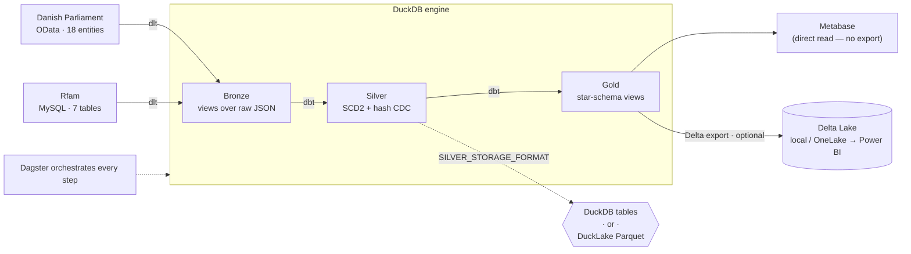
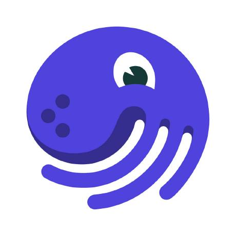
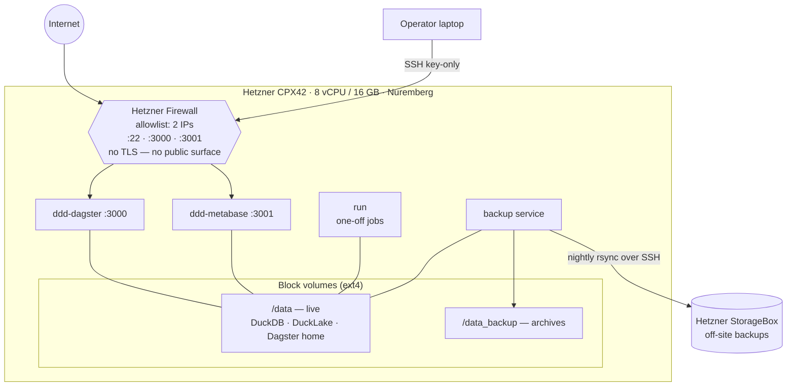

<!--
Speaker notes appear in HTML comments like this one throughout the deck.
~20 content slides, budget ~2 min each = ~40 min + 5 min Q&A.
Tone: light and honest. The audience knows this stuff — don't explain what a
view is, do tell them the parts that bit you.
-->

# A serious LakeHouse on a seriously tight budget

### Bronze → Silver → Gold with open data and free tools

*Danish democracy, RNA families, and one analytical database doing all the work*

<!--
Opener (~90s). Set expectations: this is a reference project, not a product.
The point of the talk is the *decisions* — the boring-but-correct ones and the
couple that are genuinely fun (the self-watching pipeline, the DuckLake backup
ordering puzzle). Lead with the budget angle: serious lakehouse patterns, near-
zero spend.
-->

---

## Why this talk exists

- I wanted a data platform I could run **on a laptop, for €0** — but that still does the grown-up things: CDC, history, orchestration, backups.
- Constraint forces good decisions. No Spark cluster to hide behind.
- Everything here is open source. The *only* optional paid piece is the cloud export target.
- It's a **learning project** — so I get to show you the scars, not just the architecture diagram.

<!--
The €0 framing is the hook for a technical crowd: they've all priced a "small"
cloud data stack and winced. Emphasize: the interesting engineering is in the
constraints, not in throwing managed services at it.
-->

---

## The odd-couple dataset

Two public sources, deliberately mismatched:

| | Danish Parliament (Folketing) | Rfam (EBI) |
|---|---|---|
| What | MPs, meetings, cases, votes | RNA families, genomes, clans |
| Where | `oda.ft.dk` OData REST API | public MySQL at EBI |
| Size | 18 entities | 7 tables |
| Why | rich relational graph, real history | a *completely* different shape |

- 25 entities total. No API key. No rate limit drama. No NDA.
- The mismatch is the point: if the pipeline only works for one source's shape, it's not a pipeline, it's a script.

<!--
Get a small laugh on "a completely different shape" — RNA families next to
parliamentary votes is absurd, and that's deliberate. The serious point: two
sources with different keys, date columns, and extraction modes prove the
generalization holds.
-->

---

## The stack, on one slide



- **Extract:** dlt · **Transform:** dbt + DuckDB · **Orchestrate:** Dagster · **Export:** deltalake · **BI:** Metabase (direct read).
- New to some here: **dlt** = lightweight Python extract-load; **Dagster** = the orchestrator — think SQL Agent / ADF, but code-first.

<p align="center">
  &nbsp;&nbsp;&nbsp;
  &nbsp;&nbsp;&nbsp;
  &nbsp;&nbsp;&nbsp;
  &nbsp;&nbsp;&nbsp;
  &nbsp;&nbsp;&nbsp;
  &nbsp;&nbsp;&nbsp;
  
</p>

<!--
Don't narrate every box — let the diagram do the work. Land two things: (1) DuckDB
is the engine the whole way through, and (2) Silver has a swappable storage format
(the dotted SILVER_STORAGE_FORMAT branch) we'll come back to. Note the two dotted
edges are *choices/optional*: storage format, and the export. Everything solid is
the always-on path. The logo strip is just "here's the toolbox" — don't read it out.
-->

---

## Medallion, the honest version

- **Bronze** — raw, untouched, queryable. JSON exactly as it landed.
- **Silver** — **fully historised** (SCD Type 2). Barely cleaned, *not* enriched — and that's deliberate.
- **Gold** — business-friendly. English names, surrogate keys, star schema.

Let me be honest about Silver: it doesn't scrub your data and it doesn't enrich it. Its **one job** is to capture **what changed and when**, losslessly. That's still where the engineering lives — hash-based CDC, SCD Type 2, and a load you can safely re-run — just don't mistake it for a cleaning step.

<!--
Honesty beat — correct the usual "Silver = cleaned/conformed" assumption. Here
Silver is purely historisation: every version of every row, kept forever. Cleaning
and enrichment are intentionally minimal. Bronze and Gold get one slide each;
Silver gets three — not because it transforms a lot, but because *capturing change
correctly and idempotently* is the hard part. Say that out loud so the 3-slice
ratio reads as intentional.
-->

---

## Extraction with dlt

- Two orchestrators, one engine: `api_to_file()` for OData, `sql_to_file()` for MySQL.
- Each source declares **incremental** vs **full-extract** per entity:
  - DDD: 6 incremental (filtered on `opdateringsdato`), 12 full lookups.
  - Rfam: 2 incremental (`updated`), 5 full.
- Incremental state lives in dlt; output is **timestamped JSON** (`{entity}_{YYYYMMDD_HHMMSS}.json`).
- `ThreadPoolExecutor(max_workers=4)` — extraction is I/O-bound, so threads are free lunch.

<!--
The takeaway for this crowd: incremental-vs-full is *data*, declared once per
entity, not branching logic sprinkled around the code. The date filter is the
only stateful bit and dlt owns it. Mention the SQL-injection guard here in one
breath: dates are regex-validated before they go anywhere near a query.
-->

---

## Bronze: the easy layer

- 53 views, all generated. Most are literally `read_json_auto()` over a folder.
- A `_latest` view per entity (newest snapshot) and a few utility views.
- Zero copies. Bronze is a **lens on files**, not a table.

```sql
-- essentially this, 25 times
SELECT *, '<filename>' AS LKHS_filename
FROM read_json_auto('.../Bronze/ddd/aktoer/*.json')
```

<!--
Keep this short — it's the breather slide. The one honest point: Bronze costs
almost nothing because DuckDB reads JSON natively. No staging tables, no copy
step. If someone asks "why not Parquet in Bronze" — you could, JSON is just what
the API gives and read_json_auto makes it painless.
-->

---

## Silver, part 1: detecting change with a hash

One idea: **hash each row, compare it to the same key's previous snapshot.** No `updated_at` to trust, no column-by-column diff.

- SHA-256 over the *business* columns only — exclude bookkeeping (insert time, filename, run id) or every row looks changed every run.

```sql
with hashed as (                        -- 1) hash the business columns
    select id, LKHS_filename,
           sha256(concat_ws('|', navn, parti, rolle)) as hash
    from   bronze_ddd_aktoer
),
lagged as (                             -- 2) each key's previous snapshot
    select *, lag(hash) over (partition by id order by LKHS_filename) as prev
    from   hashed
)
select *,
       case when prev is null  then 'I'     -- new key      -> insert
            when hash <> prev   then 'U'     -- hash changed -> update
       end as LKHS_cdc_operation            -- (deletes: a separate pass)
from   lagged;
```

- **Order- and batch-independent:** the `LAG()` runs over the *whole* file history, so processing five new extractions at once yields **exactly** the same rows as one-by-one. Idempotent and safe to re-run.

<!--
The conceptual core, plus the property I'm most proud of. "Don't hash the
bookkeeping columns" is the obvious-in-hindsight bit that ruins your week if you
miss it — every row looks changed every run. The second bullet is the real
engineering claim: because change is derived by a window function over all files
(not a stateful row-by-row merge), batch == sequential. Catch up on 20 missed
extractions in one run and the history is bit-identical to having run each nightly.
Configurable delimiter + null-token keep the hash deterministic across NULLs.
-->

---

## Silver, part 2: SCD Type 2 + current-version views

- Every change is **appended**, never overwritten. Full history stays in Silver.
- Tracking columns, all prefixed `LKHS_`:
  - `LKHS_date_valid_from` · `LKHS_cdc_operation` (I/U/D) · `LKHS_hash_value`
- A `_cv` ("current version") view per table exposes just the latest row — so downstream consumers don't have to think about history unless they want to.

History for the auditors, `_cv` for everyone else. Same table.

> The hash-based CDC + SCD Type 2 pattern here is inspired by **Roelant Vos**'s work on data-warehouse automation and historisation.

<!--
The LKHS_ prefix is a vanity namespace (the project's initials) but the point is
real: every system column is visually distinct from business columns. The _cv
view is the ergonomic payoff of SCD2 — you keep all history but nobody pays the
"filter to current" tax by hand. 50 Silver models = 25 history tables + 25 _cv
views. Credit where due: the historisation approach (content hash, load metadata,
SCD2) is straight out of Roelant Vos's data-warehouse-automation writing — worth a
name-check, and a good pointer for anyone who wants the deeper Data Vault lineage.
-->

---

## Silver, part 3: I don't write Silver SQL

- Bronze and Silver models are **generated** from one Python file (`configuration_variables.py`).
- That file is the single source of truth: entity lists, primary keys, date columns, SQL templates.
- Add an entity → edit *one* list → regenerate. The macros do the CDC.
- Tests assert the lists stay consistent (counts, subsets, no dupes), so a typo fails CI, not production.

```python
# add a Rfam table = append to four lists, then:
python -m ddd_python.ddd_dbt.generate_dbt_models
```

<!--
This is the "scales without growing" slide. 50+ Silver models, hand-maintaining
them would be insane and inconsistent. The generator + 9 dbt macros mean the CDC
logic exists *once*. The config-consistency tests are the safety net — they've
caught me adding a key to one list and forgetting another.
-->

---

## Gold: making it presentable

- 19 views: 10 star-schema facts/dims + `_cv` passthroughs + a date dimension.
- English names (`bronze_ddd_aktoer` → `gold_actor`), surrogate keys.
- Surrogate keys cast **UBIGINT → signed BIGINT** — because Power BI can't digest unsigned 64-bit ints. (You learn this the annoying way.)
- Mostly generated; a couple handcrafted where the star schema needed a human (`individual_votes`).

<!--
The Power BI / BIGINT detail always gets a knowing nod from anyone who's shipped
to Power BI. It's a one-macro fix but a genuinely surprising failure the first
time. Honesty beat: not everything is generated — the interesting joins are
handwritten, and that's fine.
-->

---

## Orchestration with Dagster

- Software-defined **assets**, created by factory functions (25 extraction assets from ~2 factories).
- Jobs: incremental, full-extract, full-pipeline, export, DuckLake cleanup.
- Two daily schedules (06:00 + 08:00, Europe/Copenhagen) — **shipped disabled**, because a demo that hammers a public API on a cron is rude.
- Run-status sensors fire on every job SUCCESS and FAILURE: write a summary to the log destination and push a **ntfy.sh** notification. Opt-in via `NTFY_TOPIC` in `.env`.

<!--
Asset factories pair with the config-driven generation theme: define the shape
once, stamp out 25. The "disabled by default" line is a small ethics/politeness
point about public data sources — worth saying out loud. The ntfy.sh sensors are
new: both cover all jobs, fire on success and failure, and are silent when
NTFY_TOPIC is not set — so the default deploy doesn't spam anyone.
-->

---

## One constraint to account for: single writer

DuckDB is **single-writer** — one process holds the write lock on the file. It didn't reshape the architecture; it's just a fact you have to *realise and account for*. Once you do, it's a few small choices:

- **dbt jobs → `in_process_executor`.** Everything that writes the DB runs in one process, serialized. No two models race for the lock.
- **Extraction & export → `multiprocess_executor` (max 4).** These write *files*, not the DB, so they're free to run in parallel.
- **Metabase holds a read lock → Dagster stops it before a run, starts it after.** The pipeline owns the file for the duration of a build.
- **Human connections (DBeaver, etc.) release during a run** — same rule, applied to people.

Recognise it, arrange *who* runs *where*, move on. Boring, and it never deadlocks.

<!--
Reframed from "war story" to "here's the solution" — and don't oversell it as the
thing that drove the whole design. It didn't. It's a property of the engine you
notice and handle: writers (dbt) serialized in-process; non-writers (extraction/
export) parallelize; readers (Metabase, humans) evicted for the window. The honest
framing is "realise it, account for it." The only generalizable bit: an embedded
single-file DB makes *you* the concurrency manager — lead with the mechanism, not
the drama.
-->

---

## Silver storage, switchable: DuckDB vs DuckLake

One env var — `SILVER_STORAGE_FORMAT` — flips Silver between two backends:

| | `duckdb` (default) | `ducklake` |
|---|---|---|
| Silver lives in | the `.duckdb` file | DuckLake catalog (Parquet + metadata) |
| Files on disk | inside the binary | Parquet under `DUCKLAKE_DATA_PATH` |
| Time travel | no | yes (catalog snapshots) |

- Bronze and Gold don't care — Gold's `ref()` to Silver just resolves to the catalog.
- Catching detail: DuckLake stores *tiny* tables inline in the catalog, so not every table shows up as a `.parquet` file. First time, you'll think it's broken. It isn't.

<!--
This is recent work and a nice "open table format without the Iceberg ceremony"
angle. DuckLake = Parquet data + a SQL catalog. The seam is clean because dbt's
ref() indirection means Gold never hard-codes where Silver lives. The inline-tiny-
tables footgun is a real "wait, where are my files" moment — flag it so they don't
hit it cold.
-->

---

## The Delta export — and who it's actually for

**Not Metabase.** Metabase reads the DuckDB file directly — dashboards work with **zero** export. The Delta export is an **optional outbound adapter** for *other* tooling:

```text
DuckDB  ──►  Metabase            (BI, built in, no export)
   │
   └──►  Delta Lake export  ──►  anything that speaks Delta
                                 └─► Fabric OneLake ─► Power BI  (the "enterprisey" path)
```

- Silver → Delta (incremental append), Gold → Delta (full overwrite); target flips **local ↔ OneLake** with one env var.
- Dedup read runs *inside* DuckDB via `delta_scan()`; the **write** still uses the `deltalake` lib. Folding the write into DuckDB is blocked by an **Azure OneLake bug** — upstream, not DuckDB's fault — so for now we wait it out.
- Local-only? You may never run it. Want Power BI / Spark / Databricks? Now Delta on OneLake earns its keep.

<!--
Merged slide. Lead with the framing correction — don't let a technical crowd
assume the export is load-bearing. The medallion is "done" at Gold-in-DuckDB;
Metabase already serves reports off that. Export is a fan-out for interop, Delta
being the lingua franca. On the writer split: DuckDB can write Delta; what blocks
us moving the write off `deltalake` is a bug on the **Azure OneLake** side, not
DuckDB. So this is "waiting on an upstream fix," not "DuckDB can't do it" — be
precise if asked. Land it as: BI is built in, export is for other people's tools.
-->

---

## My favourite trick: the pipeline watches itself

- Dagster stores its run history in a SQLite database.
- So… point dbt at that SQLite file too.
- A small **data-engineering** model layer turns Dagster's own runs into queryable tables — surfaced in Metabase like any other data.

The pipeline reports on the pipeline. No extra observability stack, just one more dbt source.

<!--
This usually gets the best reaction — it's a cheap, almost cheeky idea with real
payoff. Observability as "just another data source." It only works because dbt-
duckdb can attach SQLite and DuckDB reads across databases. Keep it short and let
the cleverness land on its own.
-->

---

## Backups, and a genuinely fun ordering puzzle

Four targets: `dagster`, `metabase`, `duckdb`, and (in DuckLake mode) `ducklake`.

- Retention: 62 days for Dagster/Metabase, **7 days for duckdb/ducklake**.
- The puzzle: the DuckLake **catalog** lives with the `.duckdb` file; the **data files** live elsewhere. The catalog *references* the files.
- So you must archive **data files first, catalog second** — otherwise the catalog snapshot can point at a Parquet file the backup never captured.

Files-before-catalog. Correct by construction.

<!--
This is the "small detail, real consequence" closer for the technical content.
Anyone who's restored a backup and found a dangling reference will feel this.
The ordering isn't a nice-to-have; it's the difference between a restore that
works and a catalog pointing into the void. Containers are stopped during backup
too, so it's belt-and-suspenders — but get the order right anyway.
-->

---

## How it's wired in production



Non-root containers (UID 1000 / 2000) · `restart: unless-stopped` · one node, no HA.

<!--
This is the visual companion to the next slide — show it, then talk the details
on "Runs on a laptop." Two things to point at: the firewall is the entire
perimeter (allowlist + key-only SSH, no TLS because nothing is public), and the
backup service is the only thing that reaches off-box (nightly to StorageBox).
Everything else lives on two ext4 volumes on one machine.
-->

---

## Runs on a laptop — deployed on one small box

Dev on a laptop. Production is **one Hetzner box**, run like a grown-up:

- **Host:** CPX42 (8 vCPU / 16 GB), Docker CE, Nuremberg — **~€30/mo**. Two `fstab` volumes: `/data` (live) + `/data_backup`.
- **Security is a whitelist, not a fortress:** firewall allows inbound from exactly **two IPs** (home + VPN exit); ports 22/3000/3001, everything else dropped. **No TLS — on purpose:** no public surface, the allowlist *is* the perimeter. Key-only root SSH.
- **Off-site backups** nightly via cron → Hetzner StorageBox. **Non-root containers** (UID 1000 / 2000), memory limits, `restart: unless-stopped`.

**All-in cost:** local-only = **€0** (+ ~€30/mo if you host it on Hetzner). Fabric OneLake adds ~€65/mo paused-overnight, ~€190 always-on — *only* if you want the cloud export.

**Deliberately *not* built:** real-time (batch/daily), alerting (just logged summaries), HA/failover (one node, on purpose), dev/staging/prod split. A reference project, not a platform.

<!--
Merged "deployed + cost + limits" into one "running it for real" slide. Be honest
about the security model — deliberately simple: no reverse proxy, no TLS, no
fail2ban, because there's no public endpoint. The whole attack surface is two
whitelisted IPs and key-only SSH; for a single-operator reference project that's
proportionate, and "no TLS on purpose" lands better with a security-literate crowd
than pretending there's a CA in here. The cost spread €0 → €30 → €190 is the
memorable number; saying what you DIDN'T build earns more credibility than a
feature list. This is the last "real-world" beat before the recap.
-->

---

## What I'd tell past me

- **Generate** repetitive models; hand-write the interesting 10%.
- A **content hash** beats trusting someone else's `updated_at`.
- Keep **history cheap to ignore** (`_cv` views) and cheap to keep (append-only).
- Know your engine's quirks (e.g. single-writer) and account for them — they're constraints, not catastrophes.
- Keep what *works* in place, note *why* — sometimes the blocker is upstream, and the fix is patience.

<!--
The recap slide. Each line maps to a moment earlier in the talk, so it lands as
"oh right, that" rather than new info. The single-writer line is deliberately
low-key — a quirk to handle, not a design driver. The last line is the deltalake/
OneLake situation generalized: we keep deltalake not because anything of ours is
broken but because an upstream Azure OneLake bug blocks the cleaner path — so the
honest "lesson" is that some blockers aren't yours to fix, you just wait.
-->

---

## Thanks — questions?

- It's a learning project: open source, runs on a laptop, scars included.
- Two odd datasets, one medallion, single-writer kept honest by the orchestration, and a backup that knows about ordering.
- Repo + docs: `dbt_duckdb_demo` (`README.md`, `documentation/`).

> **Am I doing anything unique here? Not at all.** But it's genuinely fun to build — and I honestly believe plenty of clients would be more than well served by *this*, instead of a far costlier alternative.

**Ask me the hard ones.**

<!--
Leave ~5 min. The blockquote is the real closing note — say it plainly and
unironically. None of these pieces are novel; the point is that the *combination*
is cheap, honest, and genuinely enough for a lot of real workloads. That humility
lands better than overclaiming, and it's a good segue into "where would this NOT
be enough?" if someone asks. Likely questions to pre-load: "why not Iceberg/Delta
for Silver instead of DuckLake?", "why dlt over Airbyte/Meltano?", "how big does
this get before DuckDB hurts?", "why keep deltalake if DuckDB can read Delta?".
You have honest answers for all of these earlier in the deck — point back to the slide.
-->
